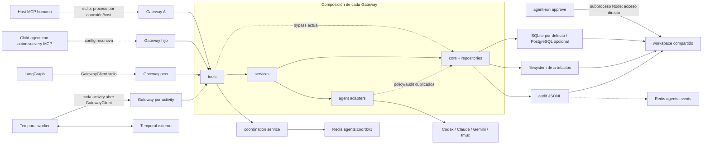
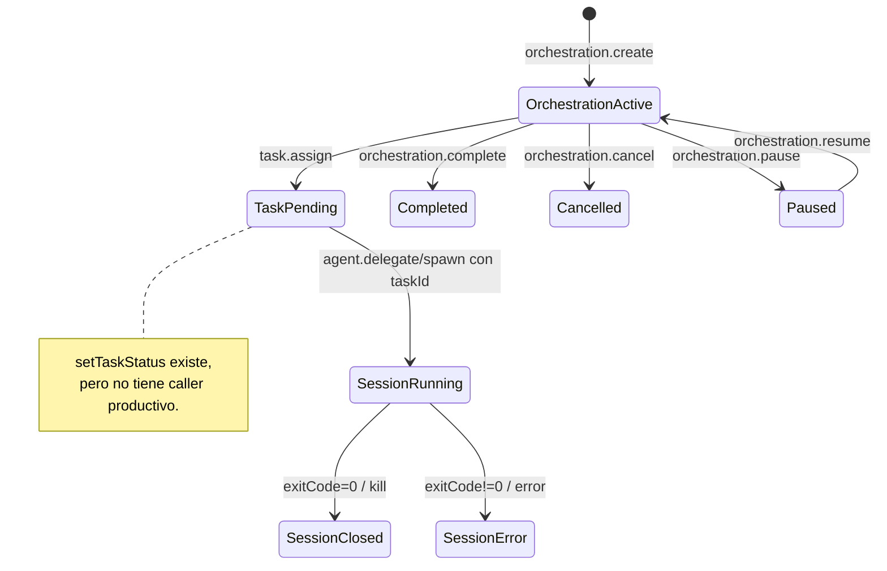

# Auditoría de arquitectura e infraestructura

## Ficha de la revisión

| Campo | Valor |
|---|---|
| Corte auditado | `41d194a9cb5276cd0e90541b23ff47a41b3ad123` |
| Comparación posterior | `develop@d521afb12a6520b95f1a9fb172911b16ab77a1ff`, descendiente directo, 78 commits por delante |
| Estado aún posterior observado | `main` y `develop` llegaron a alinearse localmente en `b532c638`; queda fuera de la comparación y no equivale a tag/publicación |
| Alcance | Gateway, límites de módulos, contratos, agregados y lifecycle, stores, adapters, LangGraph/Temporal, coordinación V5, manifests, CI y topología de despliegue |
| Método | Inspección estática del objeto Git, contraste ADR/intención versus implementación, evidencia runtime read-only consolidada en el índice de esta auditoría y revisión de planes previos |
| Calificación | **C− para la arquitectura local/dry-run; D como sistema integrado con agentes reales** |

Las referencias `archivo:línea` de este documento apuntan al corte
`41d194a`, salvo que se etiqueten expresamente como `post-corte d521afb`.
La documentación y los planes se usan como evidencia de intención, nunca como
prueba de que una garantía esté implementada.

## Resumen ejecutivo

La base es la de un monolito modular local con buenas decisiones parciales:
Gateway MCP explícito, policy determinista, SQLite con WAL y foreign keys,
artefactos separados de metadata, ADRs claros y un protocolo Redis V5
cuidadosamente cercado con leases, fencing y Lua atómico. La calificación baja
porque esas propiedades locales no componen todavía una garantía de sistema.
El diseño declara un único Gateway de enforcement, pero cada host MCP y cada
actividad Temporal puede abrir otro Gateway; la muestra operativa encontró 36
procesos, 35 sobre el mismo workspace. Tools, services y adapters tampoco
refuerzan estructuralmente el límite documentado: existen accesos directos a
core/repositorios y policy duplicada. El agregado
orchestration→task→session carece de una máquina de estados compartida: task se
crea `pending`, su mutador no se usa en producción y una orquestación puede
completarse con trabajo abierto. Además, JSON Schemas, tablas SQL, schemas Zod
y workflows representan modelos distintos del mismo dominio. Temporal aporta
historia durable, pero no idempotencia durable de los efectos Gateway; archivos,
SQL, JSONL y Redis tampoco forman una unidad recuperable. `d521afb` mejora CI,
lint, contratos Python y el audit de tool calls, pero no cambia estos límites
estructurales. La estrategia correcta no es extraer microservicios ni crear un
V6: es hacer exigible el monolito modular y ejecutar el programa V4 ya
planificado.

## 1. Mapa de arquitectura

### 1.1 Contexto y topología efectiva



La topología documentada muestra `host → un Gateway → agentes`
(`README.md:47-69`) y declara el Gateway como única frontera
(`docs/architecture.md:1-6`). El runtime real es **N Gateways por N hosts o
actividades**, todos capaces de componer el registro completo
(`gateway/src/tools/index.js:16-37`). El cliente Python usa por defecto
`node gateway/src/mcp_server.js`, hereda todo el entorno y abre una sesión stdio
(`orchestrator-langgraph/src/orchestrator_langgraph/client/gateway_client.py:35-83`);
cada llamada de activity entra en un nuevo context manager
(`orchestrator-langgraph/src/orchestrator_langgraph/activities.py:295-335`).

La configuración de proyecto agrava esa multiplicación: `.mcp.json:3-16`
registra el Gateway real, apunta al mismo workspace y permite como repo root el
repositorio completo. Esta es una diferencia arquitectónica, no sólo una
incidencia operativa: la frontera se replica dentro del sujeto que debía quedar
al otro lado.

### 1.2 Componentes y ownership efectivo

| Componente | Responsabilidad declarada | Responsabilidad/ownership real | Evaluación |
|---|---|---|---|
| `mcp_server.js` | Bootstrap y transporte de la única frontera | Compone estado, audit, artifacts, telemetry y todos los tools por proceso; no adquiere ownership exclusivo ni reconcilia estado al boot (`gateway/src/mcp_server.js:187-230`) | Frontera lógica, no topológica |
| `tools/` | Validar y delegar a services | `artifact`, `message` y `session` importan core/repos directamente; `index` instancia adapters y services (`gateway/src/tools/artifact.js:1-6`, `gateway/src/tools/message.js:1-5`, `gateway/src/tools/session.js:1-3`) | Límite parcial |
| `services/` | Casos de uso y policy | Contiene flujos principales, pero no una unidad de trabajo ni reducer lifecycle común | Útil, incompleto |
| `core/` | Dominio, policy y contratos | Mezcla dominio, repositorios, DB, filesystem, audit, telemetría y Redis; el `infra/` documentado sólo contiene `.keep` | Concentración accidental |
| Adapters | Traducir ejecución a CLIs/tmux | Vuelven a evaluar policy, auditan y ejecutan sincronamente; unen argv en una línea para tmux (`gateway/src/adapters/codex_adapter.js:166-253,299-313`) | Infraestructura con reglas de aplicación |
| SQLite/PostgreSQL | Backend de estado intercambiable | SQLite es el camino real; PostgreSQL imita la interfaz de `better-sqlite3` mediante un `psql` síncrono por statement (`gateway/src/core/postgres_db.js:3-75`) | Paridad nominal |
| Artifact store | Contenido durable + metadata | Archivo, fila SQL y audit son tres commits; no hay staging/checksum/reconciliación (`gateway/src/core/artifact_store.js:85-123`) | Recuperabilidad incompleta |
| Audit | Historia append-only y mirror opcional | JSONL local; Redis best-effort por `redis-cli`; query escanea el fichero completo (`gateway/src/core/audit.js:69-91,94-157,248-272`) | Adecuado para laboratorio |
| Coordinación V5 | Presencia y entrega addressed at-least-once | Servicio/queue robustos por operación; lifecycle operativo delegado al caller y Redis standalone | Buen subsistema, no solución de workflow |
| LangGraph | Peer MCP de orquestación | Tiene flujos propios y semántica de resultados distinta del Gateway real | Experimental |
| Temporal | Recovery durable | Historia durable, effects por activities; cache de idempotencia sólo en memoria y un Gateway nuevo por activity | Durabilidad parcial |
| Compose/packaging | Infra local opcional | Compose sólo levanta PostgreSQL y Redis; no contiene Gateway, worker, Temporal ni observabilidad (`docker/docker-compose.yml:1-49`) | Laboratorio, no unidad desplegable |

### 1.3 Dependencias y límites

La intención prescribe:

```text
tools -> services -> core/ports -> infra/adapters
```

La implementación se aproxima más a:

```text
tools ───────► services ───────► repositories/core
  ├──────────► repositories/core
  └──────────► adapter registry

services ────► adapters
adapters ────► policy_engine + audit
```

`docs/architecture.md:8-27` describe las capas y bypasses prohibidos, pero no hay
una regla de imports que convierta esa descripción en una fitness function.
La policy aparece tanto en `agent_service` (`gateway/src/services/agent_service.js:17-23,103-181`)
como en los tres adapters. A la vez, mutaciones de artifacts, messages y
sessions viven en tools. El resultado no es meramente “código desordenado”:
resulta imposible afirmar por estructura que toda mutación produjo una única
decisión de policy con el mismo principal.

### 1.4 Agregado de dominio y lifecycle as-built



No hay guardas que conecten ambos lados del diagrama. `task.assign` persiste
siempre `pending` (`gateway/src/services/task_service.js:81-104`) y el único
mutador está aislado en el repositorio
(`gateway/src/core/repositories/task_repo.js:22-23`), sin llamadas productivas.
`orchestration.complete` sólo cambia el status de la sesión de orquestación
(`gateway/src/services/orchestration_service.js:58-88`); no comprueba tasks,
sessions, approvals ni artifacts. En `agent.spawn` el proceso/tmux nace antes de
persistir la session (`gateway/src/services/agent_service.js:145-180`), creando
una ventana de proceso huérfano. En `delegate`, la session sólo existe si el
caller suministra `taskId` (`gateway/src/services/agent_service.js:29-41`).

### 1.5 Modelo de datos y fronteras de consistencia

| Estado | Store | Atomicidad local | Hueco de composición |
|---|---|---|---|
| Orchestration/task/session/approval | SQLite o PostgreSQL | SQLite migration transaccional y WAL/FKs (`gateway/src/core/state.js:19-38,70-77`) | No hay transacción de caso de uso + audit/outbox |
| Artifact content | Filesystem | Una escritura de fichero | Metadata SQL y audit pueden fallar después |
| Audit | JSONL | Append síncrono por proceso | Sin lock de workspace, rotación, checksum, outbox ni reparación |
| Audit mirror | Redis Stream | `XADD` externo best-effort | Puede divergir de JSONL; subprocess `redis-cli` por evento |
| Coordination | Redis | Lua/fencing por operación | Ephemeral, sin fallback, consumer lifecycle ni DLQ gestionados |
| Workflow | Temporal history | Durable dentro de Temporal | Side effect Gateway no tiene operation key durable |

La migración sí referencia `tasks.trace_id → orchestration_sessions` y
`sessions.task_id → tasks`, pero `sessions.trace_id`, artifacts, messages,
policy decisions y approvals no tienen una foreign key al trace
(`gateway/migrations/001_initial.sql:19-89`). Esto facilita datos parciales y
obliga a reconstruir consistencia por convención. PostgreSQL conserva esa forma
(`gateway/migrations/postgres/001_initial.sql:16-86`), pero sus migraciones se
aplican statement a statement y el marker se escribe después
(`gateway/src/core/state.js:41-57`).

### 1.6 Contratos: cuatro fuentes, cuatro modelos

| Concepto | JSON Schema | SQL/runtime | Tool/workflow | Divergencia |
|---|---|---|---|---|
| Task status | `queued/running/blocked/completed/failed/cancelled` (`schemas/task.schema.json:7-17`) | `pending/running/completed/failed/cancelled` (`gateway/migrations/001_initial.sql:19-28`) | Se crea `pending` y nunca transiciona | `queued`, `blocked` y `pending` no tienen semántica común |
| Task hierarchy | `parentTaskId`, `goal` | No hay columnas | LangGraph crea subtasks por nodo; Temporal reutiliza un task | No existe contrato normativo |
| Artifact kind | Enum cerrado sin checkpoints/push (`schemas/artifact.schema.json:7-29`) | `kind TEXT` abierto | Tool acepta cualquier string; Temporal usa `workflow_checkpoint` y `push_intent` (`orchestrator-langgraph/src/orchestrator_langgraph/activities.py:226-293`) | Schema versionado no describe producción |
| Tool input | Zod runtime | Conversor MCP propio | JSON Schemas separados | El conversor sólo conserva tipos básicos y enums (`gateway/src/tools/tool_helpers.js:16-40`) |
| Agent result | `{stdout,stderr,exitCode,...}` | Session status derivado de exit code | LangGraph legacy busca `passed/status` (`orchestrator-langgraph/src/orchestrator_langgraph/graphs/implement_test_review_push.py:271-282`) | Un resultado real puede interpretarse como fallo o éxito incorrecto |

Los JSON Schemas del directorio `schemas/` no se importan en el código
productivo. El MCP publica schemas derivados de Zod mediante un conversor local
que ignora varias restricciones avanzadas. `d521afb` añadió un módulo de
contratos Python y tests de coherencia, una mejora útil, pero no unificó schema,
DB, tools y lifecycle.

### 1.7 Plano V5: propiedades fuertes y límite real

V5 separa correctamente observabilidad (`agents:events`) de coordinación
(`agents:coord:v1`) y falla explícitamente si Redis no está disponible
(`docs/adr/ADR-V5-01-redis-coordination-plane.md:25-59`). La identidad de
participant usa token de alta entropía, hash, comparación constant-time y fence
Redis (`gateway/src/services/coordination_service.js:801-811`). Send, ACK,
capacity y lease replacement se encapsulan en Lua; inbox no descarta pending
work a ciegas (`docs/adr/ADR-V5-01-redis-coordination-plane.md:220-266`).

Sus límites están bien documentados pero no operados:

- presence expira por TTL, pero SET member e inbox sólo se limpian al descubrir
  o hacer unregister (`docs/adr/ADR-V5-01-redis-coordination-plane.md:142-147`);
- el Stream de metadata no tiene retención automática
  (`docs/adr/ADR-V5-01-redis-coordination-plane.md:200-214`);
- cada operación abre y destruye un cliente Redis
  (`gateway/src/core/coordination_queue.js:2140-2170`);
- la cola tiene 2.176 líneas y el service 1.281, concentrando protocolo,
  validación y evolución en dos unidades;
- at-least-once exige idempotencia semántica del consumer, pero el proyecto no
  entrega un consumer durable general ni DLQ;
- Cluster/Sentinel, custom CA/client certificates y acceptance de TLS/ACL
  quedan fuera (`docs/adr/ADR-V5-01-redis-coordination-plane.md:296-333`).

V5 es por tanto un subsistema sólido **dentro de un failure domain único**; no
convierte el conjunto en una plataforma distribuida fiable.

### 1.8 Intención, corte y estado posterior

| Invariante | Intención declarada | Corte `41d194a` | `d521afb` | Dictamen |
|---|---|---|---|---|
| Gateway único | Único enforcement component | Un proceso por host/activity; sin lock | Sin cambio estructural | No cumplida topológicamente |
| Tools→services | Tools validan y delegan | Bypasses directos y policy duplicada | Sin cierre global | Parcial |
| Audit independiente de telemetry | Toda acción auditable | Audit genérico de tool calls sólo se pasa si telemetry está enabled (`gateway/src/mcp_server.js:216-223`) | Writer siempre conectado | Corregido post-corte sólo para este defecto |
| CI remoto | Gate reproducible | No `.github/workflows/ci.yml`; V1 fuera de `scripts/ci.sh` | Workflow, lint y suite V1 añadidos | Mejora post-corte, no prueba release |
| Contratos compartidos | Interoperabilidad estable | Cuatro modelos divergentes | Tests Python añadidos | Parcial |
| Temporal durable | Recovery sin duplicar efectos peligrosos | Cache in-memory; ADR reconoce riesgo | Sin operation store durable | Parcial |
| Backend PostgreSQL | Alternativa equivalente | `psql` síncrono por statement, artifacts locales | Más tests, mismo modelo | Experimental |
| Infra desplegable | Local-first | Compose de Redis/Postgres sólo | Sin unidad completa | No existe como producto |

La alineación posterior de `main` y `develop` reduce drift de ramas, pero no
retroactúa cambios al corte ni sustituye un candidate manifest, tag o
publicación.

## 2. Hallazgos priorizados

### Escala

- **Crítica:** la topología o frontera central permite perder control del
  sistema en el uso real declarado.
- **Alta:** rompe una invariante central, permite estado incoherente o impide
  recovery fiable.
- **Media:** limita evolución, portabilidad u operación, con workaround local.
- **Baja:** deuda acotada sin impacto inmediato relevante.

### Resumen

| ID | Severidad | Estado respecto a auditorías previas | Hallazgo |
|---|---|---|---|
| ARC-01 | Critical | **Nuevo/ampliado globalmente** | “Gateway único” no es una propiedad de despliegue; la configuración y los clientes crean una topología recursiva |
| ARC-02 | High | Revalidado | El límite Gateway/policy no está reforzado por módulos ni por un principal server-side |
| ARC-03 | High | **Ampliado con runtime** | Un workspace multi-store carece de un único owner/writer |
| ARC-04 | High | Revalidado | El punto central bloquea durante ejecución y el timeout exterior no cancela |
| ARC-05 | High | Revalidado | SQL, filesystem, JSONL y Redis no tienen unidad de trabajo recuperable |
| ARC-06 | High | **Nuevo en esta formulación** | El lifecycle no es un agregado: task, session, approval y orchestration pueden contradecirse |
| ARC-07 | High | Ampliado | Temporal hace durable el control flow, no los efectos ni su autoridad |
| ARC-08 | High V1 / Medium global | **Nuevo/ampliado** | Contratos de task, artifact y resultados divergen entre schemas, DB, tools y workflows |
| ARC-09 | Medium | Revalidado | PostgreSQL es un adapter de compatibilidad síncrono, no una topología equivalente |
| ARC-10 | Medium | Ampliado | V5 tiene atomicidad local excelente, pero ownership de consumers, retención y failover quedan fuera |
| ARC-11 | Medium | Revalidado | Los paquetes no forman una unidad instalable/desplegable fuera del checkout |
| ARC-12 | Medium | Ampliado | Complejidad y policy están concentradas/dispersas a la vez, sin fitness functions |

### ARC-01 — La frontera única se replica dentro de hosts y children

**Hecho.** El Gateway se sirve por stdio y se construye entero por proceso
(`gateway/src/mcp_server.js:187-230`). `.mcp.json:3-16` registra ese servidor
con paths absolutos, `AGENTS_DRY_RUN=0`, auto-approval y el repositorio completo
como root. `GatewayClient` puede abrir el mismo binario con el entorno heredado
(`orchestrator-langgraph/src/orchestrator_langgraph/client/gateway_client.py:57-83`)
y cada activity abre un context nuevo
(`orchestrator-langgraph/src/orchestrator_langgraph/activities.py:295-335`). La evidencia runtime consolidada observó 36
Gateways, 35 escribiendo el mismo workspace
(`audit/2026-07-26-project-wide/README.md:62-68`).

**Juicio.** “Gateway-only” describe el canal lógico, pero no singularidad,
ownership ni ubicación de la frontera. Un child que autodetecta la configuración
obtiene su propia copia del control plane, no una capacidad acotada del parent.

**Consecuencia.** Se multiplican authority surfaces, writers, conexiones,
memoria y estados de proceso; además, cualquier supuesto de singleton
process-local deja de ser válido.

**Recomendación.** Adoptar un Gateway long-lived por workspace, con runtime root
fuera de repos y lock de ownership antes de abrir stores. Hosts, CLI y workers
deben usar un canal autenticado hacia ese proceso; children no deben heredar
config MCP de control. Esto corresponde a V4 `B/1/04`, `B/1/08` y `B/4/01`.

### ARC-02 — El límite de autorización depende de disciplina manual

**Hecho.** Tools de artifact/message/session importan core y repos directamente;
adapters vuelven a importar/evaluar policy. `approval.respond` expone
`decidedBy` aportado por caller sin contexto de principal
(`gateway/src/tools/approval.js:19-29`). `task.assign` recibe caller, target,
repo y action como input (`gateway/src/tools/task.js:7-23`).

**Juicio.** La arquitectura no puede demostrar “una mutación = una policy
decision = un principal autenticado”. El mismo concepto de authority aparece
como campo de payload, regla en service y preflight en adapter.

**Consecuencia.** Añadir una tool o surface directa puede crear un bypass sin
romper CI; endurecer policy en un lugar no asegura paridad en otro.

**Recomendación.** Un `CallContext` server-owned, un application service por
mutación y ports para efectos. Tools sólo adaptan; adapters no deciden policy.
Añadir reglas de imports y un test que enumere cada tool mutante y su decisión.
V4 `B/0/00`, `B/1/00–02` y `B/4` ya contienen el cutover correcto.

### ARC-03 — No existe ownership exclusivo del workspace

**Hecho.** State y artifact store son singletons de módulo
(`gateway/src/core/state.js:7-8`;
`gateway/src/core/artifact_store.js:9-16`), pero no hay lock de workspace.
SQLite activa WAL, que mejora concurrencia, no crea single-writer de aplicación
(`gateway/src/core/state.js:70-77`). JSONL usa `appendFileSync` por proceso
(`gateway/src/core/audit.js:69-81`), y approvals notifican por un EventEmitter
process-local (`gateway/src/services/approval_service.js:1-6,114-149`).

**Juicio.** La implementación mezcla un modelo de “single composition root” con
una topología multi-proceso. WAL resuelve parte del locking físico; no resuelve
ownership de lifecycle, orden de audit, wakeups ni reconciliación.

**Consecuencia.** Un estado persistido por un proceso puede no despertar al
waiter de otro; pueden quedar logs intercalados, caches divergentes y recovery
sin responsable.

**Recomendación.** Lock auto-released, `gateway_instance_id/boot_id`, un solo
writer y clientes internos. Si multi-writer fuese un requisito futuro, debe
rediseñarse explícitamente con broker/outbox, no inferirse de WAL.

### ARC-04 — El enforcement point también es una sección crítica bloqueante

**Hecho.** Los tres adapters usan `spawnSync` en delegate; Codex lo hace en
`gateway/src/adapters/codex_adapter.js:218-244`. `agent_service` lo envuelve en
`Promise.race` (`gateway/src/services/agent_service.js:131-135`), pero
`withTimeout` sólo rechaza una Promise y no aborta el proceso
(`gateway/src/services/_with_timeout.js:1-11`).

**Juicio.** Mientras el child corre, el event loop del Gateway no puede servir
policy, approval, heartbeat o cancel. El timeout del adapter limita la espera,
pero el timeout del service no constituye cancelación.

**Consecuencia.** Una llamada lenta puede convertir una operación de datos en
indisponibilidad de toda la frontera y hacer expirar leases.

**Recomendación.** Runner asíncrono común con argv array, backpressure,
`AbortSignal`, escalado TERM/KILL y admission control; `agent.delegate` debe ser
one-shot explícito y las sesiones supervisadas deben tener lifecycle separado.
V4 `B/0/01–03`.

### ARC-05 — No hay commit recuperable entre stores

**Hecho.** Artifact escribe bytes, fila y audit secuencialmente
(`gateway/src/core/artifact_store.js:85-112`). Orchestration/task/approval
persisten y después auditan. Redis audit es best-effort
(`gateway/src/core/audit.js:147-157`). No existen operation journal, outbox ni
reconciler.

**Juicio.** El orden reduce algunos fallos, pero no define cómo reconocer ni
reparar un corte. Un error posterior al efecto puede hacer que el caller reintente
una operación ya aplicada.

**Consecuencia.** Ficheros huérfanos, metadata sin contenido, acción sin audit,
eventos duplicados y replays Temporal con side effects repetidos.

**Recomendación.** `operations` + outbox en la misma transacción del estado;
artifact staging/checksum/rename; dispatcher idempotente a JSONL/Redis; job de
reconciliación con fault injection en cada boundary.

### ARC-06 — El lifecycle no tiene invariantes de agregado

**Hecho.** Task nace `pending` y no transiciona; session puede crearse sólo
después de arrancar tmux; complete/cancel/pause sólo mutan orchestration sin
propagar o comprobar children (`gateway/src/services/task_service.js:81-104`;
`gateway/src/services/agent_service.js:145-180`;
`gateway/src/services/orchestration_service.js:58-88`).

**Juicio.** La base contiene entidades relacionadas, no un agregado gobernado.
Los status son labels independientes, no una máquina de estados.

**Consecuencia.** “completed” puede coexistir con task pending, session running
o approval pending; cancel no implica detener procesos; recovery no sabe qué
estado es autoritativo.

**Recomendación.** Reducer transaccional con transiciones permitidas,
precondiciones, idempotency key y eventos. Reservar `starting` antes de launch;
complete exige todos los children terminales; cancel crea intención durable y
drain verificable. V4 `B/1/03` y `B/1/09`.

### ARC-07 — Temporal termina su garantía antes del efecto

**Hecho.** Temporal registra historia y activities, pero la deduplicación vive
en `_responses_by_cache_key` del worker
(`orchestrator-langgraph/src/orchestrator_langgraph/activities.py:135-140,295-335`).
El ADR admite explícitamente duplicados tras crash mid-activity
(`docs/adr/ADR-V1-05-temporal-durable-workflows.md:44-48,70-83`). La aprobación
se despierta con un signal cuyo dict se acepta en memoria del workflow
(`orchestrator-langgraph/src/orchestrator_langgraph/workflows.py:88-100`) y no
se revalida como decisión autoritativa ligada al mismo change-set.

**Juicio.** Temporal ofrece at-least-once control flow. Sin operation key en el
Gateway y sin reconsulta de approval, replay no equivale a exactly-once ni a
authority durable.

**Consecuencia.** Reinicios pueden repetir ejecución, artifact o request; un
signal mal ligado puede avanzar un workflow distinto.

**Recomendación.** Operation IDs persistentes en el efecto, señal como wake hint
y proyección Gateway revalidada por approval/trace/action/digest. V4
`E/1/03–06`.

### ARC-08 — Los contratos versionados no gobiernan el runtime

**Hecho.** Task schema y SQL discrepan; artifact schema no incluye kinds usados
por Temporal; el tool acepta `kind` libre; el conversor Zod→JSON Schema sólo
expone tipos básicos; LangGraph legacy no consume `exitCode`.

**Juicio.** Hay contract artifacts, pero no una única fuente normativa ni
compatibility policy. Tests con fixtures auto-consistentes pueden pasar mientras
dos superficies reales no interoperan.

**Consecuencia.** Cambios legítimos de un componente rompen silenciosamente
otro; status y outputs ambiguos pueden promover trabajo fallido.

**Recomendación.** Definir envelopes versionados server-owned, generar schemas y
bindings, snapshots de tools y un corpus contractual ejecutado por Gateway,
LangGraph y Temporal. Un estado/campo desconocido debe fallar cerrado.

### ARC-09 — PostgreSQL no cambia el failure model

**Hecho.** Cada query ejecuta `psql` síncrono
(`gateway/src/core/postgres_db.js:72-75`), los parámetros se materializan a SQL
(`gateway/src/core/postgres_db.js:61-69`), `close()` no hace nada y artifact
content permanece local. No hay pool, transacción de aplicación ni health.

**Juicio.** Es un adapter de compatibilidad para tests/experimentación, no una
alternativa de despliegue multi-host o de alta disponibilidad.

**Consecuencia.** Activar PostgreSQL añade procesos y latencia bloqueante sin
resolver artifacts, audit, ownership o failover.

**Recomendación.** Mantenerlo explícitamente experimental hasta disponer de
driver, transacciones, pool y pruebas live; no vender “backend swappable” como
paridad operativa.

### ARC-10 — La coordinación V5 no tiene un owner operacional

**Hecho.** La atomicidad Redis es sólida, pero el caller debe heartbeat,
reclaim, deduplicar semánticamente y ACK. Cleanup de orphans depende de
discovery, metadata stream crece sin límite y el adapter crea conexión por
operación.

**Juicio.** El protocolo define primitives, no el proceso que las mantiene.

**Consecuencia.** Un cliente incompleto puede perder liveness, acumular pending
o procesar dos veces aunque el queue layer se comporte correctamente.

**Recomendación.** SDK/consumer supervisor con lifecycle, budget de reintentos,
DLQ/quarantine, retención, métricas y runbook de restore; lane live concurrente
required antes de ampliar la topología.

### ARC-11 — Los artefactos de build no forman un producto portable

**Hecho.** `orchestrator-langgraph` empaqueta sólo Python
(`orchestrator-langgraph/pyproject.toml:12-17`), pero su default necesita un path
relativo al Gateway Node
(`orchestrator-langgraph/src/orchestrator_langgraph/client/gateway_client.py:57-83`).
El CLI también localiza
scripts Node bajo el checkout (`cli/src/agents_cli/main.py:197-228`). Compose no
incluye aplicación/worker/Temporal.

**Juicio.** El repositorio funciona como checkout de desarrollo coordinado, no
como conjunto de paquetes instalables.

**Consecuencia.** Wheel/CLI pueden instalarse correctamente y fallar en el
primer uso fuera del root; versiones Node/Python/Gateway no quedan ligadas.

**Recomendación.** Elegir una unidad de distribución: bundle local versionado o
un Gateway service instalado y canal interno. Probar desde cwd temporal y
entorno limpio. V4 `B/4/01`, `E/1/02` y `E/2/01`.

### ARC-12 — La complejidad carece de controles arquitectónicos

**Hecho.** `coordination_queue.js` tiene 2.176 líneas y
`coordination_service.js` 1.281. Policy y audit se distribuyen entre tools,
services y adapters. `infra/` está vacío, aunque se documenta como capa.

**Juicio.** No urge dividir servicios, pero sí separar protocolo/ports y
automatizar límites. Hoy el diseño depende de conocimiento experto del equipo.

**Consecuencia.** Un cambio en coordinación o policy tiene blast radius difícil
de estimar; la cobertura alta no sustituye tests de arquitectura o concurrencia.

**Recomendación.** Modularizar por responsibility dentro del mismo proceso,
definir ports y ejecutar dependency rules, contract snapshots y complexity
budgets en CI.

## 3. Fortalezas verificadas

- La decisión local-first es coherente con SQLite/filesystem y evita introducir
  infraestructura distribuida obligatoria.
- SQLite habilita WAL y foreign keys; las migraciones SQLite se aplican dentro
  de una transacción (`gateway/src/core/state.js:19-38,70-77`).
- Approval implementa first-wins en el repositorio, una buena base para carreras
  de decisión.
- V5 deriva sender/scope/timestamps server-side, valida tamaño/clasificación,
  usa lease tokens hasheados y fencing dentro de la operación Redis.
- Inbox capacity no elimina pending work; ACK valida el lote y crea tombstones
  acotadas.
- El mirror Redis del audit es deliberadamente body-free y best-effort, sin
  convertir observabilidad en authority.
- Temporal separa workflow determinista de activities; el ADR documenta
  honestamente la limitación de idempotencia.
- El composition root está localizado. Se puede endurecer como monolito modular
  sin una migración prematura a microservicios.
- `d521afb` añadió CI remoto, lint y tests contractuales; es una base mejor para
  convertir invariantes en gates, aunque no cierre los hallazgos.

## 4. Estrategia arquitectónica

### Principio rector

**Un workspace, un Gateway owner, un modelo de autoridad, un lifecycle y una
fuente normativa de contratos.** Redis y Temporal siguen siendo subsistemas
opcionales con responsabilidades acotadas; no se convierten en authority de
policy ni justifican microservicios.

### Líneas de trabajo

1. **Fijar la topología.** Runtime privado fuera de repos, un PID/writer,
   clients internos y children sin autodiscovery del control plane.
2. **Hacer exigibles las capas.** Tools como adapters, services como casos de
   uso, ports de persistencia/ejecución y policy una sola vez con contexto
   server-owned.
3. **Convertir entidades en agregado.** Reducer lifecycle, precondiciones,
   operation IDs, cancel/drain y reconciler.
4. **Componer durabilidad.** Transacción + outbox, artifact staging y
   idempotencia durable de side effects.
5. **Unificar contratos.** Envelopes versionados, schemas generados, corpus real
   y cutover atómico de clientes.
6. **Distribuir una unidad portable.** Gateway instalado o bundle versionado,
   worker conectado al único owner y stack live reproducible.

### Fitness functions

| Propiedad | Test/gate objetivo |
|---|---|
| Singularidad | Segundo Gateway sobre el mismo workspace falla antes de abrir DB/audit; lock se libera al morir el owner |
| No recursión | Codex/Claude/Gemini children no descubren tools de control en `confined` ni `workspace-yolo` |
| Límite de módulos | Dependency rule falla si tools importan repositories/core de escritura o adapters importan policy |
| Policy completa | Cada tool mutante produce exactamente una policy/authority decision ligada a `principal_id` y `operation_id` |
| Lifecycle | Ninguna orchestration completa con task/session/approval no terminal; transiciones inválidas fallan |
| Recovery | Kill en cada boundary de launch/artifact/approval/outbox converge sin zombies ni duplicados |
| No bloqueo | Durante un agente lento, policy/approval/health responden bajo el presupuesto acordado |
| Idempotencia | Mismo operation ID tras restart produce una sola session, approval, artifact y side effect |
| Contrato | Un corpus de envelopes reales corre contra Gateway, LangGraph y Temporal; no hay fixtures con campos inventados |
| Portabilidad | Wheel/CLI instalados en cwd temporal conectan al Gateway sin depender del checkout |
| V5 operable | Carrera live Redis con dos conexiones preserva fence/dedupe/capacity; pending/DLQ/retención tienen métricas |
| Candidato | CI, review, `main` y tag se ligan al mismo full SHA/tree/locks |

## 5. Plan por hitos

Este plan no crea otro programa: agrupa tareas ya especificadas en PROJECT V4.

### Milestone 0 — Base verificable

| Item | Entrega | Aceptación | Esfuerzo | Riesgo de cambio | Dependencias V4 |
|---|---|---|---:|---|---|
| M0.1 | Candidate manifest y baseline | Full SHA/tree, locks, runtimes, suites/skips y review digest coinciden | M | Bajo | `M0/0/00`, `M0/4/00`, `M0/4/02` |
| M0.2 | Reglas de arquitectura | CI falla en imports tools→repos y adapters→policy; excepciones explícitas | M | Bajo | `M0/4/00`, `B/4/00` |
| M0.3 | Contract corpus | Snapshot MCP + envelopes reales task/artifact/result | M | Bajo | `M0/2/02`, `E/0/01` |
| M0.4 | Caracterización de fallos | Tests rojos para segundo Gateway, crash after spawn y complete con task abierta | M | Bajo | Precede `B/1/03`, `B/1/08–09` |

### Milestone 1 — Topología y lifecycle seguros

| Item | Entrega | Aceptación | Esfuerzo | Riesgo de cambio | Dependencias V4 |
|---|---|---|---:|---|---|
| M1.1 | Runtime root privado | Store/config fuera de repo roots y env child allowlisted | L | Alto | `B/1/04–07` |
| M1.2 | Single owner/writer | Lock auto-release, boot ID y clients internos | L | Medio | `B/1/08`, `B/4/01` |
| M1.3 | Runner asíncrono | Cero `spawnSync` en delegate real; abort/backpressure/admission | L | Alto | `B/0/01–03` |
| M1.4 | Reducer lifecycle | Reserva before launch, FSM, terminal guards y cancel/drain | L | Alto | `B/1/03` |
| M1.5 | Reconciler | Crash injection converge sessions/tasks/tmux | L | Alto | `B/1/09` después de M1.2–M1.4 |

### Milestone 2 — Consistencia, authority y contratos

| Item | Entrega | Aceptación | Esfuerzo | Riesgo de cambio | Dependencias V4 |
|---|---|---|---:|---|---|
| M2.1 | Principal/context server-owned | Claims del caller sólo pueden coincidir o denegar | XL | Alto | `B/0/00`, `B/1/00–02` |
| M2.2 | Operation journal/outbox | Estado+evento atómicos; dispatcher y replay idempotentes | L | Alto | M1 lifecycle |
| M2.3 | Artifact commit recuperable | staging, checksum, rename y reconciler | L | Medio | `B/1/02`, `B/3` |
| M2.4 | MCP 0.2 normativo | Schemas generados, clientes migrados y mixed-version deny | XL | Alto | `B/4/00–02` |
| M2.5 | Temporal V2 effects | Operation IDs y approval revalidada | XL | Alto | `E/1/02–06`, M2.1–M2.4 |

### Milestone 3 — Infraestructura operable

| Item | Entrega | Aceptación | Esfuerzo | Riesgo de cambio | Dependencias V4 |
|---|---|---|---:|---|---|
| M3.1 | Lane Redis concurrente | Redis 7 real, 100 iteraciones con seed, cero skip/leak | M | Bajo | `M0/4/01` |
| M3.2 | Stack real efímero | PostgreSQL+Redis+Temporal+un Gateway+worker con readiness/cleanup | XL | Medio | `E/2/01` |
| M3.3 | Packaging portable | Arranque fuera del checkout y versiones ligadas al candidate | L | Medio | `E/1/02`, M1.2 |
| M3.4 | Stability evidence | Runs consecutivos sobre mismo SHA/locks/images | M + ventana | Bajo | `E/2/03` |
| M3.5 | Release identity | review OK = candidate = main = tag/publicación | M | Medio | G8 |

## 6. Bocetos de implementación — top 3

### 6.1 Un Gateway owner y canal interno

**Approach.** Al boot, resolver `workspace` canónico, crear runtime root privado
y adquirir un lock de kernel antes de `initState`, `configureAudit` o
`configureArtifactStore`. Persistir `instance_id`, `boot_id`, PID y started_at.
Exponer MCP público al host y un socket local 0600 con handshake/version para
CLI/worker. Temporal deja de ejecutar `node gateway/src/mcp_server.js` y llama
al owner por ese canal. El child recibe env allowlisted y un cwd/mount donde no
existe `.mcp.json`.

**Rollout.** Primero modo observe-only que detecte otro writer; después
fail-closed. Migrar CLI y worker antes de retirar el path directo. Mantener 0.1
sólo durante el shim V4.

**Blast radius.** Bootstrap, CLI approval, worker Temporal y cualquier host que
dependa de un Gateway propio.

**Gotchas.** No usar “lockfile existe”; usar lock auto-released. Reconciliar
sessions sólo después de demostrar que no pertenecen a otro owner vivo. El
socket no sustituye firma/audience para mutaciones.

**Verificación.** Dos procesos concurrentes; crash `SIGKILL`; child con
autodiscovery; workflow completo; todos muestran un único writer/boot.

### 6.2 Lifecycle reducer + operation journal

**Approach.** Añadir tablas `operations` y `outbox`, versionar task/session y
definir un reducer que reciba `{principal, operation_id, aggregate_id,
expected_version, command}`. La misma transacción valida FSM, persiste estado y
outbox. `spawn` reserva session `starting` antes del proceso y completa el
launch con handle/child PID. Cancel crea intención, supervisor drena y sólo
entonces terminaliza. Repetir `operation_id` devuelve el resultado persistido.

**Rollout.** Dual-write diagnóstica, comparar proyecciones, migrar mutadores uno
a uno y finalmente impedir writes legacy. Backup/restore ensayado antes de cada
migración.

**Blast radius.** Todos los services mutantes, repositorios y contratos MCP.

**Gotchas.** No almacenar stdout/prompt raw en operation result. No confundir
transport retry con business attempt. `complete` debe ser una transición
condicional, no un update libre.

**Verificación.** Fault injection antes/después de cada commit/launch/audit,
optimistic-concurrency race y replay con mismo/diferente digest.

### 6.3 Contrato normativo generado

**Approach.** Definir envelopes versionados para principal, task, session,
agent-result, artifact descriptor y approval projection. Generar JSON Schema y
bindings/validators JS/Python; la tool declaration usa esa fuente, no un
conversor parcial. Mantener fixtures capturadas de la superficie MCP real.
LangGraph/Temporal consumen un helper estricto: `exitCode===0` y verdict
estructurado; unknown/ambiguous falla cerrado.

**Rollout.** Publicar MCP 0.2 detrás de flag, ejecutar consumer matrix, migrar
todos los clientes en el mismo candidate y retirar 0.1 atómicamente.

**Blast radius.** Tools, Python clients, tests, docs y histories Temporal.

**Gotchas.** Temporal V1 requiere replay compatibility/shim; no modificar
history contract en sitio. Artifacts antiguos necesitan reader versionado, no
reescritura destructiva.

**Verificación.** Snapshot de tool surface, corpus cross-language,
mixed-version deny y replay de histories V1.

## 7. Quick wins

| Acción | Impacto | Esfuerzo | Nota |
|---|---|---:|---|
| Rechazar `.mcp.json` de control en cwd/env de children y usar sólo el ejemplo dry-run para hosts humanos | Corta recursión accidental | S | No sustituye aislamiento ni lock |
| Loggear `boot_id`, PID y paths canónicos de stores al boot | Hace visible ownership | S | Sin paths sensibles en telemetry pública |
| Añadir un preflight que detecte otro Gateway sobre el workspace | Reduce multi-writer mientras llega el lock | S | Inicialmente warning; luego fail-closed |
| Activar siempre audit de tool calls | Cierra el defecto del corte | S | Ya presente en `d521afb`; preservar con regression test |
| Añadir dependency rules y snapshot MCP al gate | Evita nuevos bypasses/drift | S–M | No exige refactor inmediato |
| Marcar PostgreSQL y Temporal como experimentales en manifests/runbooks | Alinea expectativa y soporte | S | Hasta lanes live/portability |
| Añadir `operationId` opcional sólo en modo diagnóstico | Permite medir retries antes del cutover | S–M | No prometer idempotencia hasta persistirlo |
| Medir tamaño/edad de JSONL, artifacts, Redis metadata y pending | Hace visible crecimiento | S–M | Precede políticas de retención |

## 8. Preguntas abiertas

1. ¿El contrato soportado es estrictamente un operador/un workspace/un Gateway,
   o se desea multi-host real? La respuesta cambia single-writer por un rediseño
   distribuido mucho mayor.
2. ¿Cuál es la unidad de distribución: checkout monorepo, bundle local, paquete
   Gateway instalado o servicio? Hoy los manifests expresan opciones
   incompatibles.
3. ¿PostgreSQL es una meta de producto o sólo un seam de pruebas? Si no es meta,
   conviene reducir la promesa y el coste de paridad.
4. ¿Temporal V1 tiene ejecuciones/histories que deban preservarse? Determina el
   shim y la estrategia de versionado de workflow.
5. ¿Qué RPO/RTO se espera para state, artifacts, audit y workflows? Sin objetivo
   no se puede evaluar backup/recovery.
6. ¿Se acepta que `host-unconfined` suspenda explícitamente la frontera frente
   al mismo UID? Si sí, debe ser un modo/grant auditable, no una excepción
   arquitectónica invisible.
7. ¿Quién es owner del lifecycle Redis V5: cada caller, un SDK supervisor o un
   daemon? El protocolo por sí solo no decide heartbeat/reclaim/DLQ.
8. ¿Los JSON Schemas actuales son contratos externos o documentación histórica?
   Mantenerlos sin gobernar runtime produce más riesgo que eliminarlos.
9. ¿Debe una orchestration “completed” significar sólo cierre administrativo o
   todos los effects terminales y aprobados? La FSM depende de esta semántica.
10. ¿Qué datos pueden entrar en Temporal history y audit a largo plazo? La
    decisión afecta contracts, retention y recovery, no sólo privacidad.

## Dictamen

La arquitectura no necesita una reescritura. Necesita que sus decisiones buenas
dejen de ser convenciones locales y pasen a ser invariantes ejecutables. El
orden importa: primero topología/ownership, después lifecycle/authority,
después consistencia/contratos y finalmente packaging/infra live. Endurecer
Redis o añadir más workflows antes de cerrar el Gateway único aumentaría el
radio de fallo sin mejorar la garantía central.
