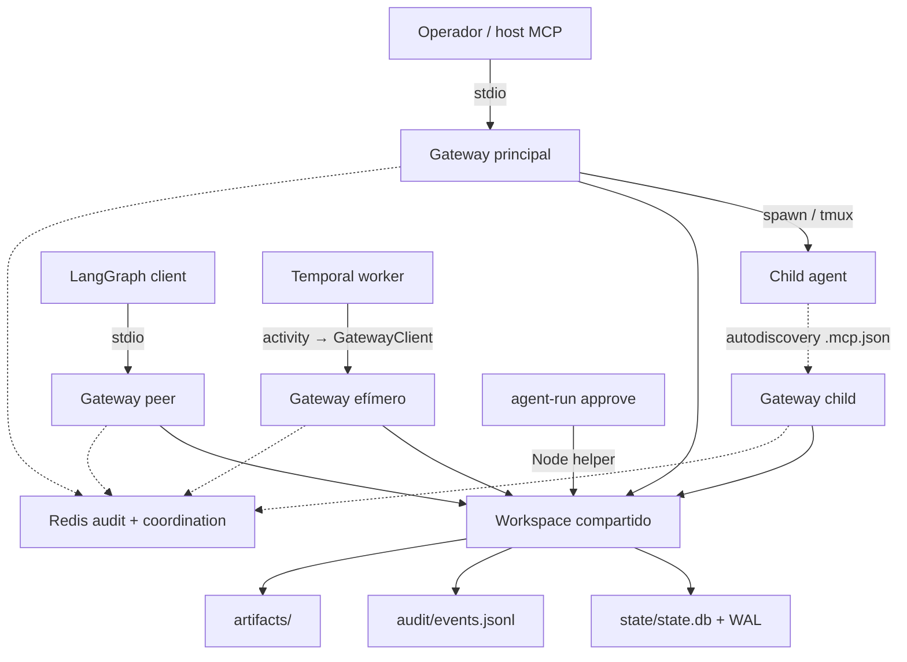

# Auditoría de operaciones y fiabilidad

## Ficha de la revisión

| Campo | Valor |
|---|---|
| Corte auditado | `41d194a9cb5276cd0e90541b23ff47a41b3ad123` |
| Comparación | `develop@d521afb12a6520b95f1a9fb172911b16ab77a1ff` |
| Método | Inspección estática, resultados de suites/SCA del informe raíz y observación read-only de metadata de procesos/ficheros abiertos |
| Alcance operativo | Topología de procesos, ownership single-writer, lifecycle, concurrencia, quotas, observabilidad, recovery, Redis/PostgreSQL/Temporal, empaquetado, runtime y release gate |
| Calificación | **D operativa; F para ejecución sostenida de agentes reales no confiables** |

Las referencias `archivo:línea` corresponden al corte `41d194a`, salvo
indicación `post-corte d521afb`. La muestra runtime es una fotografía, no un
benchmark ni una afirmación de capacidad máxima.

## Resumen ejecutivo

El proyecto es operable como laboratorio local y dry-run, pero no como servicio
supervisado. La muestra observó 36 procesos Gateway, 35 apuntando al mismo
SQLite/WAL, con aproximadamente 3,16 GiB RSS agregados; el diseño no tiene lock,
owner, inventario ni límite que impida esa topología. La causa no es sólo un
proceso olvidado: hosts MCP, children autodetectando `.mcp.json`, actividades
Temporal y comandos CLI pueden crear writers independientes. Los mecanismos de
fiabilidad existentes son valiosos pero locales: WAL/FKs, approvals first-wins,
timeouts, Redis leases/fencing/backpressure y compose healthchecks. No hay un
supervisor que componga esas piezas en liveness, cancellation, graceful drain,
reconciliación, quotas o recovery. `spawnSync` puede bloquear el único event
loop que sirve policy y approvals; tmux puede sobrevivir al Gateway; un wait de
approval sólo recibe wakeup en el proceso que emitió el EventEmitter. La
observabilidad se limita a JSONL y `stderr`; el consumer de métricas lee una vez
desde `$`, imprime un snapshot y termina. No existen RPO/RTO, backups/restores
ensayados, rotación, watermarks, SLOs ni una unidad desplegable completa.
`d521afb` añade CI remoto, lint, locks Python y más tests, y desacopla audit de
telemetry, pero no introduce ownership, recovery ni operación real de la
topología.

## 1. Mapa operativo

### 1.1 Topología recursiva y multi-Gateway



La configuración local del corte apunta explícitamente todos los procesos al
mismo workspace y habilita ejecución real
(`.mcp.json:3-16`). `mcp_server.js` abre los stores en cada boot y espera a que
termine stdin, sin adquirir lock ni registrar ownership
(`gateway/src/mcp_server.js:187-230`). `GatewayClient` hereda `os.environ` y
usa un path relativo al Gateway (`orchestrator-langgraph/src/orchestrator_langgraph/client/gateway_client.py:57-83`);
la activity crea un context nuevo por llamada
(`orchestrator-langgraph/src/orchestrator_langgraph/activities.py:295-335`).

La observación no intrusiva consolidada en el informe raíz fue:

| Señal | Valor observado |
|---|---:|
| Procesos Gateway | 36 |
| Gateways sobre el mismo workspace SQLite/WAL | 35 |
| RSS agregado aproximado | 3,16 GiB |
| Fuente | `audit/2026-07-26-project-wide/README.md:62-68` |

No se leyó contenido de prompts, artifacts ni datos personales, y no se
detuvieron procesos.

### 1.2 Entrypoints y ownership

| Entrypoint | Duración esperada | Qué abre/crea | Owner/cleanup actual |
|---|---|---|---|
| MCP host → `mcp_server.js` | Vida de stdin | DB, audit, artifact store, registry, Redis clients por operación | El host; no hay lock ni shutdown coordinator |
| `GatewayClient` Python | Vida del context | Subproceso Gateway completo | El client context |
| Temporal activity | Una llamada | Nuevo `GatewayClient` y Gateway | Activity runner; cache no sobrevive al worker |
| `agent-run approve` | One-shot | Subproceso Node, DB y JSONL | CLI; no notifica buses de otros procesos |
| `agent.delegate` | One-shot | Child CLI síncrono | Adapter timeout; event loop bloqueado |
| `agent.spawn` | Persistente | tmux + agent CLI | No hay supervisor/reconciler al boot |
| V5 coordination call | Por operación | Cliente Redis nuevo | Se destruye al final de la operación |
| Temporal worker | Long-running | Conexión Temporal y activities | `worker.run()`; sin health externo ni graceful hooks propios |

### 1.3 Stores y responsabilidades de recuperación

| Store/plano | Autoridad | Persistencia | Recovery implementado | Riesgo residual |
|---|---|---|---|---|
| SQLite | Estado local por defecto | WAL + fichero | Migraciones transaccionales | Sin backup/restore, owner, busy policy o reconcile |
| PostgreSQL | Estado opcional | Externo | Migraciones al boot | `psql` sync por statement; sin pool/transacción/health |
| Filesystem artifacts | Contenido | Ficheros locales | Ninguno | Huérfanos/metadata rota |
| JSONL audit | Historia local | Append | Query tolera línea corrupta | Sin rotación, index, checksum, repair o retention |
| `agents:events` | Mirror de observabilidad | Redis Stream | Best-effort | Divergencia esperada; sin durable consumer |
| `agents:coord:v1` | Presence/inbox/dedupe ephemeral | Redis AOF en compose local | TTL, reclaim y ACK primitives | Caller debe operar heartbeat/reclaim/idempotencia |
| Temporal history | Workflow state | Temporal externo | Replay | Side effects Gateway no idempotentes |
| tmux | Sesión interactiva | Servidor tmux | `kill` manual | Puede sobrevivir al Gateway y quedar sin owner |

### 1.4 Failure domains y comportamiento real

| Fallo | Comportamiento en el corte | Detección | Recuperación |
|---|---|---|---|
| Gateway termina | Se cierra stdio; SQLite/files permanecen; tmux puede seguir | Log/host MCP | Manual; no boot reconciliation |
| Segundo Gateway mismo workspace | Arranca normalmente | No hay señal dedicada | Ninguna; WAL arbitra sólo SQL |
| Child se cuelga | `spawnSync` bloquea hasta timeout del adapter | Respuesta tardía/error | Timeout mata/retorna según API; service timeout no cancela |
| Disk full durante artifact | Puede existir combinación parcial file/row/audit | Excepción local | Manual |
| Audit append falla tras DB mutation | Caller puede recibir error tras efecto | Log/error | Retry puede duplicar |
| Redis audit cae | JSONL sigue; warning best-effort | `stderr` | No replay/outbox |
| Redis coordination cae | `COORDINATION_UNAVAILABLE`; otras tools siguen | Error explícito | Caller reintenta; no fallback |
| Redis pierde datos | Presence/delivery V5 desaparecen por diseño | Externa | Re-register; business state debe venir de otro store |
| Approval resuelta en otro proceso | DB cambia, waiter no recibe EventEmitter | Sólo al agotar wait y volver a poll | Latencia hasta timeout |
| Temporal worker muere mid-activity | Replay puede repetir Gateway effect | Temporal | Cache in-memory no protege tras restart |
| SIGTERM/restart | No hay drain protocol ni handlers productivos específicos | Process exit | Manual; sessions no convergen |
| Clock skew Gateway↔Redis | Precheck y TTL pueden discrepar | No hay métrica/gate | Requiere NTP operacional externo |

### 1.5 Capacidad y quotas existentes

| Recurso | Límite existente | Hueco |
|---|---|---|
| Gateway processes | Ninguno | Recursión y fan-out ilimitado |
| Agent processes/tmux sessions | Ninguno global o por principal/repo/trace | Exhaustión de CPU/RAM/PIDs y provider spend |
| Agent concurrency | Ningún admission controller | Todas las llamadas admitidas hasta bloqueo/fallo |
| Prompt/stdout/stderr/snapshot | Sin budget común | Memoria, logs y egress no acotados de extremo a extremo |
| Artifacts | Sin límite de bytes/count/trace ni watermark de disco | Crecimiento indefinido |
| JSONL | Sin rotación/retention/size cap | Query O(n), disk exhaustion |
| Approval wait | Cap server-side de 60 s por defecto | Bueno localmente; wakeup cross-process deficiente |
| Agent wait | 600 s por defecto | Timeout sin cancelación coordinada |
| V5 message body | 65.536 bytes máximo | Bien acotado |
| V5 inbox | 10.000 entries por participant | Bien acotado; metadata events no |
| V5 receive/lease/dedupe | Límites configurables y validados | Sin supervisor que mantenga lifecycle |
| Provider/API cost | Ninguno | No hay token/spend budget ni circuit breaker |

Los defaults relevantes están en `gateway/src/config.js:78-157`; los límites
V5 también se documentan en `docs/coordination-bus.md:22-49`.

### 1.6 Observabilidad as-built

```text
Gateway structured stderr ───────────────► terminal/host
Gateway spans "OTel-inspired" stderr ───► terminal/host
Domain/tool audit JSONL ─────────────────► fichero local
Audit mirror best-effort ────────────────► Redis agents:events
Coordination metadata ───────────────────► Redis agents:coord:v1:events
Metrics consumer ── XREAD desde "$" una vez ─► snapshot stderr y exit
```

La telemetría implementa spans in-memory/`stderr`, no un SDK/exporter OTel
operacional (`gateway/src/core/telemetry.js:108-149,214-227`). En el corte, el
handler sólo recibía writers de tool-call audit si telemetry estaba enabled
(`gateway/src/mcp_server.js:216-223`); `d521afb` corrigió esa dependencia. El
consumer de métricas inicia el cursor en `$`, mantiene counters sólo en memoria,
ejecuta un `read()` y termina
(`orchestrator-langgraph/src/orchestrator_langgraph/consumers/metrics.py:37-50,137-184`).
No hay durable offset/consumer group, scrape endpoint, dashboard, alert rule,
SLO o vínculo estable entre boot/process/trace.

### 1.7 Packaging y runtime

- `docker/docker-compose.yml:1-49` levanta PostgreSQL 16 y Redis 7 con AOF,
  healthchecks, credenciales de desarrollo y puertos publicados. No levanta
  Gateway, worker, Temporal, collector ni dashboard.
- No hay Dockerfile de aplicación, unidad systemd, launcher/supervisor,
  manifests de rollout/rollback ni IaC en el corte.
- `gateway/package.json:1-22` es privado y exige Node `>=20`, con dependencias
  semver-range y sin artifact de distribución.
- `orchestrator-langgraph/pyproject.toml:1-17` empaqueta sólo Python y declara
  dependencias sin pins; el Gateway Node requerido no viaja en el wheel.
- `cli/pyproject.toml:1-25` empaqueta sólo el CLI Python, aunque `approve`
  requiere scripts Node localizados en el checkout
  (`cli/src/agents_cli/main.py:197-228`).
- `scripts/ci.sh:7-35` en el corte no ejecuta lint ni tests
  `orchestrator-langgraph`; `d521afb` añade ambos y un workflow remoto
  (`scripts/ci.sh` post-corte, `.github/workflows/ci.yml` post-corte).

La consecuencia operativa es importante: hay un entorno de desarrollo
documentado, no una unidad instalable con lifecycle, health y rollback.

### 1.8 Postura de fiabilidad por dimensión

| Dimensión | Nota | Justificación |
|---|---|---|
| Availability local dry-run | C | Pocos servicios obligatorios y fallo explícito de Redis opcional |
| Availability real-agent | D | Event loop bloqueante, no supervisor ni admission |
| Durability de estado | C− | SQLite WAL/Temporal history ayudan; effects multi-store no componen |
| Recovery | F | Sin RTO/RPO, reconcile integral, restore drill ni owner |
| Observability | D | Logs/JSONL útiles, sin métricas durables, alertas ni SLO |
| Capacity/abuse resistance | F | Sin budgets comunes de proceso, bytes, disco o coste |
| Deployability | D | Checkout coordinado; compose parcial; paquetes no autocontenidos |
| Change safety en `41d194a` | D | Gate local incompleto y sin CI remoto |
| Change safety en `d521afb` | C | CI/lint/locks/test coverage mejoran; live dependencies siguen incompletas |
| Redis V5 protocol | B− | Buen fencing/backpressure/idempotencia acotada |
| Redis V5 operations | D+ | Sin consumer supervisor, DLQ, retention automática ni failover |

No hay SLO, error budget, RPO ni RTO declarados. Las notas no deben leerse como
mediciones de disponibilidad.

### 1.9 Intención, as-built y comparación post-corte

| Capacidad | Intención publicada | As-built `41d194a` | Post-corte `d521afb` | Estado |
|---|---|---|---|---|
| Topología Gateway | Un enforcement point local | Un Gateway por host/client/activity y recursión desde children | Sin owner/lock nuevo | Divergencia abierta |
| Approval async | Wait acotado y respuesta de operador | Persistencia first-wins, pero wakeup process-local y CLI writer separado | Sin canal único | Parcial |
| Agent timeout | Llamadas acotadas | Adapter timeout existe; event loop bloquea y service timeout no cancela | Sin runner async | Parcial |
| Audit | JSONL append-only con mirror opcional | Domain audit existe; tool-call audit dependía de telemetry | Tool-call audit siempre conectado | Defecto puntual corregido |
| V5 coordination | At-least-once con fencing/backpressure | Primitives correctas; lifecycle/retention/DLQ quedan en caller/operator | Sin supervisor general | Protocolo sólido, operación incompleta |
| Temporal recovery | Replay sin bypass ni duplicados peligrosos | History durable; idempotencia in-memory y crash mid-effect abierto | Más tests/contracts, mismo effect model | Experimental |
| CI/release | Gate repetible | Gate local sin V1/lint ni CI remoto | CI remoto, lint, suite V1 y lock Python | Mejora sustancial, sin stability evidence |
| Runtime instalable | Quickstart local | Checkout obligatorio; compose parcial | Sin bundle/stack completo | Abierto |

La alineación aún posterior de `main` y `develop` en `b532c638` corrige la
divergencia local de ramas, pero está fuera de la pareja auditada y no aporta por
sí sola candidate manifest, tag, publicación, restore drill o ventana de
estabilidad.

## 2. Hallazgos priorizados

### Resumen

| ID | Severidad | Estado | Hallazgo |
|---|---|---|---|
| OPS-01 | Critical | **Nuevo/ampliado globalmente** | Autodiscovery y clients generan Gateways recursivos con la superficie completa |
| OPS-02 | High | **Confirmado por runtime** | Múltiples writers comparten workspace; wakeups y ownership son process-local |
| OPS-03 | Medium | **Nuevo global** | `agent-run approve` persiste por un camino que omite el sink Redis configurado |
| OPS-04 | High | Revalidado | Ejecución síncrona bloquea liveness y el timeout exterior no cancela |
| OPS-05 | High | Ampliado | No hay supervisor/reconciler de sessions, tmux, tasks ni operations |
| OPS-06 | High | **Nuevo/ampliado** | No hay admission control ni budgets de procesos, bytes, disco o proveedor |
| OPS-07 | High | Ampliado | Logs y mirrors no constituyen observabilidad operable |
| OPS-08 | High | Revalidado | Backup, restore, retention y reparación multi-store no existen |
| OPS-09 | Medium | Ampliado | V5 entrega primitives, pero no el lifecycle operacional del consumer |
| OPS-10 | Medium | Revalidado | Packaging y stack runtime dependen del checkout y de conocimiento local |
| OPS-11 | Medium | **Nuevo en esta auditoría** | Startup/shutdown carecen de readiness, drain y health de extremo a extremo |
| OPS-12 | Medium | Revalidado | Lanes live y release identity no sostienen claims de fiabilidad |
| OPS-13 | Medium | Ampliado | Subprocesos por query/event/operación convierten adapters opcionales en amplificadores de carga |

### OPS-01 — La configuración permite recursión del control plane

**Hecho.** `.mcp.json:3-16` está dentro del repo accesible al child, apunta al
Gateway real y usa el mismo workspace. El registry de cada proceso incluye todos
los tools (`gateway/src/tools/index.js:28-37`). La muestra encontró decenas de
Gateways hijos.

**Consecuencia.** Cada child puede crear más children/Gateways, multiplicar
writes y memoria y replicar la superficie de approvals/artifacts/sessions. El
problema escala geométricamente y hace que el “control plane” forme parte de la
carga.

**Recomendación.** Eliminar la config activa del alcance de children; runtime
root y control config fuera de repo roots; child env allowlisted; canary que
demuestre ausencia de tools de control. Un lock debe impedir el daño residual si
un host vuelve a descubrirla. V4 `B/1/04`, `B/1/07–08`.

### OPS-02 — WAL no sustituye un owner single-writer

**Hecho.** Todos los Gateways pueden abrir el mismo SQLite, JSONL y artifact
store. SQLite usa WAL/FKs (`gateway/src/core/state.js:70-77`), pero no hay lock.
Audit hace append directo (`gateway/src/core/audit.js:69-81`). Approval wakeup
usa `EventEmitter` de módulo y sólo vuelve a consultar DB al terminar el timeout
(`gateway/src/services/approval_service.js:114-149`).

**Consecuencia.** Orden de eventos no determinista, espera de approval de hasta
el timeout aun estando decidida, stores con versiones distintas del mismo
efecto, uso de memoria multiplicado y recovery sin proceso responsable.

**Recomendación.** Un Gateway owner por workspace, lock auto-release antes de
abrir stores, boot ID e inventario. CLI/workers son clients, no writers. V4
`B/1/08`, `B/2/00–02`, `B/4/01`.

### OPS-03 — La resolución CLI usa un pipeline de observabilidad distinto

**Hecho.** `gateway/scripts/approval-respond.mjs:12-23` configura audit sólo con
`auditLog`, sin `redisUrl/redisStream`, y llama al mismo service desde otro
proceso. La CLI lanza ese helper
(`cli/src/agents_cli/main.py:197-228`).

**Consecuencia.** SQLite/JSONL reflejan la decisión, pero consumers que esperan
el mirror Redis pueden seguir mostrando `pending`; waiters en otro Gateway no
reciben el evento process-local.

**Recomendación.** CLI mutante a través del canal del owner; outbox único para
todos los sinks; signal/Redis sólo como wake hint y DB como proyección
autoritativa.

### OPS-04 — Una operación de agente puede congelar toda la frontera

**Hecho.** Los adapters ejecutan `spawnSync`; Codex en
`gateway/src/adapters/codex_adapter.js:218-244`. El service aplica un
`Promise.race` que no puede preemptar el event loop ni matar el child
(`gateway/src/services/_with_timeout.js:1-11`).

**Consecuencia.** Policy, approvals, health, messages y heartbeats de ese
Gateway dejan de responder; leases V5 pueden expirar; el caller no distingue
cola, hang, child vivo o timeout de transporte.

**Recomendación.** Runner async con abort real, process group, TERM→KILL,
streaming/backpressure y límites de concurrencia. Liveness debe seguir
respondiendo durante una ejecución lenta. V4 `B/0/01–03`.

### OPS-05 — No hay supervisor ni reconciliación de lifecycle

**Hecho.** `agent.spawn` crea tmux antes de persistir session
(`gateway/src/services/agent_service.js:145-180`). Boot sólo inicializa stores y
sirve MCP; no escanea `starting/running`, PIDs o tmux
(`gateway/src/mcp_server.js:187-230`). `orchestration.cancel` cambia una fila,
sin drenar sessions (`gateway/src/services/orchestration_service.js:58-88`).

**Consecuencia.** tmux/child huérfanos, sessions eternamente running,
orchestrations completed con trabajo vivo y kills manuales arriesgados.

**Recomendación.** Supervisor con handles de proceso, state machine, reservation
before launch, heartbeats y reconciler al boot. Un transport timeout no debe
marcar terminal una sesión reattachable. V4 `B/1/03`, `B/1/09`, `B/5/02`.

### OPS-06 — La plataforma no tiene presupuesto de recursos

**Hecho.** No hay límites globales/per-principal para Gateways, agents, tmux,
concurrencia, output, artifact bytes, audit size, disco o coste. Sólo
coordination y waits tienen caps específicos (`gateway/src/config.js:110-146`).

**Consecuencia.** Una recursión o caller defectuoso puede agotar PIDs, RAM,
filesystem o presupuesto de proveedor sin violar ninguna regla de policy.

**Recomendación.** Admission antes del launch con budgets jerárquicos
host→principal→repo→trace: procesos, concurrencia, output, artifact, wall-clock
one-shot y provider spend. Watermarks de disco deben degradar a read-only/deny
antes de corromper stores. V4 `B/0/03`.

### OPS-07 — Hay telemetría, pero no un sistema de observabilidad

**Hecho.** Spans salen a `stderr`; el metrics consumer es one-shot, empieza en
`$` y pierde historia; audit query escanea JSONL completo. No hay health
externo, exporter, durable consumer, alertas o SLO.

**Consecuencia.** El operador no puede responder con rapidez: cuántos owners,
qué está bloqueado, qué queue crece, cuál approval espera, qué store diverge o
si un restart recuperó todo. La primera señal puede ser RAM/disk agotado.

**Recomendación.** Métricas mínimas por boot/workspace: process ownership,
tool latency/error, event-loop lag, child counts, queue/pending/oldest age,
approval age, store bytes, outbox lag, reconcile actions. Endpoint o exporter
real, dashboards y alertas ligadas a SLO.

### OPS-08 — No existe una historia de backup/restore verificable

**Hecho.** Artifacts, SQLite/PostgreSQL, JSONL, Redis y Temporal tienen
lifecycle independiente. No hay scripts/gates de backup, restore, export,
retention o erase coordinados. Artifact write no es atómico con metadata/audit
(`gateway/src/core/artifact_store.js:85-123`).

**Consecuencia.** Un backup parcial puede restaurar filas sin bytes o viceversa;
se desconoce RPO/RTO; retry/replay puede resucitar o duplicar estado.

**Recomendación.** Inventario de stores, operation journal, snapshots
coordinados, manifests con checksums/versions y restore drill. Definir RPO/RTO
por modo. Un erase/retention sólo termina cuando todos los stores y backups
confirman o queda `pending`.

### OPS-09 — El caller carga con la operación completa de V5

**Hecho.** V5 requiere heartbeat, receive, reclaim, procesamiento idempotente y
ACK (`docs/adr/ADR-V5-01-redis-coordination-plane.md:220-266,335-345`). Cleanup
de expired inbox se activa por discovery; metadata stream no tiene retención
(`docs/adr/ADR-V5-01-redis-coordination-plane.md:142-147,200-214`). Cada operación crea cliente Redis nuevo
(`gateway/src/core/coordination_queue.js:2140-2170`).

**Consecuencia.** Clients simples pueden expirar, dejar pending, redeliver
effects o acumular memoria; un pico de heartbeats multiplica handshakes.

**Recomendación.** Consumer SDK/supervisor, connection reuse, jitter de
heartbeat, retry budget, DLQ/quarantine, retention y métricas. Mantener Redis
standalone como único topology soportado hasta probar failover.

### OPS-10 — “Instalado” no significa “arrancable”

**Hecho.** Wheels no incluyen Gateway; Python usa un path relativo; CLI busca
helpers Node en el repo; compose sólo incluye dependencias.

**Consecuencia.** Un entorno limpio puede pasar instalación y fallar al operar.
No existe una versión única que ligue Gateway, CLI, worker, schemas y config.

**Recomendación.** Bundle o service versionado, launcher que resuelva endpoint,
config schema y preflight de binarios. Acceptance desde cwd temporal y usuario
sin checkout. V4 `E/1/02`, `E/2/01`.

### OPS-11 — No hay protocolo de readiness, drain y shutdown

**Hecho.** El Gateway espera `stdin.end` y no registra handlers para marcar
draining, rechazar launches, terminar children o cerrar stores
(`gateway/src/mcp_server.js:226-230`). El worker sólo conecta y ejecuta
`worker.run()`; su “health check” es una activity, no un probe del stack
(`orchestrator-langgraph/src/orchestrator_langgraph/worker.py:54-82`).

**Consecuencia.** Un restart no distingue ready de conectado, puede aceptar
trabajo mientras faltan stores y deja procesos/sessions ambiguos. Automatizar
rollout seguro es imposible.

**Recomendación.** Estados `starting/ready/draining/stopped`, health de
dependencias, señal de liveness independiente y shutdown con deadline técnico:
cerrar admission, persistir intents, drenar/reattach, flush outbox y liberar
lock.

### OPS-12 — Los tests live no sostienen un claim de operación

**Hecho.** En el corte, CI local no incluía V1 y no había workflow remoto
(`scripts/ci.sh:7-35`). Redis/PostgreSQL/Temporal/agentes reales eran opt-in o
skipped; el crash harness Temporal lo declara explícitamente
(`docs/adr/ADR-V1-05-temporal-durable-workflows.md:50-68`). `d521afb` añadió CI
y tests, pero las lanes live siguen sin ser una evidencia de estabilidad del
mismo candidate.

**Consecuencia.** Una suite verde puede no ejercitar proceso persistente,
concurrencia, restart, Redis real, Temporal real ni packaging fuera del checkout.

**Recomendación.** Lanes required escalonadas: Redis concurrente; stack
Postgres+Redis+Temporal+un Gateway; canary agents con budget. Todos sobre mismo
candidate SHA/locks/images y skip budget exacto.

### OPS-13 — Los adapters opcionales amplifican procesos y latencia

**Hecho.** PostgreSQL ejecuta un `psql` síncrono por statement
(`gateway/src/core/postgres_db.js:72-75`); audit Redis crea `redis-cli` por evento
(`gateway/src/core/audit.js:94-145`); V5 abre cliente Redis por operación. Cada
activity puede abrir un Gateway adicional.

**Consecuencia.** Habilitar “más fiable” infraestructura puede aumentar PIDs,
handshakes, event-loop blocking y puntos de fallo. Bajo fan-out recursivo, la
amplificación es material.

**Recomendación.** Drivers/pools long-lived propiedad del único Gateway,
backpressure, circuit breakers y métricas de pool/queue. No activar PostgreSQL
como mejora de producción hasta cambiar su adapter.

## 3. Fortalezas operativas verificadas

- Redis coordination falla explícitamente sin servicio y no degrada a un
  fallback con semántica distinta
  (`docs/adr/ADR-V5-01-redis-coordination-plane.md:44-47`).
- V5 limita cuerpo, inbox, block, lease, dedupe y ACK; valores inválidos hacen
  fallar startup, evitando configuración silenciosamente insegura
  (`docs/coordination-bus.md:22-49`).
- Leases, fencing, capacity y ACK son atómicos dentro de Redis; pending work no
  se trimea para “hacer sitio”.
- SQLite habilita WAL/FKs y sus migrations se agrupan transaccionalmente.
- Approvals usan first-wins en persistencia, una buena base para decisión
  concurrente.
- Logs y spans tienen JSON estructurado y minimizan exception detail; permiten
  evolucionar sin reemplazar todos los call sites.
- Audit JSONL sigue siendo local aunque Redis mirror falle; coordinación no
  contamina el stream legacy.
- Compose incluye healthchecks y volúmenes para las dos dependencias que sí
  define.
- El ejemplo MCP portable usa dry-run, a diferencia de la config local activa
  (`client-config/mcp.json.example:1-13`).
- `d521afb` mejora sustancialmente change safety con CI remoto, lint, locks y
  suite V1; debe conservarse como baseline de la remediación.

## 4. Estrategia de fiabilidad

### Postura objetivo por modo

| Modo | Garantía objetivo |
|---|---|
| `dry-run` | Arranque reproducible, un owner, cero child real, cleanup total |
| `confined` | Un owner, sandbox/control plane aislado, budgets y recovery |
| `workspace-yolo` | Repo/scratch amplios, pero control plane, quotas y owner preservados |
| `host-unconfined` | Declara que no hay boundary frente al UID; grant one-shot/scope, budgets y audit siguen vigentes |
| V5 Redis | Standalone/single-shard, consumer supervisado y pérdida ephemeral explícita |
| Temporal V2 | Un Gateway owner, operation IDs durables y approval revalidada |

### Líneas de trabajo

1. **Contención inmediata:** cortar recursión, inventariar procesos y no admitir
   un segundo writer.
2. **Supervisor de control plane:** ownership, process handles, async execution,
   admission, drain y reconciliation.
3. **Recovery multi-store:** operation journal/outbox, artifact commit,
   backups/restores y RPO/RTO.
4. **Observabilidad útil:** métricas de estado/edad/capacidad, durable consumers,
   alertas y runbooks.
5. **Runtime reproducible:** bundle/service, preflights, health/readiness y lanes
   live sobre candidate inmutable.

### SLOs/fitness functions iniciales

Los valores finales requieren decisión del owner; estos gates son mínimos
propuestos:

| Propiedad | Gate verificable |
|---|---|
| Owner único | 100 % de boots: un segundo Gateway falla antes de abrir cualquier store |
| Liveness del control plane | Durante un child lento, `health`, policy y approval responden dentro del presupuesto acordado |
| Cleanup | Tras shutdown normal: 0 Gateways/listeners/tmux no declarados; tras kill: segundo boot reconcilia |
| Idempotencia | Crash/retry en cada boundary deja exactamente un effect por operation ID |
| Approval propagation | Decisión CLI visible en DB/audit/waiter/projection sin esperar el timeout completo |
| Capacity | Launch por encima de budget se rechaza antes de crear child |
| Disk safety | Watermark impide nuevos artifacts antes de disk-full; reads/recovery siguen disponibles |
| Audit lag | Outbox age y sink status observables; ningún evento se pierde silenciosamente |
| Redis queue | Pending oldest age, reclaim count, inbox utilization y DLQ/quarantine visibles |
| Restore | Restore drill del mismo candidate cumple RPO/RTO y checksums |
| Portability | Stack arranca desde paquetes/images en cwd vacío, sin path del checkout |
| Change safety | Cero skip no presupuestado y todas las lanes usan el mismo SHA/locks/images |

## 5. Plan por hitos

El plan agrupa PROJECT V4; no propone V6.

### Milestone 0 — Contención y evidencia

| Item | Entrega | Aceptación | Esfuerzo | Riesgo | Dependencias V4 |
|---|---|---|---:|---|---|
| O0.1 | Cortar config recursiva | Children no descubren Gateway; preflight detecta overlap runtime/repo | S–M | Bajo | `B/1/04`, antes de real mode |
| O0.2 | Inventario read-only | Lista boot/PID/workspace/store/session sin leer contenido sensible | M | Bajo | `C/0/03` |
| O0.3 | Candidate/gate reproducible | SHA/locks/runtimes/suites/skips machine-readable | M | Bajo | `M0/0/00`, `M0/4/00–02` |
| O0.4 | Baselines de capacidad | PIDs, RSS, event-loop lag, disk bytes, JSONL rate, pending | M | Bajo | Sin cambio de semántica |

### Milestone 1 — Owner y lifecycle

| Item | Entrega | Aceptación | Esfuerzo | Riesgo | Dependencias V4 |
|---|---|---|---:|---|---|
| O1.1 | Lock single-writer + boot ID | Segundo writer fail-fast; crash libera lock | M | Medio | `B/1/08` |
| O1.2 | Canal CLI/worker al owner | CLI/Temporal no abren DB/Gateway adicional | L | Alto | `B/2`, `B/4/01` |
| O1.3 | Runner async + admission | Control plane responde bajo carga; cancel idempotente | L | Alto | `B/0/01–03` |
| O1.4 | Supervisor/reconciler | starting/running/cancelling convergen tras fault injection | L | Alto | `B/1/03`, `B/1/09` |
| O1.5 | Readiness/drain | No launch al drenar; shutdown libera stores/lock y preserva reattach | M | Medio | O1.1–O1.4 |

### Milestone 2 — Recovery, quotas y observabilidad

| Item | Entrega | Aceptación | Esfuerzo | Riesgo | Dependencias V4 |
|---|---|---|---:|---|---|
| O2.1 | Budget manager | Límites host/principal/repo/trace para process/output/artifact/coste | L | Medio | `B/0/03` |
| O2.2 | Journal/outbox | DB+event atómicos; sinks reintentables y lag medible | L | Alto | Lifecycle M1 |
| O2.3 | Artifact reconciliation | staging/checksum/rename; huérfanos convergen | L | Medio | `B/1/02`, `B/3` |
| O2.4 | Metrics/exporter/alerts | Owner, liveness, ages, queues, disk y reconcile visibles | L | Bajo | O1/O2 |
| O2.5 | Backup/restore/retention | Drill con manifest/checksums y RPO/RTO aprobados | XL | Alto | `B/3/03` |
| O2.6 | V5 consumer runtime | Connection reuse, heartbeat jitter, reclaim, DLQ y retention | L | Medio | `M0/4/01` |

### Milestone 3 — Stack reproducible y confianza de release

| Item | Entrega | Aceptación | Esfuerzo | Riesgo | Dependencias V4 |
|---|---|---|---:|---|---|
| O3.1 | Packaging portable | Gateway/worker/CLI arrancan fuera del checkout | L | Medio | `E/1/02` |
| O3.2 | Lane Redis required | Concurrencia/fence/dedupe/cleanup, 0 skip | M | Bajo | `M0/4/01` |
| O3.3 | Stack real efímero | Postgres+Redis+Temporal+un Gateway+worker, readiness/cleanup | XL | Medio | `E/2/01` |
| O3.4 | Canary agents con budget | Codex/Claude dry-safe/no-push y luego real con aprobación por run | L | Alto | `E/2/02` |
| O3.5 | Stability window | Runs consecutivos sobre mismo candidate | M + tiempo | Bajo | `E/2/03` |
| O3.6 | Release identity | candidate = review = main = tag/publicación | M | Medio | G8 |

## 6. Bocetos de implementación — top 3

### 6.1 Protocolo de boot, ownership y drain

**Approach.**

1. Resolver workspace/runtime mediante `realpath`.
2. Abrir un lock de kernel exclusivo antes de SQLite/JSONL/artifacts.
3. Crear `boot_id` y registrar PID, start time, schema/config digest y endpoints.
4. Abrir stores, ejecutar migrations y reconcile; sólo entonces marcar `ready`.
5. En `SIGTERM`/stdin end: marcar `draining`, cerrar admission, esperar
   one-shots dentro de un deadline técnico, persistir handles reattachables,
   flush outbox, cerrar stores y liberar lock.
6. En boot posterior, reconciliar sólo resources del boot muerto.

**Rollout.** Detect-only → warning → fail-closed. Migrar CLI/worker al canal del
owner antes del último paso.

**Blast radius.** Todos los entrypoints que hoy abren su propio Gateway o DB.

**Gotchas.** No matar tmux por edad sin comprobar ownership/boot. No reutilizar
un lockfile de existencia. Readiness no debe depender de Redis si sólo se usan
tools no-coordination.

**Verify.** Boot concurrente, SIGTERM, SIGKILL, stale PID reuse, DB migration
failure, Redis optional down y tmux reattach.

### 6.2 Supervisor de procesos y budget manager

**Approach.** Un `ProcessSupervisor` usa `spawn` con argv, process group y
streams limitados. Antes del launch, un `AdmissionController` reserva cuotas
atómicamente por host/principal/repo/trace: concurrencia, PIDs, output bytes,
artifact bytes y provider budget. Session `starting` se persiste con
`operation_id`; child start la mueve a `running`. Cancel y exit son eventos
idempotentes. Output excedido detiene captura/child según policy sin bloquear el
Gateway.

**Rollout.** Primero dry-run y un adapter; después Codex/Claude/Gemini. Mientras
un adapter siga sync, real delegate permanece disabled para ese adapter.

**Blast radius.** Agent delegate/spawn/ask/kill y cualquier test que asuma
respuesta inmediata completa.

**Gotchas.** Timeout de transporte no es deadline de session supervisada.
Cost/provider budget debe reservar antes del child. Los modos YOLO cambian
filesystem/network, no eliminan cuotas ni ownership.

**Verify.** Slow child + health concurrente, output flood, fork bomb canary no
destructivo, cancel/exit race, restart y cuota concurrente.

### 6.3 Recovery journal y observabilidad derivada

**Approach.** Persistir operation/outbox/reconcile records sin prompt/output raw.
El dispatcher proyecta a JSONL y Redis con cursor durable. Métricas se derivan
de estado allowlisted: outbox oldest age, pending operations, lifecycle age,
reconcile result, artifact bytes, JSONL bytes y queue pending. Backup manifest
incluye schema version, full candidate SHA, DB snapshot, artifact checksums,
audit cursor y Temporal namespace/build ID. Restore crea un entorno aislado,
valida y sólo después habilita launches.

**Rollout.** Shadow outbox en paralelo al audit actual; comparar cardinalidad y
orden; cutover por sink. Primer restore drill con datos canary, nunca personales
o restricted reales.

**Blast radius.** Mutadores, audit consumers, backup/runbooks y dashboards.

**Gotchas.** Redis V5 ephemeral no debe restaurarse como business truth.
Temporal history y artifacts deben compartir referencias opacas/digests, no
copiar raw. Un sink caído deja operation `delivered_partial`, no “completed”.

**Verify.** Fault injection por sink, disk watermark, corrupt JSONL, restore a
host limpio y replay sin duplicados.

## 7. Quick wins

| Acción | Impacto | Esfuerzo | Límite |
|---|---|---:|---|
| Sustituir la `.mcp.json` activa por configuración humana que use runtime fuera del repo y dry-run por defecto | Reduce recursión inmediata | S | No protege contra otra config local |
| Al boot, emitir una línea con `boot_id`, PID, workspace hash y backend | Permite detectar owners duplicados | S | No incluir paths/secrets públicos |
| Añadir detector read-only de otros PIDs/writers | Visibilidad inmediata | S | El lock real sigue pendiente |
| Preservar la corrección d521afb que audita tools aunque telemetry esté off | Evita observabilidad accidentalmente vacía | S | No crea outbox |
| Hacer poll periódico corto en `approval.wait` mientras exista multi-proceso | Reduce latencia de wakeup perdido | S | Solución transitoria; aumenta DB reads |
| Añadir tamaño/edad a `agent-run audit` e inventario | Watermark manual | S–M | No sustituye métricas |
| Añadir `health` read-only con boot/store/admission status | Base de readiness | M | No declarar ready antes de reconcile |
| Documentar PostgreSQL/Temporal como experimental y V5 standalone-only | Evita expectativa falsa | S | No mejora runtime |
| Ejecutar el worker/wheel desde cwd temporal en CI | Detecta paths implícitos | S | Fallará hasta resolver packaging |
| Poner límite/rotación explícita al Stream metadata V5 o alertar por bytes | Evita crecimiento invisible | S–M | Elegir retention según necesidad forense |

## 8. Runbooks mínimos requeridos

| Runbook | Debe responder |
|---|---|
| Duplicate Gateway | Cómo identificar owner, drenar clients, cerrar writers extra y verificar stores |
| Stuck child/tmux | Cómo distinguir vivo/bloqueado/huérfano, cancelar y reattach sin perder evidencia |
| Disk pressure | Qué writes bloquear, cómo rotar/exportar y cómo evitar inconsistencia artifact/DB/audit |
| SQLite/PostgreSQL failure | Qué es retryable, cómo restaurar y cómo verificar schema/candidate |
| Redis audit outage | Qué se pierde, cómo medir lag y cómo reponer desde outbox |
| Redis coordination loss | Re-register, pending semantics, qué no debe reconstruirse como authority |
| Temporal worker restart | Build IDs, V1/V2 compatibility, drain, replay y duplicate-effect checks |
| Approval stuck | Fuente autoritativa, propagación, first-wins y reparación de waiter/mirror |
| Release rollback | Candidate/tree/locks/images, compatibilidad DB/workflow y evidencia del rollback |

## 9. Preguntas abiertas

1. ¿Cuántos Gateways, agents y tmux sessions se consideran normales por
   workspace? La respuesta actual implícita (“sin límite”) no permite capacity
   planning.
2. ¿Cuál es el SLO de respuesta del control plane mientras un agente trabaja?
3. ¿Qué RPO/RTO se requiere para state, artifacts, audit y Temporal?
4. ¿Qué store es autoritativo para reconstruir una operación cuando JSONL,
   Redis y DB discrepan?
5. ¿Debe el audit ser tamper-evident o sólo trazabilidad local best-effort?
6. ¿Qué retention necesita cada store y qué legal hold/erase aplica a backups?
7. ¿Redis audit y coordination compartirán instancia/credenciales en el modo
   soportado, o son failure domains separados?
8. ¿Se soportará Redis Sentinel/Cluster o PostgreSQL multi-host? Si no, debe
   mantenerse fuera de claims y tests de aceptación.
9. ¿Temporal V1 tiene executions abiertas que requieran workers compatibles
   durante el cutover?
10. ¿Qué budgets de proveedor/tokens/coste puede consumir un trace y quién
    puede ampliarlos?
11. Decidido: `host-unconfined` es necesario y admite grant one-shot o por
    sesión. Quedan por fijar TTL, `maxUses`, budgets y señal de presencia.
12. ¿Quién es on-call/owner operativo, aunque el piloto sea local/single-user?
    Sin owner
    no hay responsable de reconcile, restore o release.

## Dictamen

La fiabilidad no falló por elegir SQLite, Redis standalone o stdio; esas
elecciones son razonables para el alcance local. Falló la composición: muchos
procesos creen ser el único owner y ninguno gobierna el lifecycle completo.
Cerrar recursión y single-writer ofrece el mayor retorno inmediato. Después,
async execution, supervisor, quotas y recovery convierten los mecanismos ya
presentes en un sistema operable. Sólo entonces las lanes live y el packaging
pueden sostener un claim de release real-agent.
