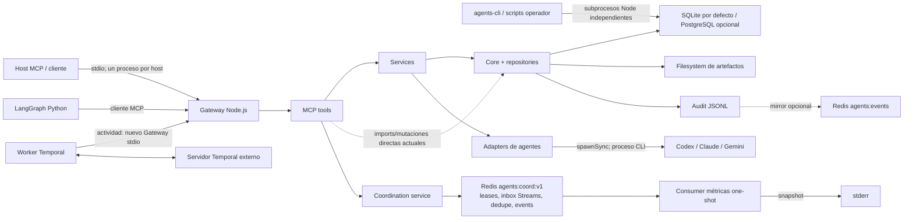
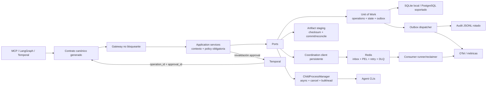

# Auditoría independiente de arquitectura e infraestructura — PROJECT V5

Model: gpt-5.6-sol

Reasoning: ultra

Execution profile: fast/priority

Snapshot: `develop` @ `d521afb12a6520b95f1a9fb172911b16ab77a1ff` (`/tmp/agents-orchestrator-v5-audit.dx0UlX/worktree`)

Independence: evaluación independiente del estado *as-built*; no se consultaron auditorías, revisiones ni informes previos.

Fecha: 2026-07-25

## Alcance, método y límites

Esta revisión cubre la arquitectura de software, los límites de componentes, los contratos, la persistencia, el plano de coordinación V5, Temporal/LangGraph, empaquetado, CI/CD, resiliencia, observabilidad y postura operativa del snapshot indicado. Se contrastaron las decisiones declaradas en `README.md`, `docs/architecture.md` y los ADR con la implementación, los manifiestos, las migraciones, los tests y la automatización existente; la documentación se trató como intención, no como prueba del comportamiento real.

La inspección fue estática y de solo lectura. No se conectó a Redis, PostgreSQL, Temporal, agentes reales ni hosts MCP compartidos, por lo que no se atribuyen cifras de latencia, capacidad o recuperación que el repositorio no demuestre. Tampoco se penaliza al proyecto por no ser una plataforma cloud cuando declara un alcance local y de operador único; sí se señalan los puntos que impiden sostener sus propias invariantes o evolucionar con seguridad hacia un uso compartido.

## Resumen ejecutivo

1. **Calificación global: C** para el alcance declarado de herramienta local y de operador único; la misma implementación sería **D** si se desplegara hoy como servicio compartido o de producción.
2. El proyecto conserva buenas decisiones de base —Gateway único, política determinista, ADR explícitos, SQLite con WAL y un protocolo Redis con fencing y Lua atómico—, pero varias de esas fronteras no están reforzadas por la estructura ejecutable.
3. La postura de resiliencia es **recuperable en algunos fallos locales pero no operada de extremo a extremo**: un proceso bloqueado, una escritura parcial o la pérdida del Redis único pueden detener o desalinear el flujo sin detección ni reparación automática suficiente.
4. El primer riesgo estructural es que el Gateway único ejecuta agentes mediante llamadas síncronas largas y, a la vez, permite rutas de mutación que no atraviesan uniformemente servicios y política, de modo que el punto central es tanto cuello de botella como frontera incompleta.
5. El segundo riesgo es la ausencia de una unidad de trabajo durable entre base de datos, archivos, JSONL, Temporal y eventos, agravada por una deduplicación Temporal en memoria y por señales de aprobación que no se revalidan contra el Gateway.
6. El tercer riesgo es operacional: la entrega Redis *at-least-once* no tiene presupuesto de reintentos ni DLQ, mientras Redis/PostgreSQL/Temporal reales quedan fuera del gate CI y la observabilidad se limita principalmente a `stderr`.
7. La primera oportunidad es convertir el monolito actual en un monolito modular realmente exigible, con `tools → application services → ports`, identidad/política obligatoria y contratos generados desde una sola fuente.
8. La segunda oportunidad es introducir claves de operación persistentes, *transactional outbox* y commits de artefacto recuperables para que los reintentos sean seguros en Gateway y Temporal.
9. La tercera oportunidad es operar el plano asíncrono con consumidor, reclaim, DLQ, retención, métricas y un lane CI con dependencias reales, sin añadir todavía microservicios, Kubernetes ni Redis Cluster.

## 1. Mapa de arquitectura *as-built*

### 1.1 Contexto y topología de ejecución

El Gateway es deliberadamente el punto de entrada MCP y se inicia sobre `stdio`; su composición crea configuración, estado, repositorios, auditoría, artefactos, sanitización y registro de herramientas en un mismo proceso (`gateway/src/mcp_server.js:187-228`). La arquitectura documentada prescribe que las herramientas deleguen en servicios, que los servicios implementen casos de uso y que los adapters no abran atajos alrededor del Gateway (`docs/architecture.md:8-27`). La implementación mantiene esa forma en varias rutas, pero no de manera uniforme: algunas herramientas importan y mutan repositorios/core directamente, y los adapters también evalúan política.

No existe un “orchestrator service” independiente: LangGraph es un peer que usa MCP y Temporal agrega durabilidad desde otro proceso, tal como declara el diseño (`docs/architecture.md:82-89`). Sin embargo, cada actividad Temporal abre un nuevo proceso Gateway por `stdio` (`orchestrator-langgraph/src/orchestrator_langgraph/activities.py:321-324`, `orchestrator-langgraph/src/orchestrator_langgraph/client/gateway_client.py:34-53`), por lo que composición, conexiones y caches son por actividad, no compartidos.

### 1.2 Componentes, responsabilidades y ownership efectivo

| Componente | Responsabilidad pretendida | Estado *as-built* y ownership de datos | Evidencia |
|---|---|---|---|
| Gateway MCP | Única frontera de control y mutación | Proceso Node local por host MCP; posee composición y exposición de tools, pero no todas las rutas atraviesan un servicio/policy uniforme | `README.md:60-100`; `gateway/src/mcp_server.js:187-228`; `gateway/src/tools/index.js:1-37` |
| Tools | Adaptación MCP, validación y delegación | Mezcla adaptación con policy, auditoría y acceso directo a repositorios/artefactos | `gateway/src/tools/artifact.js:1-6`; `gateway/src/tools/message.js:1-5`; `gateway/src/tools/session.js:1-3` |
| Services | Casos de uso y reglas de aplicación | Albergan flujos principales, pero algunos efectos quedan fuera de una unidad de trabajo y ciertas operaciones carecen de decisión policy | `gateway/src/services/orchestration_service.js:17-72`; `gateway/src/services/agent_service.js:103-222` |
| Core/repositories | Dominio, policy, storage y contratos internos | Núcleo reutilizable, aunque reúne política, DB, archivos, auditoría, telemetría y el protocolo Redis; `coordination_queue.js` concentra 2.000+ líneas | `gateway/src/core/policy_engine.js:313-353`; `gateway/src/core/coordination_queue.js:1-2176` |
| Agent adapters | Ejecutar/gestionar CLIs externas | Procesos síncronos y policy preflight dentro del adapter; bloquean el event loop del Gateway durante la ejecución | `gateway/src/adapters/claude_adapter.js:101-170`; `gateway/src/adapters/codex_adapter.js:85-93,218-244`; `gateway/src/adapters/gemini_adapter.js:66-120` |
| State backend | Estado de sesiones, tareas, approvals, mensajes y metadatos | SQLite local es el default; PostgreSQL opcional usa `psql` síncrono por operación | `gateway/src/core/state.js:14-77`; `gateway/src/core/postgres_db.js:1-75` |
| Artifact store | Contenido y metadatos de artefactos | Contenido en filesystem local; metadata en el backend DB; escritura y metadata no son atómicas | `gateway/src/core/artifact_store.js:85-123` |
| Audit | Trazabilidad append-only | JSONL local autoritativo de facto, con mirror Redis opcional y best-effort; no hay outbox ni rotación | `gateway/src/core/audit.js:69-91,240-273`; `docs/adr/ADR-V1-04-redis-streams-event-bus.md:23-43` |
| Redis coordination V5 | Identidad con lease, inbox por participante, dedupe, ACK y discovery | Redis dedicado y autoritativo mientras vive; Lua preserva atomicidad por operación, pero no existe fallback, DLQ ni consumidor gestionado | `docs/adr/ADR-V5-01-redis-coordination-plane.md:23-59,154-179,220-266`; `gateway/src/core/coordination_queue.js:268-560,900-1023` |
| LangGraph | Selección y orquestación de grafos | Peer MCP; el nodo no-Temporal consulta approvals del Gateway, pero sus contratos de cliente son diccionarios y nombres hardcoded | `orchestrator-langgraph/src/orchestrator_langgraph/nodes/approval.py:23-59`; `orchestrator-langgraph/src/orchestrator_langgraph/client/gateway_client.py:12-18,96-132` |
| Temporal worker | Reanudación durable de workflows | Workflow durable, pero idempotencia de actividades en memoria y aprobación mediante signal no revalidada | `orchestrator-langgraph/src/orchestrator_langgraph/activities.py:135-140,295-335`; `orchestrator-langgraph/src/orchestrator_langgraph/workflows.py:87-128,265-321` |
| Métricas/telemetría | Visibilidad de ejecución y coordinación | Spans “OTel-inspired” a `stderr`; consumer Redis lee una vez desde `$`, imprime snapshot y termina | `gateway/README.md:3-17`; `gateway/src/core/telemetry.js:122-149,214-227`; `orchestrator-langgraph/src/orchestrator_langgraph/consumers/metrics.py:122-183` |

### 1.3 Flujos y consistencia

| Flujo | Secuencia actual | Garantía real |
|---|---|---|
| Delegación de agente | Tool → service → adapter → CLI síncrona → session/audit | El CLI tiene timeout propio, pero bloquea el Gateway; no hay cancelación cooperativa ni bulkhead |
| Artefacto | Escribir fichero → persistir metadata → append audit | Puede quedar fichero huérfano, metadata apuntando a contenido ausente o acción exitosa con respuesta fallida |
| Approval | Persistir cambio → append audit → emitir evento en bus de proceso | Persistencia sobrevive; notificación no cruza procesos y el audit puede quedar desalineado |
| Mensaje legacy | DB con token de trace → audit | Persistencia y audit son dos commits; no hay outbox |
| Coordinación V5 | Lua Redis valida lease/capacidad/dedupe y escribe Stream/event metadata | Atomicidad fuerte dentro de Redis; entrega *at-least-once* y recuperación dependen del consumidor |
| Workflow Temporal | Actividad → Gateway subprocess → cache local del worker | Reejecución tras crash puede repetir efectos; el cache no es durable ni compartido |

### 1.4 Topología de datos y despliegue

SQLite activa WAL y claves foráneas (`gateway/src/core/state.js:70-77`), una base razonable para el modo local. PostgreSQL se selecciona por configuración, pero la implementación ejecuta `psql` síncrono para cada statement y aplica migraciones sin una abstracción transaccional compartida (`gateway/src/core/postgres_db.js:1-75`, `gateway/src/core/state.js:41-68`). Aun usando PostgreSQL, el contenido de artefactos continúa en disco local, por lo que no se obtiene una topología multi-host coherente.

`docker/docker-compose.yml` levanta solamente PostgreSQL y un Redis único con AOF, healthchecks, credenciales de desarrollo y puertos publicados (`docker/docker-compose.yml:1-49`). No hay imagen de la aplicación, Temporal, IaC, promoción de entornos, estrategia de rollout/rollback ni stack de observabilidad; esto es coherente con que cloud, multi-host y auth estén fuera de alcance (`README.md:174-193`), pero significa que el repositorio entrega código y un laboratorio local, no una unidad operable reproducible.

### 1.5 Intención frente a implementación

| Invariante declarada | Intención | Implementación observada | Evaluación |
|---|---|---|---|
| Gateway-only | Toda mutación/control/approval pasa por policy desde un service | Varias tools acceden a core/repos; `approval.respond`, `agent.kill` y otras rutas no muestran decisión policy equivalente | Parcial |
| Layers | Tools adaptan; services orquestan; adapters ejecutan | Tools y adapters contienen policy/audit/repos; no hay regla de imports automatizada | Parcial |
| Local-first | Sin dependencia cloud obligatoria | SQLite/filesystem y CLIs locales son default | Cumplida |
| PostgreSQL fallback | Backend opcional con fallback local | Si se selecciona PostgreSQL y falla, el startup falla; no hay fallback por indisponibilidad | Divergencia |
| Temporal durable | Reanudación con side effects a través del Gateway | El workflow es durable, los side effects no tienen idempotencia durable | Parcial |
| Redis coordination | Redis autoritativo, sin fallback silencioso, *at-least-once* | Lua/fencing/dedupe cumplen; operación de retries/DLQ queda en el caller | Parcial |
| Contratos versionados | Schemas compartidos definen interoperabilidad | Schemas se cargan en tests, no en runtime, y divergen en estados/campos/kinds | Incumplida |
| Observabilidad | Traces y métricas opcionales | Formato inspirado en OTel a `stderr`, sin SDK/exporter/backend/alertas | Nominal |

## 2. Auditoría de arquitectura e infraestructura

### 2.1 Escala de severidad

- **Crítica:** pérdida de control, datos o disponibilidad sistémica probable y sin mitigación razonable.
- **Alta:** viola una invariante central o puede producir indisponibilidad, duplicados o decisiones incorrectas en flujos principales.
- **Media:** limita resiliencia, escalabilidad, mantenibilidad o promoción operativa; el alcance local reduce el impacto inmediato.
- **Baja:** deuda o fricción acotada con workaround claro.

No se identificó una condición crítica bajo el alcance local y de operador único declarado. Se identificaron 9 hallazgos altos, 9 medios y 1 bajo.

### 2.2 Hallazgos de severidad alta

#### A-01 — El Gateway único puede quedar indisponible durante una ejecución de agente

**Hecho.** Claude, Codex y Gemini se ejecutan con APIs síncronas (`spawnSync`) y timeouts de hasta el valor global configurado (`gateway/src/adapters/claude_adapter.js:159-170`, `gateway/src/adapters/codex_adapter.js:218-244`, `gateway/src/adapters/gemini_adapter.js:108-120`). El service envuelve la llamada con `_withTimeout` (`gateway/src/services/agent_service.js:117-141`), pero esa utilidad es un `Promise.race` con timer y no puede preemptar ni cancelar trabajo que bloquea el event loop (`gateway/src/services/_with_timeout.js:1-11`).

**Juicio.** La frontera central de control es también una sección crítica bloqueante. El timeout interno del proceso limita la duración absoluta, pero el timeout del service no aporta cancelación y el mismo proceso no puede atender tools, approvals, heartbeats o mensajes mientras `spawnSync` está activo.

**Consecuencia.** Una delegación lenta puede inmovilizar el Gateway durante minutos, hacer expirar leases Redis, retrasar approvals y convertir una sola llamada en fallo de disponibilidad para todos los consumidores de ese proceso.

**Recomendación.** Sustituir `spawnSync` por un `ChildProcessManager` asíncrono con `AbortSignal`, deadline, escalado `SIGTERM → SIGKILL`, límites de concurrencia por adapter y registro durable del proceso. Añadir una prueba que mantenga una ejecución artificialmente larga y demuestre que `health`, `coordination.heartbeat` y `approval.get` siguen respondiendo.

#### A-02 — La invariante Gateway/policy depende de disciplina manual y tiene rutas de bypass

**Hecho.** El ADR exige que toda mutación, control o approval pase por `policy_engine` invocado desde un service, con tools que solo delegan (`docs/adr/ADR-001-gateway-only.md:12-27`). Sin embargo, `artifact`, `message` y `session` importan core/repos/audit y realizan trabajo de aplicación en la tool (`gateway/src/tools/artifact.js:1-6,58-126`, `gateway/src/tools/message.js:1-5,23-101`, `gateway/src/tools/session.js:1-3,5-42`). `approval.respond` invoca el service sin actor/contexto de policy (`gateway/src/tools/approval.js:19-29`), y `agent.kill`/`view` no muestran una evaluación policy equivalente a `spawn/delegate` (`gateway/src/services/agent_service.js:103-222`). Los adapters vuelven a importar y evaluar policy (`gateway/src/adapters/claude_adapter.js:12-13,101-141`, `gateway/src/adapters/codex_adapter.js:14-15,85-93`, `gateway/src/adapters/gemini_adapter.js:12-13,66-74`).

**Juicio.** “Gateway-only” sí restringe el canal de entrada, pero no constituye todavía una frontera de autorización estructural. La política está dispersa en tools, services y adapters, y la arquitectura no distingue con precisión capacidades de operador confiable frente a acciones expuestas a un cliente MCP/LLM.

**Consecuencia.** Una nueva tool puede introducir una mutación sin policy sin romper CI; approvals y controles pueden aplicar una autoridad distinta según el camino elegido, y auditar “quién pudo hacer qué” exige reconstruir lógica distribuida.

**Recomendación.** Crear un contexto de llamada tipado (`actor`, `role`, `session`, `operation_id`, `trace_id`) y exigir que toda mutación entre por un application service que produzca exactamente una decisión policy auditable. Definir excepciones de operador como capacidades explícitas, no bypass implícitos, y añadir reglas automáticas de imports y tests de cobertura de decisiones.

#### A-03 — Los efectos DB, filesystem y audit no forman una unidad atómica o recuperable

**Hecho.** Un artefacto escribe primero contenido y después metadata y audit (`gateway/src/core/artifact_store.js:85-123`). Orquestaciones, tareas y approvals persisten estado y luego hacen append del evento de audit (`gateway/src/services/orchestration_service.js:17-72`, `gateway/src/services/task_service.js:81-104`, `gateway/src/services/approval_service.js:74-100`). El append JSONL es síncrono y puede lanzar error (`gateway/src/core/audit.js:69-91`); no hay transacción que incluya ambos recursos ni outbox durable.

**Juicio.** La secuencia ordena los efectos, pero no define cómo detectar y reparar un corte entre ellos. En particular, “estado aplicado + audit fallido” puede devolverse como error al cliente, que entonces reintenta una operación ya aplicada.

**Consecuencia.** Son posibles artefactos huérfanos, metadata rota, acciones sin registro permanente, duplicados por retry y estados de approval que no coinciden con la historia de auditoría.

**Recomendación.** Introducir una unidad de trabajo DB con `operations` y `outbox`, registrar estado + evento en una misma transacción, y despachar JSONL/Redis de forma reintentable. Para archivos, usar staging, checksum, rename atómico y un reconciliador que complete o elimine entradas incompletas.

#### A-04 — La idempotencia de actividades Temporal se pierde al reiniciar el worker

**Hecho.** El runner de actividades usa un cache en memoria (`orchestrator-langgraph/src/orchestrator_langgraph/activities.py:135-140`) alrededor de llamadas al Gateway (`orchestrator-langgraph/src/orchestrator_langgraph/activities.py:295-335`). Cada llamada abre un Gateway MCP nuevo (`orchestrator-langgraph/src/orchestrator_langgraph/activities.py:321-324`), y el workflow permite reintento de actividad (`orchestrator-langgraph/src/orchestrator_langgraph/workflows.py:60-84,101-109`). El propio ADR reconoce que un crash después del side effect y antes de completar la actividad puede repetirlo (`docs/adr/ADR-V1-05-temporal-durable-workflows.md:44-48,70-82`).

**Juicio.** Temporal garantiza reejecución, no *exactly-once*. El cache actual reduce duplicados dentro de un proceso sano, pero no es una clave de idempotencia durable y compartida con el sistema que ejecuta el efecto.

**Consecuencia.** Un crash puede duplicar `agent.delegate`, solicitudes de approval, checkpoints o artefactos. La probabilidad aumenta precisamente durante fallos, cuando la reanudación durable debería aportar seguridad.

**Recomendación.** Derivar un `operation_id` determinista de workflow/run/activity/intento semántico, enviarlo en cada comando Gateway y persistir resultado/estado en la misma DB del efecto. Un retry debe devolver el resultado previo o continuar una operación conocida, no volver a ejecutar ciegamente.

#### A-05 — El workflow Temporal confía en una señal de aprobación no anclada al estado del Gateway

**Hecho.** El signal handler acepta y almacena un diccionario (`orchestrator-langgraph/src/orchestrator_langgraph/workflows.py:87-95`); el workflow espera esa señal (`orchestrator-langgraph/src/orchestrator_langgraph/workflows.py:111-128`) y usa su `status` para continuar después de solicitar approval (`orchestrator-langgraph/src/orchestrator_langgraph/workflows.py:265-321`). No reconsulta el approval por ID antes de producir checkpoint/push intent (`orchestrator-langgraph/src/orchestrator_langgraph/workflows.py:350-401`). El nodo LangGraph no-Temporal sí consulta al Gateway (`orchestrator-langgraph/src/orchestrator_langgraph/nodes/approval.py:23-59`). El “push” actual es un artefacto dry-run, no un `git push` real (`orchestrator-langgraph/src/orchestrator_langgraph/activities.py:226-254`).

**Juicio.** Hay dos fuentes de verdad para una decisión protegida: la entidad approval en Gateway y un payload de señal Temporal. El impacto presente está acotado porque el efecto final es `push_intent`, pero la frontera fallará en cuanto se conecte un efecto real.

**Consecuencia.** El workflow puede registrar `approval_granted` y avanzar mientras el Gateway mantiene el approval pendiente, denegado o asociado a otro sujeto.

**Recomendación.** Hacer que la señal contenga solo un wake-up y `approval_id`; al despertar, consultar Gateway y verificar ID, subject, actor autorizado, estado terminal y versión/fence. Rechazar señales huérfanas o discordantes y registrar el vínculo en el historial.

#### A-06 — La entrega *at-least-once* de Redis no tiene política operativa de poison messages ni DLQ

**Hecho.** `receive` solo reclama mensajes pendientes cuando el caller proporciona `reclaimIdleMs` (`gateway/src/services/coordination_service.js:396-437`, `gateway/src/core/coordination_queue.js:1956-2001`). El contrato declara entrega *at-least-once* e idempotencia manual del consumidor (`docs/adr/ADR-V5-01-redis-coordination-plane.md:220-249`), pero el key model no incluye DLQ ni contador/presupuesto de redeliveries (`docs/adr/ADR-V5-01-redis-coordination-plane.md:154-179`). El ACK elimina el entry del Stream después de validar ownership/fence (`gateway/src/core/coordination_queue.js:997-1023`).

**Juicio.** Las primitivas de cola son sólidas, pero el sistema entrega una librería, no una operación completa del consumidor. No existe un componente responsable de reclaim periódico, backoff, límite de intentos, cuarentena o alarma.

**Consecuencia.** Un mensaje poison puede permanecer en PEL indefinidamente, ser reclamado sin fin o bloquear capacidad hasta que los sends fallen; la recuperación depende de que cada agente implemente correctamente el mismo protocolo.

**Recomendación.** Añadir un runner de consumo con idempotencia semántica, metadata de intentos, reclaim con jitter, `max_deliveries`, DLQ por inbox y herramientas de inspección/replay autorizadas. Medir PEL age, redeliveries, DLQ depth e inbox utilization.

#### A-07 — El gate CI no prueba las dependencias que definen la arquitectura V5

**Hecho.** GitHub Actions instala y ejecuta el gate local sin levantar servicios (`.github/workflows/ci.yml:16-48`). El ADR de CI excluye agentes/tmux/Temporal/Redis/PostgreSQL reales (`docs/adr/ADR-007-remote-ci-safety-net.md:14-16`). PostgreSQL live es opt-in (`docs/v1-postgres-repository-tests.md:7-50`), los tests Redis se saltan sin `AGENTS_TEST_REDIS_URL` (`tests/gateway/coordination_queue_ack_live.test.js:15-20,86-89`; `tests/gateway/coordination_two_instance_live.test.js:15-20,182-183`) y Temporal también se documenta como harness opt-in (`docs/adr/ADR-V1-05-temporal-durable-workflows.md:50-68`).

**Juicio.** Los tests unitarios validan mucha lógica Lua y de contrato, pero una release V5 puede quedar verde sin probar Redis 7, wire protocol, concurrencia entre procesos, PostgreSQL real, migraciones o crash/retry Temporal.

**Consecuencia.** Incompatibilidades de runtime, carreras y fallos de recuperación aparecen solo en la máquina del operador; el área de mayor riesgo queda fuera del criterio de merge.

**Recomendación.** Mantener un lane rápido hermético y añadir un lane de integración obligatorio con Redis 7 y PostgreSQL desechables, más un lane Temporal periódico/required para cambios en workflow. Las pruebas deben usar namespaces únicos, inyectar fallos y publicar logs/diagnósticos como artefactos.

#### A-08 — No existe un bucle de observabilidad operable

**Hecho.** El Gateway declara telemetría “OTel-inspired”, sin SDK ni OTLP (`gateway/README.md:3-17`), y sus exporters son no-op o `stderr` (`gateway/src/core/telemetry.js:122-149,214-227`). Python replica un modelo de spans a `stderr` (`orchestrator-langgraph/src/orchestrator_langgraph/telemetry.py:47-50,155-166`). El consumer de métricas comienza en `$`, ejecuta una sola lectura y termina tras imprimir un snapshot (`orchestrator-langgraph/src/orchestrator_langgraph/consumers/metrics.py:122-183`). No se encontraron backend de métricas, dashboards, SLO, alertas ni persistencia de cursor.

**Juicio.** Hay instrumentación útil para depuración, pero no observabilidad: no se puede relacionar disponibilidad, backlog, errores y latencia a lo largo del tiempo ni detectar una degradación sin mirar manualmente procesos.

**Consecuencia.** Expiración de leases, inbox lleno, PEL envejecido, reintentos Temporal, caída del mirror o bloqueo del Gateway pueden pasar inadvertidos; reiniciar el consumer pierde todo evento anterior a su nuevo `$`.

**Recomendación.** Adoptar OTel real o una salida Prometheus mínima, con contexto propagado Gateway↔Temporal↔Redis, métricas RED/USE, cursor/grupo durable para consumidores y alertas sobre disponibilidad, latencia, errores, backlog, lease churn y capacidad. Definir primero pocos SLO ligados a flujos, no un catálogo de métricas.

#### A-09 — Los schemas versionados no son la fuente de verdad del runtime

**Hecho.** Los JSON Schemas se cargan en tests, no en la composición productiva (`tests/gateway/schemas.test.js:19-67`). `task.schema.json` permite `queued/running/blocked/...`, mientras el service y la migración usan `pending` (`schemas/task.schema.json:7-17`, `gateway/src/services/task_service.js:81-91`, `gateway/migrations/001_initial.sql:19-27`). El schema de artefacto enumera kinds concretos y exige `path`, pero la tool acepta cualquier string, oculta path y LangGraph emite kinds adicionales (`schemas/artifact.schema.json:7-29`, `gateway/src/tools/artifact.js:8-15,34-38,60-71`, `orchestrator-langgraph/src/orchestrator_langgraph/activities.py:238-285`). El schema de mensaje usa `from/to`, mientras la tool retorna `fromId/toId` (`schemas/message.schema.json:7-16`, `gateway/src/tools/message.js:11-20`). La conversión Zod→MCP descarta restricciones como mínimos, máximos y regex (`gateway/src/tools/tool_helpers.js:16-40`).

**Juicio.** Existen tres contratos incompatibles: Zod runtime, JSON Schema versionado y diccionarios Python hardcoded. La suite comprueba que los archivos son válidos, no que describan el wire real.

**Consecuencia.** Un cliente generado desde `schemas/` puede aceptar estados que el DB rechaza o rechazar respuestas válidas; cambios incompatibles no tienen un detector fiable.

**Recomendación.** Elegir una fuente canónica, generar desde ella el schema MCP/JSON, validadores y tipos Python, y añadir golden tests request/response contra el Gateway real. Versionar cambios incompatibles y conservar compatibilidad explícita o migración.

### 2.3 Hallazgos de severidad media

#### A-10 — El backend PostgreSQL es un scaffold de desarrollo, no un backend operacional equivalente

**Hecho.** El adapter materializa parámetros y ejecuta `psql` síncronamente por sentencia, sin pool ni API de transacción (`gateway/src/core/postgres_db.js:1-75`). Las migraciones se recorren al inicializar (`gateway/src/core/state.js:41-57`), y seleccionar PostgreSQL no hace fallback a SQLite si el servicio está indisponible (`gateway/src/core/state.js:60-68`), pese a que el ADR describe una postura de backend opcional/fallback (`docs/adr/ADR-V1-03-postgres-state-backend.md:22-43`).

**Juicio.** Es suficiente como prueba de compatibilidad SQL, pero el nombre de backend sugiere propiedades —pooling, transacciones, migración concurrente, errores tipados— que no están implementadas. El alcance “experimental” del README reduce la severidad (`README.md:182-193`).

**Consecuencia.** Cada query paga creación de proceso, una operación larga bloquea Node, dos starters pueden competir por migraciones y el modo seleccionado falla en boot en vez de degradar según la intención documentada.

**Recomendación.** O bien declarar y aislar PostgreSQL inequívocamente como experimental, o sustituir `psql` por driver/pool, transacciones y lock/versionado de migraciones. Decidir explícitamente entre fail-fast y fallback; un fallback silencioso con dos stores sería peor.

#### A-11 — Metadata compartida y contenido local impiden una unidad de datos multi-host y complican DR

**Hecho.** El backend de metadata puede ser PostgreSQL, pero el artifact store siempre usa rutas locales (`gateway/src/core/artifact_store.js:85-123`). Audit vive en JSONL local, con Redis solo como mirror opcional (`docs/adr/ADR-V1-04-redis-streams-event-bus.md:23-43`).

**Juicio.** Esto es correcto para workstation, pero PostgreSQL no convierte el sistema en distribuido: dos Gateways pueden ver metadata común y no el mismo contenido o audit.

**Consecuencia.** Backup/restore requiere coordinar DB, filesystem y JSONL a un punto consistente; un host nuevo puede recuperar filas que apuntan a archivos inexistentes.

**Recomendación.** Documentar el “data recovery set” y probar su restore. Antes de multi-host, introducir un port de object store o un volumen compartido con checksum/versionado y reconciliación; no añadirlo para el modo local si no existe ese requisito.

#### A-12 — Redis es un punto único de fallo explícito del plano de coordinación

**Hecho.** V5 soporta una instancia/shard y declara Redis autoritativo sin fallback (`gateway/src/core/coordination_contract.js:46-49`; `docs/adr/ADR-V5-01-redis-coordination-plane.md:44-47,302-308`). Compose ofrece un Redis con AOF y volumen local, pero sin réplica o procedimiento de restauración (`docker/docker-compose.yml:27-45`).

**Juicio.** La decisión de fallar explícitamente es mejor que degradar a semánticas distintas, y es proporcionada al modo local. Sigue siendo un límite de disponibilidad: sesiones DB pueden sobrevivir mientras identidad, leases e inboxes desaparecen o quedan inaccesibles.

**Consecuencia.** Una caída de Redis detiene coordinación; una pérdida del volumen borra el plano efímero y exige re-registro/reconciliación que no está automatizada ni ensayada.

**Recomendación.** Definir RPO/RTO y un runbook de restart/re-register. Si el SLO futuro lo exige, usar persistencia/backup y Sentinel o servicio gestionado antes de considerar Cluster; el protocolo Lua multi-key debe revisarse antes de sharding.

#### A-13 — El acceso Redis por operación y discovery global fijan un techo de escala innecesariamente bajo

**Hecho.** El cliente Redis se crea/conecta/cierra por operación (`gateway/src/core/coordination_queue.js:2140-2169`). Discovery recorre el set de participantes con `SSCAN` y ejecuta Lua por lotes (`gateway/src/core/coordination_queue.js:1719-1805`). El ADR reconoce este diseño simple y su límite topológico (`docs/adr/ADR-V5-01-redis-coordination-plane.md:302-333`).

**Juicio.** Es adecuado para pocos agentes locales y favorece aislamiento de tests, pero multiplica handshakes, dificulta backpressure y hace O(N) el camino de discovery.

**Consecuencia.** Con churn o decenas/centenas de participantes, latencia y carga crecerán antes que el trabajo útil; un burst abre muchas conexiones cortas.

**Recomendación.** Mantener un cliente por Gateway con lifecycle/reconnect controlado y cierre en shutdown. Medir antes de indexar; si discovery domina, añadir índices por capability/role mantenidos atómicamente en los mismos scripts.

#### A-14 — Retención, compactación y limpieza no tienen ownership operativo

**Hecho.** El Stream de eventos de coordinación es no acotado por diseño (`docs/adr/ADR-V5-01-redis-coordination-plane.md:200-214`), la limpieza de inboxes expirados ocurre de forma oportunista en discovery/unregister (`docs/adr/ADR-V5-01-redis-coordination-plane.md:142-147`) y las consultas de audit recorren el JSONL completo (`gateway/src/core/audit.js:240-273`). No se encontró política de rotación, cuota, archivado o reaper gestionado.

**Juicio.** El crecimiento es lento en pruebas, pero todos los stores append-only convierten el tiempo de vida del proyecto en una dimensión de capacidad no controlada.

**Consecuencia.** Disco y memoria Redis crecen, las consultas de audit se degradan y keys huérfanas permanecen hasta que una operación casual las toca.

**Recomendación.** Definir ventanas de retención por clase, `MAXLEN`/trim seguro para telemetría no autoritativa, rotación/compresión de JSONL y un reaper idempotente con dry-run, métricas y presupuesto de trabajo.

#### A-15 — La notificación de approval es local al proceso y no coincide con el modelo multiproceso real

**Hecho.** `approvalBus` es un `EventEmitter` en memoria (`gateway/src/services/approval_service.js:1-7`) y `wait` escucha ese bus, consultando persistencia solo al vencer el timeout (`gateway/src/services/approval_service.js:114-149`). La CLI de operador lanza un script Node separado (`cli/src/agents_cli/main.py:203-247`, `gateway/scripts/approval-respond.mjs:1-27`).

**Juicio.** Un approval respondido desde la vía operacional normal no puede despertar inmediatamente al Gateway que está esperando; la DB conserva corrección eventual, pero el event bus induce una expectativa falsa de coordinación cross-process.

**Consecuencia.** El caller espera hasta timeout aunque el approval ya esté resuelto, aumentando latencia y reintentos.

**Recomendación.** Reemplazar la espera por polling DB acotado con backoff o por una notificación cross-process durable; conservar la DB como fuente de verdad y tratar la señal solo como wake-up.

#### A-16 — El repositorio no produce todavía una unidad desplegable ni un camino de rollback

**Hecho.** Compose contiene solo Redis/PostgreSQL (`docker/docker-compose.yml:1-49`); el inventario no contiene Dockerfile de Gateway/worker, servicio Temporal, IaC, promoción de entornos o automatización de rollback. CI ejecuta tests, no construye ni verifica un artefacto de release (`.github/workflows/ci.yml:16-48`). Cloud, multi-host y auth están expresamente fuera de alcance (`README.md:174-193`).

**Juicio.** No es un defecto para una herramienta instalada desde source en una workstation. Sí impide afirmar que una versión es reproducible u operable fuera de la máquina del autor y hace costoso ensayar recovery.

**Consecuencia.** Versiones de Node/Python/CLIs y configuración del host forman parte implícita del producto; no existe smoke test del artefacto que se ejecutará ni vuelta atrás definida.

**Recomendación.** Crear primero un perfil Compose/devcontainer reproducible con Gateway, worker y dependencias, healthchecks y configuración inyectada. Solo si aparece un entorno compartido, evolucionar ese artefacto a despliegue y rollback; no introducir Kubernetes por anticipación.

#### A-17 — La reproducibilidad Python declarada no se aplica en CI y falta trazabilidad de supply chain

**Hecho.** El README prescribe lockfiles para instalaciones reproducibles (`README.md:15-34`), pero CI instala los pyprojects editables resolviendo dependencias en ese momento (`.github/workflows/ci.yml:38-43`), y un test estructura exige esa forma exacta (`tests/structure/test_ci_gate.py:38-46`). Node sí usa `npm ci`; las actions se referencian por tags mayores (`.github/workflows/ci.yml:22-35`). No se construye SBOM, attestation ni artefacto firmado.

**Juicio.** La mitad Node tiene un gate más reproducible que Python. Para el alcance local, SBOM/firma es hardening, pero ignorar el lock en el gate ya permite deriva real.

**Consecuencia.** Dos ejecuciones del mismo commit pueden resolver versiones Python distintas; un fallo o compromiso upstream entra sin cambio de repositorio y es difícil reconstruir qué se probó.

**Recomendación.** Sincronizar CI desde los locks y comprobar que están actualizados. Pinnear actions por SHA y generar SBOM/provenance cuando exista un artefacto distribuible.

#### A-18 — Los defaults de Compose no constituyen una frontera de red segura fuera de localhost

**Hecho.** Compose publica PostgreSQL y Redis en puertos del host y usa credenciales de desarrollo (`docker/docker-compose.yml:1-49`). El ADR V5 exige ACL, TLS y aislamiento de red para un despliegue fuera del contexto local confiable (`docs/adr/ADR-V5-01-redis-coordination-plane.md:268-320`).

**Juicio.** Es aceptable como laboratorio explícitamente local, pero fácil de copiar como plantilla de despliegue. Redis contiene identidad, leases e inboxes, por lo que no es “solo cache”.

**Consecuencia.** Si el bind del runtime expone esos puertos en una red compartida, otro actor puede leer/manipular coordinación o acceder al estado con secretos previsibles.

**Recomendación.** Limitar binds a loopback en el perfil local, generar secretos y añadir un perfil separado para red compartida con ACL/TLS/firewall. Marcar el compose como desarrollo y hacer que el startup rechace defaults inseguros en modos no locales.

### 2.4 Hallazgo de severidad baja

#### A-19 — La configuración MCP versionada contiene una ruta personal absoluta

**Hecho.** `.mcp.json` referencia `/home/carase/...` y habilita modo real/auto-approve (`.mcp.json:1-16`), mientras otros ejemplos usan rutas relativas.

**Juicio.** Es una fricción de portabilidad más que un fallo sistémico, pero mezcla configuración personal con una plantilla compartida y puede activar capacidades diferentes según el host.

**Consecuencia.** Un checkout nuevo no arranca con la configuración versionada; usuarios tienden a copiar/editar el archivo y acumulan drift no visible.

**Recomendación.** Usar un wrapper relativo al repo o una variable explícita, separar ejemplo de configuración local ignorada y mantener defaults conservadores.

### 2.5 Fortalezas que conviene preservar

1. **Decisiones y alcance explícitos.** Los ADR describen autoridad, fallos y límites, y el README no presenta como producción lo que es experimental (`README.md:174-193`; `docs/adr/ADR-V5-01-redis-coordination-plane.md:23-59`).
2. **Política determinista y testeable.** El pipeline de policy valida y compone reglas de forma pura antes de decidir (`gateway/src/core/policy_engine.js:313-353`); debe centralizarse, no reemplazarse.
3. **SQLite local bien configurado.** WAL, foreign keys y migraciones/repositories dan una base proporcionada al modo workstation (`gateway/src/core/state.js:14-77`).
4. **Protocolo Redis cuidadoso.** Namespace/encoding, leases con fence, capacidad, dedupe y ACK se validan atómicamente con Lua (`gateway/src/core/coordination_contract.js:57-96`; `gateway/src/core/coordination_queue.js:115-173,268-560,900-1023`).
5. **Fallo explícito del plano Redis.** El sistema no finge semántica equivalente cuando Redis falta; las tools no relacionadas pueden seguir operando (`docs/adr/ADR-V5-01-redis-coordination-plane.md:44-59`).
6. **Tests de contrato y live bien aislados.** Aunque los live no son gate, usan prefijos/entornos opt-in y cubren ACK y escenarios de dos instancias (`tests/gateway/coordination_queue_ack_live.test.js:15-20`; `tests/gateway/coordination_two_instance_live.test.js:15-20`).
7. **Ausencia de ciclos estáticos locales.** El grafo de imports JS inspeccionado no mostró ciclos; la deuda es dirección de dependencias, no una maraña circular.
8. **CI de mínimo privilegio y lock Node.** El workflow limita permisos y usa `npm ci` (`.github/workflows/ci.yml:13-48`); es una base útil para ampliar el gate.
9. **Temporal mantiene determinismo del workflow.** Las llamadas con side effects están encapsuladas como actividades y el ADR documenta honestamente la ventana de duplicación (`docs/adr/ADR-V1-05-temporal-durable-workflows.md:21-48,70-82`).

## 3. Estrategia de arquitectura

### 3.1 Principio rector

**Conservar un monolito modular local-first y hacer durables, exigibles y observables sus fronteras antes de distribuirlo.** El objetivo no es multiplicar servicios, sino garantizar que una operación entra una vez por el Gateway, recibe una decisión de policy, aplica efectos idempotentes/recuperables y deja evidencia consultable incluso bajo retry o crash.

### 3.2 Estado objetivo

Este estado mantiene MCP `stdio`, SQLite y filesystem como defaults. PostgreSQL, Temporal y Redis siguen siendo opcionales, pero cuando se habilitan tienen una definición de soporte comprobable y no cambian las invariantes de autorización, idempotencia o auditoría.

### 3.3 Temas estratégicos y definición de “hecho”

| Tema | Cambio de arquitectura | Fitness functions | Se considera hecho cuando |
|---|---|---|---|
| T1. Gateway como kernel exigible | `tools → application services → ports`; contexto de actor; policy única; contrato canónico | Regla de imports; inventario automático de tools mutantes; request/response golden tests; cero bypass no documentado | Toda mutación genera una decisión policy con actor/operation/trace, y CI falla ante un acceso directo nuevo |
| T2. Efectos durables y consistentes | `operation_id`, unit of work, outbox, artefacto staged/checksum, idempotencia Temporal | Fault injection después de cada efecto; retry devuelve mismo resultado; reconciliador llega a cero pendientes | Crash/retry no duplica side effects ni pierde audit; DB/filesystem pueden restaurarse a un conjunto consistente |
| T3. Asincronía operada | Gateway no bloqueante; Redis runner, reclaim, retry budget, DLQ y retención; approval revalidado | Health/heartbeat durante agent run; poison-message test; PEL/DLQ/capacity metrics; signal discordante rechazada | Un consumer muerto se recupera sin pérdida, un poison se cuarentena y ninguna señal sustituye a la fuente de verdad |
| T4. Entrega y observabilidad reproducibles | Locks en CI, servicios reales, artefacto ejecutable, OTel/métricas, SLO y restore drill | Mismo commit→mismos deps; integration lane; smoke test del artefacto; alert tests; restore periódico | La versión probada es la ejecutada, fallos principales generan señal accionable y el restore cumple RPO/RTO |

### 3.4 Fitness functions concretas

1. **Boundary test:** ninguna `gateway/src/tools/**` puede importar repositories, DB, audit, artifact store o adapters; solo schemas/DTO y application services, salvo allowlist temporal decreciente.
2. **Policy coverage:** cada tool marcada `mutation|control|approval` debe producir exactamente una decisión con `actor_id`, `role`, `operation_id`, `resource` y `outcome`; una excepción exige capability y ADR.
3. **Wire compatibility:** ejemplos reales del Gateway validan el contrato canónico, y el cliente Python generado ejecuta los mismos golden cases.
4. **Non-blocking liveness:** mientras un agent fixture tarda más que su deadline, p95 de `health`, `approval.get` y `coordination.heartbeat` local permanece bajo un objetivo acordado.
5. **Idempotency:** repetir 100 veces el mismo `operation_id`, incluyendo kill/restart entre pasos, produce una única entidad/artefacto/approval y el mismo resultado observable.
6. **Outbox recovery:** fallar antes/después de commit, append JSONL, publish Redis y rename de archivo converge mediante replay/reconciliación sin huecos ni duplicados semánticos.
7. **Temporal crash safety:** matar el worker después del side effect y antes del ACK no repite el efecto al reanudar.
8. **Approval integrity:** una signal con ID, subject, versión o estado discordante jamás habilita el paso protegido.
9. **Queue recovery:** matar un consumer deja el mensaje pending; otro lo reclama, y al superar `max_deliveries` termina en DLQ con payload/trace recuperables.
10. **Capacity/retention:** tests de soak demuestran límites de Stream, JSONL y keys huérfanas; reaper y rotación no rompen ACK/dedupe.
11. **Integration gate:** Redis 7, PostgreSQL y el workflow Temporal mínimo se ejecutan en entornos desechables con diagnóstico publicado.
12. **Restore:** un backup de DB + artifacts + audit se restaura en un directorio vacío y pasa validación de checksums/referencias dentro de RPO/RTO.

### 3.5 Trade-offs y decisiones de no hacer todavía

- **No dividir en microservicios.** Los problemas actuales son fronteras no exigidas y efectos no durables; separar procesos aumentaría fallos distribuidos antes de resolverlos.
- **No introducir Kubernetes ni multi-región.** No hay SLO, tenancy ni volumen que lo justifique; un perfil Compose reproducible cubre el siguiente paso.
- **No adoptar Redis Cluster aún.** El protocolo depende de Lua multi-key y el alcance es pequeño; cliente persistente, backup y quizá Sentinel son pasos previos.
- **No forzar PostgreSQL como default.** SQLite encaja con local-first. PostgreSQL debe madurar como opción real o permanecer experimental, sin crear dos caminos de comportamiento ambiguo.
- **No sustituir MCP `stdio` por una API de red.** Eso ampliaría la superficie de auth/tenancy; solo debe evaluarse si aparece un requisito multiusuario.
- **No convertir el mirror Redis de audit en autoridad.** Primero hay que consolidar DB/outbox/JSONL y definir retención; añadir otra fuente de verdad empeoraría la reconciliación.
- **No añadir un object store por anticipación.** Se necesita un port y un recovery set claros, pero el backend remoto solo tiene sentido con multi-host o RPO que lo exija.

## 4. Plan detallado

### 4.1 Convenciones

- **Esfuerzo S:** menos de 2 horas.
- **Esfuerzo M:** hasta media jornada.
- **Esfuerzo L:** 1–2 días de una persona con conocimiento del repositorio.
- **Blast radius bajo/medio/alto:** alcance probable de una regresión si el cambio falla.
- Los hitos son secuenciales en sus invariantes, no necesariamente en todos sus tickets; M0 debe aterrizar antes de cambiar semántica.

### 4.2 Milestone 0 — Baseline y guardrails

| ID | Título y descripción | Archivos/componentes | Criterios de aceptación | Esfuerzo | Blast | Dependencias |
|---|---|---|---|---|---|---|
| M0.1 | **Mapa de tools y policy.** Clasificar cada tool como read/mutation/control/approval y documentar su service/policy path actual | `gateway/src/tools/**`, `gateway/src/services/**`, `policies/**` | Inventario completo en test data; CI falla si aparece una tool no clasificada | M | Bajo | Ninguna |
| M0.2 | **Regla de dependencias.** Añadir test/ESLint para impedir nuevos imports tool→core/repos/adapters, con allowlist temporal de deuda existente | `gateway/eslint.config.js`, `tests/structure/**`, tools | Un bypass nuevo rompe CI; allowlist enumera propietario y ticket de retirada | M | Bajo | M0.1 |
| M0.3 | **Baseline de contrato real.** Capturar schemas request/response de tools y validar ejemplos runtime contra `schemas/` | `schemas/**`, `tool_helpers.js`, tests Gateway, cliente Python | El test reproduce y enumera todas las divergencias actuales; no se aceptan nuevas | L | Bajo | Ninguna |
| M0.4 | **Locks Python en CI.** Instalar exactamente dependencias bloqueadas y comprobar drift | `.github/workflows/ci.yml`, `requirements.lock`, pyprojects, test CI | Dos runs usan las mismas versiones; lock desactualizado falla con mensaje accionable | S | Bajo | Ninguna |
| M0.5 | **Lane de integración Redis/PostgreSQL.** Levantar servicios desechables, ejecutar migraciones y tests live con namespaces únicos | CI, compose, tests live | Lane required para cambios de core/coordination/state; logs y health se adjuntan al fallo | L | Bajo | M0.4 |
| M0.6 | **Harness Temporal de crash.** Automatizar servidor/worker/workflow mínimo y puntos de kill controlados | Temporal tests, workflows, activities, CI | El test demuestra primero el duplicado conocido y queda como gate del fix | L | Bajo | M0.4 |
| M0.7 | **Objetivos operativos.** Acordar support matrix, SLO inicial, RPO/RTO y límite de concurrencia | README/ADR/runbooks | Decisión firmada para local y, si aplica, shared; cada objetivo tiene owner y señal medible | M | Bajo | Preguntas abiertas |

### 4.3 Milestone 1 — Contener riesgos de corrección y disponibilidad

| ID | Título y descripción | Archivos/componentes | Criterios de aceptación | Esfuerzo | Blast | Dependencias |
|---|---|---|---|---|---|---|
| M1.1 | **ChildProcessManager asíncrono.** Implementar spawn async, deadlines, cancelación y registro de hijos; migrar Codex como piloto | `gateway/src/adapters`, nuevo port/adapter, `agent_service` | Codex se cancela en deadline; Gateway responde durante ejecución; no quedan procesos huérfanos | L | Alto | M0.1, M0.2 |
| M1.2 | **Migrar Claude/Gemini y añadir bulkheads.** Completar adapters y límites global/por adapter | adapters, config, health | Fixtures concurrentes respetan límites; queue/backpressure y shutdown son deterministas | L | Alto | M1.1 |
| M1.3 | **Contexto y enforcement policy único.** Introducir call context/capabilities y mover `artifact/message/session/approval/kill` a services | tools, services, policy, DTO | Cero import en allowlist; toda mutación registra una decisión; tests de rol cubren deny/allow | L | Alto | M0.1, M0.2 |
| M1.4 | **Registro durable de operaciones.** Añadir tabla/repository `operations` con clave única, estado y resultado | migrations, repositories, services | Misma clave concurrente ejecuta una vez y devuelve el mismo resultado; estados in-flight son recuperables | L | Alto | M0.5 |
| M1.5 | **Transactional outbox.** Persistir cambio de estado y evento en la misma transacción; dispatcher idempotente hacia audit/Redis | state adapters, services, audit | Fault injection en cada frontera converge; ningún estado committed carece de evento outbox | L | Alto | M1.4 |
| M1.6 | **Commit recuperable de artefactos.** Staging, checksum, rename y reconciliador | artifact store, schema/migration, CLI diagnóstico | Crash en write/metadata/rename no deja referencia inválida; reconciliador es idempotente | L | Alto | M1.4, M1.5 |
| M1.7 | **Idempotencia Temporal end-to-end.** Propagar `operation_id` y eliminar cache como garantía | activities, workflows, Gateway contracts | El harness M0.6 pasa tras kill/restart y demuestra un solo side effect | L | Alto | M1.4, M0.6 |
| M1.8 | **Approval Temporal verificado.** Signal como wake-up y relectura/validación en Gateway | workflows, approval service/client, tests | Signals falsas, stale o de otro subject se rechazan; solo estado Gateway granted continúa | M | Medio | M1.3, M1.7 |
| M1.9 | **Runner Redis con reclaim/retry/DLQ.** Extraer ciclo operativo y herramientas de replay autorizadas | coordination service/core, consumer package, schemas | Consumer crash se recupera; poison llega a DLQ exactamente al límite; replay conserva trace | L | Medio | M0.5, M1.3 |

### 4.4 Milestone 2 — Consolidar contratos, datos y operación

| ID | Título y descripción | Archivos/componentes | Criterios de aceptación | Esfuerzo | Blast | Dependencias |
|---|---|---|---|---|---|---|
| M2.1 | **Contrato canónico y generación.** Unificar Zod/JSON Schema/MCP y generar tipos/cliente Python | `schemas/**`, tools helpers, Python client | Golden suite sin divergencias; cambio incompatible exige versión/migración | L | Medio | M0.3, M1.3 |
| M2.2 | **Separar coordination core.** Dividir contrato/keys, scripts Lua, repository/client y casos de uso sin cambiar wire | `coordination_queue.js`, `coordination_service.js` | Tests existentes pasan sin cambios semánticos; límites de imports se cumplen; módulos tienen owner claro | L | Medio | M0.2, M1.9 |
| M2.3 | **Cliente Redis persistente.** Lifecycle por Gateway, reconnect/backpressure y shutdown | coordination adapter/composition/config | Soak no muestra crecimiento de conexiones; caída/restart produce errores tipados y recovery controlado | L | Medio | M2.2 |
| M2.4 | **Retención y reaper.** Políticas para events/inboxes/dedupe/audit, dry-run y cuotas | Redis scripts/service, audit, config, runbooks | Tests conservan ACK/dedupe; storage se mantiene bajo límite; toda eliminación es medible/repetible | L | Medio | M1.9, M2.2 |
| M2.5 | **Driver PostgreSQL real.** Reemplazar `psql` por pool/driver y errores tipados | package deps, `postgres_db`, repositories | Paridad de suite SQLite/PG; ninguna query bloquea event loop; conexiones se cierran limpiamente | L | Alto | M0.5 |
| M2.6 | **Transacciones y migraciones PostgreSQL.** UoW real, advisory lock/versionado y decisión fail-fast/fallback | state, migrations, ADR/config | Starters concurrentes no duplican migración; rollback de transacción probado; semántica documentada coincide | L | Alto | M2.5, M1.5 |
| M2.7 | **Recovery set y restore.** Inventariar DB/files/audit/config, backup consistente, validator y drill | state/artifacts/audit, scripts seguros, runbooks | Restore desde cero pasa checksums, FK y referencias dentro de RPO/RTO acordado | L | Medio | M1.6, M0.7 |
| M2.8 | **Perfil ejecutable reproducible.** Empaquetar Gateway y worker, añadir Temporal al perfil de integración y healthchecks | Dockerfiles/compose/config/CI | Checkout limpio arranca stack versionado y pasa smoke workflow; secretos no están embebidos | L | Medio | M0.5, M0.6, M1.2 |

### 4.5 Milestone 3 — Hardening y gobernanza continua

| ID | Título y descripción | Archivos/componentes | Criterios de aceptación | Esfuerzo | Blast | Dependencias |
|---|---|---|---|---|---|---|
| M3.1 | **Telemetría real y propagación.** Integrar SDK/exporter, correlation context y métricas Gateway/Temporal/Redis | telemetry JS/Python, services, worker, compose | Una ejecución se sigue end-to-end; exporter caído no rompe el flujo; cardinalidad está acotada | L | Medio | M1.5, M1.9, M2.8 |
| M3.2 | **SLO, dashboards y alert tests.** Availability/latency/error, PEL/DLQ/capacity, activity retries y outbox lag | observability config/runbooks | Cada SLO tiene query, budget, alerta y runbook; fixtures disparan y resuelven alertas | L | Bajo | M0.7, M3.1 |
| M3.3 | **Artefacto de release y rollback.** Build inmutable, smoke test, SBOM/provenance y procedimiento de vuelta | CI/release/container manifests | Commit→digest trazable; rollback ensayado conserva compatibilidad de datos | L | Medio | M2.8, M2.6 |
| M3.4 | **Reconciliar ADR y support matrix.** Actualizar intención con semántica real de PG, Temporal, contratos y Redis | README, architecture, ADR, changelog | No quedan contradicciones conocidas; experimental/supported y failure modes son explícitos | M | Bajo | M2.1–M2.8 |
| M3.5 | **Portabilidad y ownership.** Sustituir ruta personal, añadir owners por límites y checklist de ADR | `.mcp.json`, examples, CODEOWNERS/contrib docs | Checkout en ruta arbitraria pasa smoke; cada componente crítico tiene owner/reviewer | S | Bajo | M2.8 |
| M3.6 | **Drill periódico de recuperación.** Automatizar bloqueo Gateway, caída Redis, worker crash y restore | CI scheduled/runbooks/harness | Ejecución periódica publica RTO/RPO y no deja recursos; regresión abre incidente/ticket | L | Bajo | M2.7, M3.2 |

### 4.6 Quick wins de alto impacto

1. **S — Usar los lockfiles Python en CI** y fallar si no corresponden a los pyprojects.
2. **S — Añadir el guardrail de imports con allowlist explícita**, aunque la retirada completa ocurra en M1.3.
3. **S — Hacer portable `.mcp.json`** y separar ejemplo versionado de configuración local.
4. **S — Añadir un test golden que exponga las divergencias `task/message/artifact`**, evitando que crezcan antes de M2.1.
5. **S — Publicar un comando de readiness diagnóstico** que compruebe backend seleccionado, Redis coordination y versión/migración sin mutar estado.

### 4.7 Bocetos de implementación para los tres primeros cambios de mayor riesgo

#### Boceto 1 — Gateway no bloqueante

1. Definir un port `AgentProcessRunner.run({command, args, cwd, envAllowlist, deadline, signal, onEvent})`.
2. Implementarlo con `spawn`, captura incremental y límites de bytes; registrar PID, adapter, session y deadline en un registry.
3. En cancelación, enviar `SIGTERM`, esperar un grace period corto y escalar a `SIGKILL`; resolver siempre con un resultado tipado.
4. En `agent_service`, adquirir un semáforo antes de ejecutar y liberar en `finally`; no envolver trabajo síncrono en `Promise.race`.
5. Migrar Codex detrás de feature flag, comparar salida/sanitización, después Claude y Gemini.
6. Verificar con test de liveness, cancelación, shutdown, orphan scan y saturación del bulkhead; rollback es volver adapter por adapter mientras el port permanece.

#### Boceto 2 — Operación durable, outbox y artefacto recuperable

1. Crear `operations(operation_id UNIQUE, kind, subject, status, result_json, started_at, completed_at)` y `outbox(event_id UNIQUE, operation_id, topic, payload_json, published_at, attempts)`.
2. Al entrar a una mutación, reservar `operation_id`; si ya está `completed`, devolver `result_json`; si está `running`, aplicar política de join/retry/timeout.
3. Dentro de una transacción, aplicar estado y añadir outbox. Un dispatcher con lease publica audit/Redis y marca `published_at`; los sinks deduplican por `event_id`.
4. Para artefactos, escribir `staging/<operation_id>`, `fsync`, calcular checksum, persistir metadata/outbox y hacer rename atómico; un reconciliador termina o revierte estados `staging`.
5. Propagar la misma key desde Temporal; eliminar el cache como mecanismo de corrección, aunque pueda conservarse como optimización.
6. Desplegar por tipo de operación, empezando por approval/artifact, con fault injection en todos los cortes y métricas `outbox_lag`, `operation_stuck`, `artifact_reconcile`.

#### Boceto 3 — Consumo Redis operado

1. Mantener las primitivas Lua existentes y añadir una capa runner responsable del loop, no duplicarla en cada agente.
2. Registrar intento y último error fuera del body sensible, y aplicar reclaim solo después de idle + backoff con jitter.
3. Al alcanzar `max_deliveries`, mover atómicamente a `dlq:<participant>` conservando message ID, sender, trace y causa; ACK/XDEL del original solo después del movimiento.
4. Exponer `dlq.list`, `dlq.inspect`, `dlq.replay` y `dlq.drop` bajo policy/capability de operador y audit obligatorio.
5. Mantener cliente Redis por proceso y emitir métricas de PEL age, redelivery rate, DLQ depth, inbox utilization, lease expiry y command latency.
6. Probar consumer kill, Redis restart, poison determinista, replay y capacidad; conservar compatibilidad wire para participantes V5 durante la migración.

## 5. Preguntas abiertas y decisiones requeridas

1. ¿El horizonte de PROJECT V5 sigue siendo estrictamente un operador confiable en una workstation, o existe una fecha/requisito para uso compartido, remoto o multi-host?
2. ¿Qué concurrencia de agentes, tasa de mensajes, tamaño de inbox y duración máxima de delegación se consideran normales y extremos?
3. ¿Qué SLO se espera para disponibilidad/latencia del Gateway y qué RPO/RTO aplican a estado, artefactos, audit, Redis coordination y workflows Temporal?
4. ¿La pérdida total del plano Redis es aceptable si sesiones/artefactos sobreviven, y cuál es el procedimiento deseado de re-registro/reconciliación?
5. ¿Cuál es la autoridad única de approvals: operador CLI, actor MCP autenticado/capability o workflow Temporal, y qué identidad debe quedar probada?
6. ¿PostgreSQL es un target soportado a corto plazo o un experimento que debería aislarse hasta disponer de driver, pool y transacciones?
7. ¿Los artefactos deben poder compartirse entre hosts, o el filesystem local forma parte deliberada del contrato de producto?
8. ¿El futuro paso “push” ejecutará realmente un side effect Git remoto? Si es así, ¿qué branch protections, credenciales, idempotencia y rollback lo gobernarán?
9. ¿Qué retención legal/operativa se requiere para audit y qué datos pueden contener PII o secretos antes de exportarlos a observabilidad?
10. ¿Qué restricciones de coste y dependencia externa condicionan Temporal, OTel backend, Redis gestionado o un object store?

## Dictamen final

La arquitectura no necesita una reescritura ni una distribución prematura. Necesita convertir sus buenas decisiones documentadas en invariantes ejecutables: un Gateway que permanezca vivo, un solo camino de policy, efectos idempotentes y recuperables, coordinación con ownership operativo y una entrega que pruebe el stack real. Si M0 y M1 se completan antes de añadir nuevos side effects o topologías, PROJECT V5 puede pasar de un prototipo local bien razonado a una plataforma local robusta; M2 y M3 deben quedar condicionados por SLO y alcance reales, no por aspiración arquitectónica.
