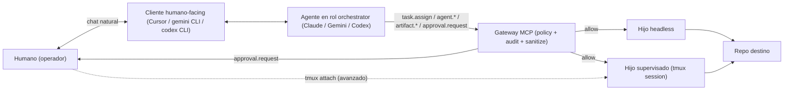
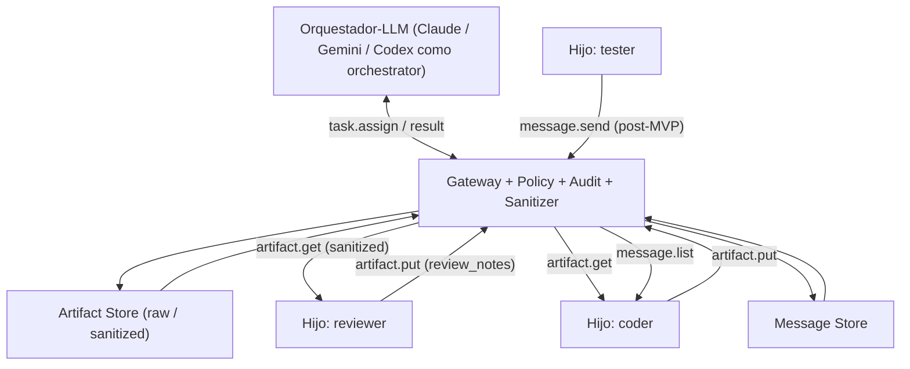
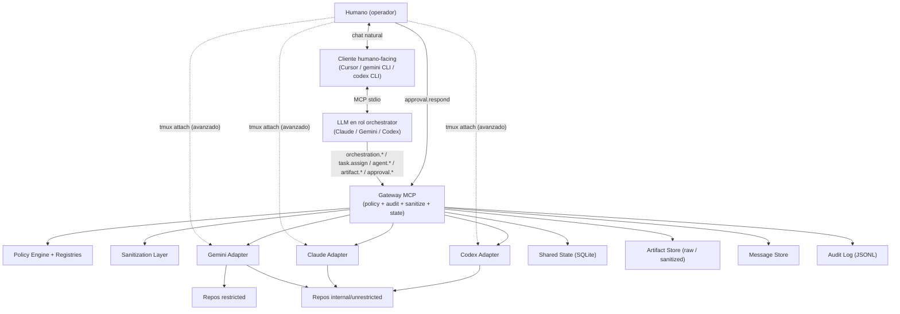
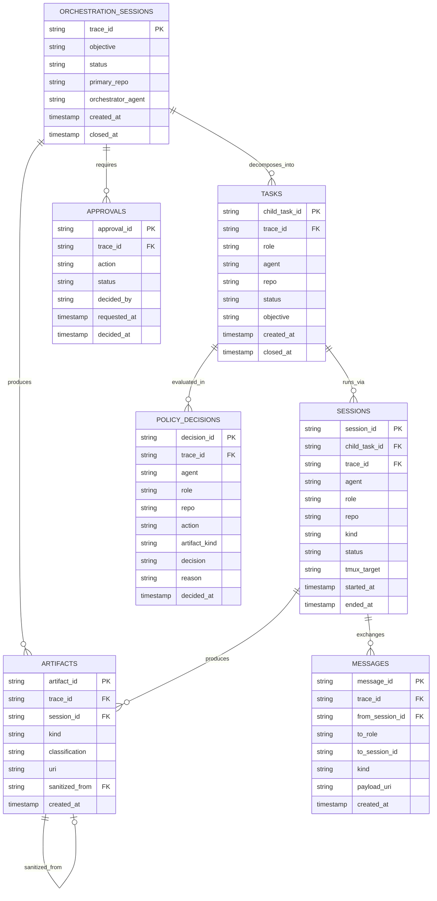
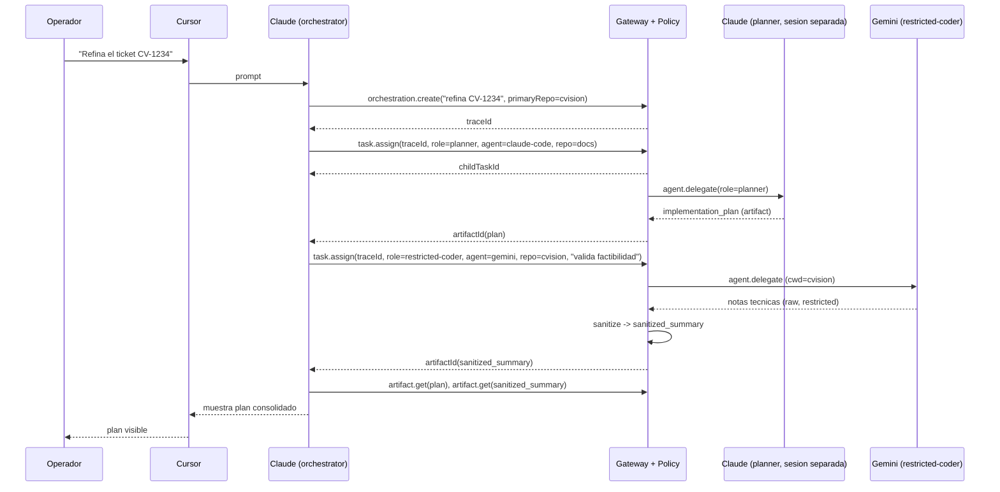

# Plan de proyecto: Sistema de orquestacion y comunicacion entre agentes IA

Version 4 - LLM-as-orchestrator desde MVP.

Cambios principales respecto a v3:

- El "Orquestador" es un **rol**, no un componente. Lo desempena el agente humano-facing (la instancia de Claude en Cursor, o de Gemini CLI, o de Codex que el operador usa como front door).
- No hay un proceso Python separado tipo `orchestrator/`. La inteligencia de planificacion vive en el LLM que el humano usa.
- La unica pieza nueva a construir es el **Gateway MCP**, que aplica policy, audita, sanitiza y media. Los adapters se reusan del experimento `gemini-orchestrator`.
- El orquestador-LLM no es un agente privilegiado: es un consumidor mas del Gateway, sujeto a policy (no puede leer raw `restricted`, no puede escribir codigo directamente, etc.).
- En Fase 3, si el flujo se vuelve repetitivo, se puede sustituir al LLM-orchestrator por un orquestador determinista (Python o LangGraph). El **contrato** (las MCP tools del Gateway) no cambia.

---

## 1. Resumen ejecutivo

Construimos una plataforma local de orquestacion donde el humano interactua con su agente habitual (Claude en Cursor, Gemini CLI o Codex) y ese agente actua en **rol de orquestador**: descompone el objetivo, asigna subtareas a hijos especializados (planner, coder, reviewer, tester...), consulta estado, recoge artefactos y solicita aprobaciones humanas.

El orquestador no es un componente que construimos. Es un rol que un agente puede asumir cuando esta conectado al Gateway MCP. Lo unico que tenemos que construir es el Gateway: un servidor MCP que aplica policy, audita, sanitiza y media toda la comunicacion entre agentes.

Hoy ya existe un experimento, `gemini-orchestrator`, que valida la primitiva basica: un MCP server expone Gemini CLI como herramienta a un agente padre. La v4 generaliza ese patron y le anade las capas que faltan (policy, audit, sanitization, roles, comunicacion mediada hijo a hijo, aprobaciones formales).

La arquitectura es **MCP-first y Gateway-only**: el MVP no necesita event bus, base de datos relacional, motor de workflows, ni un Orquestador como proceso separado. Solo necesita el Gateway MCP encima de los CLIs ya instalados.

Compromisos:

- Linea roja: Gemini CLI es el unico agente aprobado para repos `restricted` (en rol `restricted-coder`).
- Linea de autonomia: dentro del scope permitido, el agente trabaja sin pedir permiso. La aprobacion humana se reserva a efectos externos irreversibles.
- Linea de control: el humano interactua con su agente habitual, que actua como orquestador. tmux es observabilidad opcional.
- Linea de canal: hijos no se comunican directamente; todo pasa por Gateway.
- Linea de confianza: el orquestador-LLM no tiene privilegios especiales en policy. Si pide algo prohibido, el Gateway lo deniega igual que a cualquier otro consumidor.

---

## 2. Contexto y situacion actual

Hoy el operador trabaja con tres agentes:

- Gemini CLI: agente unico aprobado para repositorios sensibles (`cvision`, `cvlib`, etc.).
- Claude Code (en Cursor o standalone): agente de proposito general.
- Codex: agente alternativo, sin acceso MCP por configuracion actual.

El experimento `gemini-orchestrator` ya valida el patron LLM-as-orchestrator en su forma minima: un MCP server en Node que expone Gemini como herramienta a un agente padre. Ofrece dos primitivas:

- `delegate` / `delegate_json`: invocacion headless de `gemini -p --yolo` con `cwd` fijo.
- `spawn_session` / `ask` / `view`: sesion Gemini persistente dentro de tmux que el humano puede `tmux attach`-ear.

En la practica, cuando el operador usa Cursor con Claude conectado al experimento, **Claude ya esta actuando como orquestador**: recibe el objetivo en lenguaje natural, decide cuando llamar a Gemini, lee el output, decide el siguiente paso. Lo que falta es:

- Policy y audit: hoy nada impide que Claude pida a Gemini operar fuera de scope.
- Roles funcionales: hoy todo es "delegar a Gemini" sin distincion de rol.
- Sanitization: hoy los outputs raw fluyen sin filtrar.
- Comunicacion mediada hijo a hijo: hoy todo va via el agente padre (Claude), lo que es valido pero no escala a multiagente.
- Aprobaciones formales: hoy las aprobaciones son ad-hoc.
- Persistencia y trazabilidad: hoy no hay `traceId` ni audit log estructurado.

V4 cierra esos huecos sin romper el flujo actual de uso del operador.

---

## 3. Problema

Sintomas:

- La comunicacion por ficheros entre agentes es lenta y propensa a errores de copia.
- Hoy no hay barrera tecnica que impida a un agente intentar tocar un repo `restricted`. La barrera es la prudencia humana.
- Los outputs de Gemini sobre `restricted` se mueven a otros agentes copiando manualmente, sin garantia de sanitizacion.
- No hay un solo lugar donde ver el estado de una tarea multiagente.

Causas raiz:

1. Falta una capa de policy entre los agentes y los repos.
2. Falta un mediador para la comunicacion hijo a hijo (cuando exista).
3. No hay roles funcionales: cada agente se trata como una caja indistinta.
4. No hay sanitization layer.
5. No hay audit log estructurado.
6. Los CLIs operan en modo interactivo o `--yolo`, sin un wrapper que aplique salvaguardas externas al modelo.

V4 ataca esto sin construir un "Orquestador" que duplique la inteligencia que el LLM humano-facing ya tiene.

---

## 4. Vision y objetivos

Cuando el sistema funcione:

- El humano sigue hablando con su agente habitual (Claude en Cursor, Gemini CLI, Codex). El cambio que ve es: cuando ese agente delega trabajo a otro, lo hace via Gateway con policy y audit; cuando produce outputs cruzando clasificaciones, pasan por sanitization automaticamente.
- Cualquier delegacion entre agentes pasa por una llamada tipada y auditada.
- La politica de "que agente puede hacer que cosa, en que rol, sobre que repo, con que artefacto" es codigo, no costumbre.
- Los outputs raw de repos `restricted` no salen del sistema sin pasar por sanitizacion, ni siquiera al agente que esta haciendo de orquestador.
- El humano siempre puede inspeccionar en vivo via tmux la sesion de cualquier hijo, especialmente sobre repos `restricted`, pero no necesita hacerlo.
- Toda accion tiene `traceId` y deja audit log.
- Los agentes trabajan autonomamente dentro del scope permitido; el humano solo es interrumpido cuando hay un efecto externo irreversible.
- El orquestador-LLM se puede sustituir por codigo determinista o LangGraph en fase posterior sin tocar el contrato.
- El sistema corre local en una maquina de desarrollo sin dependencias cloud.

---

## 5. Alcance

### Dentro

- Gateway MCP que aplica policy, audita, media y sanitiza.
- Adapters reutilizables para Gemini, Claude y Codex con `cwd`-pinning y sesiones tmux opcionales.
- Roles funcionales (orchestrator, planner, coder, restricted-coder, reviewer, tester, documenter, security_reviewer) separados del agente tecnico.
- Policy engine evaluando `(agent, role, repo, classification, action, path, artifact_kind, artifact_classification)`.
- Sanitization layer para outputs de repos `restricted`.
- Comunicacion hijo a hijo mediada (parent-mediated y artifact-mediated en MVP).
- Persistencia local (SQLite) de orchestration_sessions, tasks, sesiones, decisiones y artefactos.
- Audit log inmutable, incluyendo eventos de intervencion humana via tmux best-effort.
- Aprobacion humana explicita para acciones externas irreversibles, expuesta como tool MCP que el orquestador-LLM solicita y el humano resuelve.
- Integracion minima con Jira (lectura) y Git (lectura) via MCP servers internos.
- Configuracion lista para usar el Gateway desde Cursor (`.cursor/mcp.json`) y desde Gemini CLI nativo.

### Fuera

- Componente "Orquestador" como proceso Python separado (no es necesario en MVP; opcional en Fase 3).
- Hosting cloud, Kubernetes, multi-tenant.
- Orquestacion de modelos LLM directos (sin pasar por sus CLIs oficiales).
- Sustitucion del CI/CD existente.
- Edicion o gestion de Confluence mas alla de lectura.
- RAG / Graph DB de codigo (pospuesto a roadmap futuro).
- RBAC fino por usuario individual; el MVP asume un unico operador local.
- Comunicacion directa hijo a hijo (rechazado explicitamente).
- UI propia: el "frontend" del operador es el cliente que ya usa (Cursor, terminal con `claude` / `gemini` / `codex`).

---

## 6. Supuestos y restricciones

- Los CLIs `gemini`, `claude` y `codex` estan instalados y autenticados en la maquina del operador.
- `tmux` esta disponible (Linux).
- Existe acceso a los repos como ya se tiene hoy; el sistema no anade credenciales propias.
- Los modelos se acceden con las cuentas y suscripciones que ya estan en uso; el sistema no introduce coste adicional de modelos.
- El operador puede ejecutar Docker localmente (opcional, para Postgres/Redis cuando entren).
- El idioma de codigo es Node para el Gateway (reuso del experimento) y Python para policy/registries/sanitization si se separa.
- Se asume buena fe del operador local; no es modelo de amenaza multi-usuario hostil.
- El humano puede observar e intervenir hijos via tmux, pero el sistema no garantiza captura completa de esas intervenciones (best-effort).
- El cliente humano-facing (Cursor, Gemini CLI nativo) sabe consumir MCP servers via stdio.

---

## 7. Stakeholders y roles operativos

| Rol | Responsabilidad |
|---|---|
| Operador | Da objetivos a su agente habitual (que actua de orquestador), aprueba acciones externas irreversibles. Una persona en MVP. |
| Mantenedor del registry de repos | Decide la clasificacion de cada repo. Cambios via PR. |
| Mantenedor de capabilities | Define que puede hacer cada agente y en que roles, incluido el rol `orchestrator`. Cambios via PR. |
| Mantenedor de roles | Define el catalogo de roles funcionales. Cambios via PR. |
| Auditor | Revisa audit log y artefactos sanitizados; puede ser la misma persona. |
| Agentes (Gemini, Claude, Codex) | Workers que asumen roles. Uno de ellos (el que el humano usa) actua de orquestador en cada sesion. |

---

## 8. Glosario y modelo de dominio

| Termino | Definicion |
|---|---|
| Agente | Proceso CLI que ejecuta tareas con un modelo LLM (Gemini CLI, Claude Code, Codex). El "que CLI". |
| Rol | Funcion que un agente desempena en una tarea: `orchestrator`, `planner`, `coder`, `restricted-coder`, `reviewer`, `tester`, `documenter`, `security_reviewer`. El "que hace". Un mismo agente puede actuar en distintos roles segun contexto. |
| Orquestador (rol) | Rol que asume el agente humano-facing. Recibe el objetivo del operador en lenguaje natural, descompone, asigna trabajo a hijos por rol, consulta estado, recoge artefactos y solicita aprobaciones. **No es un componente**, es un rol que cualquier agente puede asumir si el registry se lo permite. |
| Hijo | Instancia concreta de un agente actuando en un rol distinto de `orchestrator` dentro de una orchestration_session. |
| Gateway | Servidor MCP unico. Es el unico componente nuevo a construir. Aplica policy, audita, persiste estado, sanitiza, media comunicacion hijo a hijo. |
| Repositorio | Carpeta versionada con git. Tiene una y solo una clasificacion. |
| Clasificacion | `unrestricted` / `internal` / `restricted`. Determina que agentes pueden trabajar sobre el repo. |
| Capability | Accion concreta que un agente en un rol puede o no realizar (`code.read`, `code.write`, `tests.run`, `git.push.protected`, `task.assign`, `tmux.interact`, ...). |
| Accion | Operacion nombrada que se evalua contra la politica. |
| Policy decision | Resultado de evaluar una accion: `allow` / `deny` / `require_approval` / `allow_with_sanitization`. |
| Tarea (task) | Unidad de trabajo de un hijo concreto dentro de una orchestration_session. |
| Orchestration session | Unidad de trabajo a nivel humano, identificada por `traceId`. Agrupa el objetivo, las tareas asignadas, los hijos activos, los artefactos producidos, las aprobaciones pendientes y el resultado. Vive en SQLite, poblada por las llamadas que el orquestador-LLM hace al Gateway. |
| Sesion de agente | Instancia viva de un agente sobre un repo. Headless (efimera) o supervisada (tmux). |
| Artefacto | Output persistido: diff, plan, resumen, log. Tiene tipo, clasificacion y politica de visibilidad por rol. |
| Raw artifact | Artefacto sin sanitizar. Solo accesible por agentes/roles aprobados para su clasificacion. |
| Sanitized artifact | Artefacto procesado por la sanitization layer. Compartible segun politica. |
| TraceId | Identificador unico que correla todas las sesiones, mensajes, artefactos y decisiones de una orchestration_session. |
| Mensaje | Comunicacion tipada via Gateway. Persistido y auditado. |
| Efecto externo irreversible | Accion cuyo resultado escapa del workspace local: push a rama protegida, PR a target protegido, deploy, llamada con side-effects a sistema productivo, modificacion de configuracion compartida. |
| Operacion rutinaria | Accion confinada al working tree o a la sesion actual: leer, escribir codigo, correr tests, commits locales en ramas no protegidas, formatear, instalar dependencias en sandbox del agente. |
| Intervencion humana via tmux | Mecanismo avanzado por el cual el operador escribe directamente en una sesion de un hijo. Auditada best-effort. |

---

## 9. Principios de diseno

1. Seguridad fuera del modelo. Las restricciones se aplican en el wrapper (Gateway), no en el prompt del orquestador-LLM.
2. Ficheros como artefactos, no como protocolo.
3. Capability-based: las capacidades se evaluan en contexto (agente, rol, repo, accion, artefacto).
4. `cwd` como capability primaria. La primera linea de defensa es no spawnear un agente con un `cwd` que su capability no incluye.
5. Autonomia por defecto dentro del scope permitido. El agente trabaja sin pedir permiso para operaciones rutinarias.
6. Aprobacion humana solo para efectos externos irreversibles.
7. Sustituibilidad de componentes. SQLite, JSONL, MCP son intercambiables sin tocar el contrato.
8. Default-deny en fronteras de clasificacion. Default-allow para operaciones rutinarias dentro del scope.
9. Trace-first. Toda operacion tiene `traceId` desde su nacimiento.
10. Humano como autoridad final. La policy puede pedir aprobacion, pero no puede otorgarla.
11. Auditar todo, interrumpir poco.
12. **Single human control plane**. El operador interactua con un solo agente humano-facing, que actua de orquestador. No abre cinco terminales.
13. **Comunicacion hijo a hijo siempre mediada**. Toda transferencia entre hijos pasa por Gateway.
14. **Separacion agente/rol**. La politica evalua agente y rol, no solo agente.
15. **Best-effort para canales humanos directos**. Las intervenciones via tmux se capturan best-effort.
16. **Orquestador como rol, no como autoridad**. El orquestador-LLM es un consumidor mas del Gateway. Puede pedir cosas que la policy le va a denegar; el sistema esta disenado para que esa denegacion sea la barrera real.
17. **Construir lo minimo**. La inteligencia de planificacion ya existe en el LLM humano-facing. Construir un "Orquestador" como proceso aparte duplicaria esa inteligencia y crearia un punto de mantenimiento adicional. En MVP no se hace.
18. **Sustituibilidad del orquestador**. El rol `orchestrator` puede ser desempenado por un LLM (MVP), por codigo determinista o por LangGraph (Fase 3+). El contrato no cambia.

---

## 10. Modelo de clasificacion de repositorios

```text
unrestricted  -> ejemplos publicos, sample-apps, tutoriales
internal      -> herramientas internas, documentacion, automatizacion propia
restricted    -> codigo sensible: KYC, biometria, antifraude, criptografia, PII
```

Criterios objetivos para clasificar un repo:

- Si contiene codigo de deteccion de fraude, KYC, biometria, criptografia propietaria: `restricted`.
- Si su filtracion expondria a clientes, tenants, o saltaria controles antifraude: `restricted`.
- Si es herramienta interna sin PII ni logica de negocio sensible: `internal`.
- Si es ejemplo publico o reproduccion de tutoriales: `unrestricted`.

Regla operativa: `restricted` por defecto si hay duda.

---

## 11. Roles funcionales

Los roles separan "que CLI es el agente" de "que funcion desempena en una tarea".

### 11.1 Catalogo

| Rol | Responsabilidad | Capabilities tipicas |
|---|---|---|
| `orchestrator` | Recibir el objetivo del operador, descomponer, asignar trabajo a hijos, recoger artefactos sanitizados, solicitar aprobaciones humanas. | `task.assign`, `agent.delegate`, `agent.spawn`, `agent.ask`, `agent.view`, `artifact.get` (sanitized), `approval.request`, `orchestration.*` |
| `planner` | Descomponer la tarea en subtareas concretas, identificar riesgos. | `code.read`, `mcp.use`, `artifact.put` |
| `coder` | Leer/escribir codigo, aplicar cambios, ejecutar checks locales sobre repos no `restricted`. | `code.read`, `code.write`, `tests.run`, `format.run`, `git.commit.local`, `git.branch.local`, `deps.install.sandbox` |
| `restricted-coder` | Idem `coder` pero sobre `restricted`. Solo Gemini puede asumirlo. | Idem `coder`, sobre clasificacion `restricted`. |
| `reviewer` | Revisar planes, diffs (sanitized), summaries. | `artifact.review`, `review.write` |
| `tester` | Ejecutar tests, analizar fallos. | `tests.run`, `code.read`, `review.write` |
| `documenter` | Generar documentacion a partir de artefactos sanitizados. | `docs.write`, `artifact.review` |
| `security_reviewer` | Revisar implicaciones de seguridad/PII/auth dentro de lo permitido. | `artifact.review`, `review.write` (solo sobre artefactos sanitizados o repos `internal`/`unrestricted`) |

### 11.2 Reglas de asignacion

- Un agente solo puede actuar en roles que esten en `allowedRoles` para ese agente.
- En MVP, **el rol `orchestrator` no puede coexistir con otros roles del mismo agente en la misma orchestration_session**: si el agente humano-facing es Claude actuando de `orchestrator`, no puede a la vez asumir `coder` en esa misma sesion. Si necesita escribir codigo, abre una sesion supervisada Claude-coder via `agent.spawn` y delega ahi (separacion de identidad por sesion).
- Esto evita confusion y simplifica audit: el orquestador planifica; los hijos ejecutan.

### 11.3 Que significa exactamente "el orquestador-LLM no escribe codigo"

El orquestador-LLM puede razonar sobre codigo, leer artefactos sanitizados, redactar prompts para hijos. Pero no debe ejecutar `code.write` ni invocar shell directamente sobre repos. Para hacer eso, asigna la subtarea a un hijo en rol `coder` o `restricted-coder`. Esto:

- Hace explicita la frontera de capability.
- Permite que el rol `orchestrator` viva en `claude-code` (que no puede tocar `restricted`) sin que eso le impida orquestar trabajo de Gemini sobre `restricted`.
- Mantiene auditable que la escritura de codigo siempre pasa por el agente que la policy autoriza.

---

## 12. Modelo de capacidades de agente y rol

| Capability | Gemini CLI | Claude Code | Codex |
|---|---|---|---|
| Roles permitidos | `orchestrator`, `planner`, `coder`, `restricted-coder`, `reviewer`, `tester`, `documenter`, `security_reviewer` | `orchestrator`, `planner`, `coder`, `reviewer`, `tester`, `documenter`, `security_reviewer` | `orchestrator` (limitado), `coder`, `reviewer`, `tester` |
| Leer/escribir en `restricted` | si (solo en rol `restricted-coder`) | no | no |
| Leer/escribir en `internal` | si | si | si |
| Leer/escribir en `unrestricted` | si | si | si |
| Como `orchestrator`: leer artefactos sanitizados | si | si | si |
| Como `orchestrator`: leer artefactos raw `restricted` | no (Gemini-orchestrator tampoco; el rol orchestrator no implica acceso raw) | no | no |
| Como `orchestrator`: invocar `task.assign` | si | si | si |
| Como `orchestrator`: invocar `agent.spawn`/`agent.delegate` | si | si | si |
| Como `orchestrator`: ejecutar `code.write` directamente | no | no | no |
| Ejecutar tests | si | si | si |
| Commits locales en ramas no protegidas | si | si | si |
| Crear/cambiar ramas locales | si | si | si |
| Instalar dependencias en sandbox del agente | si | si | si |
| Usar MCP tools | si | si | no |
| `tmux.interact` | si | si | si |
| `git.push` a rama protegida | requiere aprobacion | requiere aprobacion | requiere aprobacion |
| `git.createPullRequest` contra target protegido | requiere aprobacion | requiere aprobacion | requiere aprobacion |
| Cambios de `production_config` | requiere aprobacion | requiere aprobacion | requiere aprobacion |
| Cambios en `auth.*` o `pii.*` (en `restricted`) | requiere aprobacion (rol `restricted-coder`) | n/a | n/a |

Notas:

- Cuando un agente actua como `orchestrator`, su capability set se restringe: pierde `code.write` y solo puede leer artefactos sanitizados. Esto es lo que hace seguro que cualquier agente pueda asumir el rol.
- Un mismo agente puede ser `orchestrator` en una sesion del operador y `reviewer` en otra orchestration_session distinta: depende de la asignacion concreta.
- "Ramas protegidas" se definen por convencion en el repo (`main`, `master`, `develop`, `release/*`).
- Las capabilities efectivas son la **interseccion** de: agente, rol, repo y la regla `requiresApprovalFor`.

---

## 13. Politica y motor de decision

### 13.1 Inputs y outputs

La decision de policy se evalua sobre la tupla:

```text
(agent, role, repo, classification, action, path, artifact_kind, artifact_classification, target_branch?)
```

Outputs posibles: `allow`, `deny`, `require_approval`, `allow_with_sanitization`.

### 13.2 Regla base

```text
Frontera de clasificacion (default-deny):
  Si el agente no tiene la clasificacion del repo en `allowedClassifications`,
  o el repo no tiene al agente en `allowedAgents`,
  o el rol del agente no esta en `allowedRoles` del agente,
  o la ruta esta en `excludedPaths`,
  o el artefacto pedido tiene clasificacion superior a la permitida para el rol:
    -> deny.

Dentro del scope permitido (default-allow para rutinario):
  Si la accion esta marcada `requiresApprovalFor`:
    -> require_approval.
  En caso contrario:
    -> allow.

Cruce de frontera de clasificacion:
  Si el output ira a destinatarios cuya clasificacion no permite el raw:
    -> allow_with_sanitization.
```

### 13.3 Casos del orquestador-LLM

```text
claude-code + orchestrator + cualquier repo + task.assign(role=restricted-coder, agent=gemini, repo=cvision)
  -> allow (claude orquesta; quien actua sobre cvision es gemini, no claude)

claude-code + orchestrator + cvision + artifact.get(raw_diff)
  -> deny (orchestrator no puede leer raw; ni siquiera Gemini en rol orchestrator puede)

claude-code + orchestrator + cvision + artifact.get(sanitized_diff)
  -> allow

claude-code + orchestrator + sample-apps + code.write
  -> deny (orchestrator no escribe codigo; debe delegar a un coder)

claude-code + reviewer + sample-apps + code.write
  -> deny (reviewer tampoco escribe; cambia de rol)

claude-code + coder + sample-apps + code.write
  -> allow

claude-code + orchestrator + cvision + approval.request("git.push.protected")
  -> allow (el orchestrator puede solicitar aprobacion; el humano la otorga)
```

### 13.4 Por que esto es seguro aunque el orquestador sea un LLM

- El orquestador-LLM no tiene capability `code.write` ni `code.read.raw_restricted`. Si el modelo se confunde, o sufre prompt injection, o intenta saltar reglas, el Gateway lo deniega.
- El audit log registra cada intento, incluso los denegados. Un patron repetido de denies por el mismo orquestador es senal de problema (a vigilar como metrica).
- Las acciones reales (escritura de codigo, push, etc.) las ejecutan los hijos via adapters que tambien pasan por policy, con sus propias capabilities.
- La unica via para que codigo `restricted` salga del sistema es vencer dos capas: el adapter de Gemini y la sanitization layer. El orquestador-LLM no las puede saltar pidiendo "amablemente" porque no es una autoridad para la policy.

---

## 14. Sanitizacion

Que se elimina:

- Codigo fuente raw de repos `restricted`.
- Diffs raw que tocan rutas `restricted`.
- Stack traces que revelan rutas internas o nombres de clases internas.
- Tenant IDs, customer IDs, secretos, tokens.
- Configuracion productiva (URLs internas, credenciales, feature flags sensibles).
- Reglas antifraude concretas, umbrales biometricos.

Que se generaliza:

- Rutas: `modulo de parsing MRZ`, `componente de deteccion facial`.
- Nombres de clase: "el parser interno", "el verificador de calidad".
- Stack traces: tipo de error mas capa, sin clase concreta.

Versionado: cada output sanitizado conserva referencia al raw (id mas hash) en el audit log.

Implementacion inicial: reglas declarativas (allowlist/denylist, regex de PII y secretos) mas revision humana cuando el operador este disponible. Reemplazable en fase posterior por una pasada de modelo LLM con prompt fijo + verificador de patrones.

**Importante**: la sanitization es la barrera fisica entre clasificaciones. El orquestador-LLM, aunque sea Claude actuando con buena intencion, recibe siempre la version sanitizada cuando la origen es `restricted`. Nunca la raw.

---

## 15. Visibilidad de artefactos por rol

| Artefacto | Gemini `restricted-coder` | Gemini `coder` | Claude `orchestrator` | Claude `reviewer` | Codex `tester` | Operador (humano) |
|---|---|---|---|---|---|---|
| `raw_diff` (de repo `restricted`) | si | no | no | no | no | si (via Gateway, audit explicito) |
| `raw_code` (de repo `restricted`) | si | no | no | no | no | si |
| `raw_stacktrace` (de repo `restricted`) | si | no | no | no | no | si |
| `raw_diff` (de repo `internal`/`unrestricted`) | si | si | si | si | si | si |
| `sanitized_diff` | si | si | si | si | si | si |
| `sanitized_summary` | si | si | si | si | si | si |
| `implementation_plan` | si | si | si | si | si | si |
| `test_report` (sin secretos) | si | si | si | si | si | si |
| `review_notes` | si | si | si | si | si | si |
| `documentation_draft` | si | si | si | si | si | si |

Reglas:

- Todo `artifact.get` y `artifact.share` se evalua por policy. No hay bypass.
- El **orquestador no es un canal privilegiado** para acceder a raw. Si pide raw `restricted`, la policy le niega igual que a cualquier otro consumidor.
- El operador humano puede pedir raw via Gateway con audit explicito (consciente, no en flujo automatico) si necesita inspeccionar el contenido para depurar o para una decision concreta.

---

## 16. Modelo de delegacion

### 16.1 Como llega el humano al sistema

El humano **no abre una nueva interfaz**. Sigue usando su agente habitual:

- Cursor con Claude Code conectado al Gateway via `.cursor/mcp.json`.
- Gemini CLI nativo configurado para usar el Gateway como MCP server.
- Codex con su CLI cuando soporte MCP.

El cliente del operador conecta al Gateway por stdio. El system prompt del agente (configurado por el operador o por la integracion del cliente) le dice al LLM "estas en rol orchestrator; usa estas tools para delegar trabajo a otros agentes".

A partir de ahi, el operador habla con su agente como hace hoy. La diferencia es que ahora el agente, cuando necesita tocar codigo o un repo, llama a las tools del Gateway en vez de hacerlo directamente.

### 16.2 Capa orquestador - hijos

El orquestador-LLM, dentro de su sesion con el operador, usa las tools del Gateway:

```text
orchestration.create(objective, primaryRepo?)            -> {traceId}
task.assign(traceId, role, agent?, objective, inputArtifacts?)
                                                          -> {childTaskId, sessionId?, attachCommand?}
agent.delegate(traceId, agent, role, repo, prompt, action) -> {result, artifactId, sessionId}
agent.spawn(traceId, agent, role, repo, name?)            -> {sessionId, attachCommand}
agent.ask(sessionId, prompt)                              -> {response}
agent.view(sessionId)                                     -> {snapshot}
agent.kill(sessionId)
artifact.put(traceId, kind, content, classification?)     -> {artifactId}
artifact.get(artifactId)                                  -> {content, classification, sanitized}
artifact.share(traceId, artifactId, targetRole|targetAgent) -> {decision, sharedArtifactId?}
approval.request(traceId, action, context)                -> {approvalId, status}
orchestration.view(traceId)                               -> {status, plan, children, ...}
orchestration.cancel(traceId)
```

### 16.3 Primitivas de ejecucion

Una vez el orquestador asigna trabajo, la ejecucion ocurre en una de dos formas:

- **Headless / one-shot**: una llamada, una respuesta. Para subtareas cortas y deterministas.
- **Supervisada / persistente**: sesion tmux observable. Para subtareas largas o sensibles. `tmuxTarget` con patron `ag-<traceId>-<agent>-<role>`.

### 16.4 tmux: posicionamiento

`tmux` es mecanismo de observabilidad e intervencion humana directa, no canal de coordinacion. El operador puede attach-ear para inspeccionar; no es necesario para que el flujo avance.

| Modo | Uso normal |
|---|---|
| Observacion | Permitido, no obligatorio. |
| Intervencion directa | Permitido como modo avanzado. |
| Debugging | Recomendado en incidencias. |
| Operacion diaria | No recomendado. La operacion diaria pasa por el orquestador-LLM. |

### 16.5 Diagrama de delegacion



---

## 17. Comunicacion entre hijos

### 17.1 Regla base

Los agentes hijos no se comunican directamente entre si. Toda comunicacion hijo a hijo pasa por el Gateway.

```text
No permitido:  coder -> reviewer
Permitido:     coder -> Gateway -> artifact/message store -> Gateway -> reviewer
```

### 17.2 Patrones soportados

#### 17.2.1 Orchestrator-mediated (MVP por defecto)

El orquestador-LLM recibe el resultado de un hijo, decide si debe enviarlo a otro, y con que nivel de detalle. En la practica:

```text
coder -> result -> orquestador-LLM (recibido como response de agent.delegate o agent.ask)
orquestador-LLM razona y decide
orquestador-LLM -> task.assign(role=reviewer, inputArtifacts=[sanitized_diff_id]) -> reviewer
```

Es el patron de menor friccion porque el orquestador-LLM ya esta en el bucle de razonamiento.

#### 17.2.2 Artifact-mediated (MVP, recomendado para colaboracion)

Los hijos publican artefactos via `artifact.put` y los consumen via `artifact.get`. El orquestador-LLM solo coordina cuando dispara cada paso.

```text
coder -> artifact.put(raw_diff)
Gateway -> sanitize(raw_diff) -> sanitized_diff
orquestador-LLM -> task.assign(role=reviewer, inputArtifacts=[sanitized_diff])
reviewer -> artifact.get(sanitized_diff) -> revisa
reviewer -> artifact.put(review_notes)
orquestador-LLM -> task.assign(role=coder, inputArtifacts=[review_notes])
coder -> artifact.get(review_notes) -> aplica
```

#### 17.2.3 Message-mediated (post-MVP)

Hijos intercambian mensajes tipados via `message.send` / `message.list`. Util cuando el orquestador-LLM no necesita razonar entre cada paso.

#### 17.2.4 Workflow-mediated (Fase 3 y mas)

LangGraph reemplaza al orquestador-LLM para flujos repetitivos y bien definidos. **No reemplaza al Gateway**: LangGraph decide el flujo; el Gateway sigue aplicando policy.

### 17.3 Diagrama



---

## 18. Contratos de mensaje y de tool

### 18.1 Tools que expone el Gateway al orquestador-LLM

El Gateway expone exactamente este set de tools. Quien las puede llamar lo decide la policy (segun rol del agente que llama).

```text
policy.check(agent, role, repo, action, path?, artifactKind?)  -> {decision, reason}

orchestration.create(objective, primaryRepo?, constraints?)    -> {traceId}
orchestration.view(traceId)                                    -> {status, plan, children, artifacts, approvals}
orchestration.cancel(traceId)
orchestration.pause(traceId)
orchestration.resume(traceId)

task.assign(traceId, role, agent?, objective, inputArtifacts?, constraints?)
                                                                -> {childTaskId, sessionId?, attachCommand?}
agent.delegate(traceId, agent, role, repo, prompt, action, timeoutMs?)
                                                                -> {result, artifactId, sessionId}
agent.spawn(traceId, agent, role, repo, name?, initialPrompt?) -> {sessionId, attachCommand}
agent.ask(sessionId, prompt, timeoutMs?)                       -> {response}
agent.view(sessionId, lines?)                                  -> {snapshot}
agent.kill(sessionId)                                          -> {killed}

artifact.put(traceId, kind, content, classification?, sessionId?) -> {artifactId}
artifact.get(artifactId, requesterAgent, requesterRole)           -> {content, classification, sanitized}
artifact.share(traceId, artifactId, targetRole|targetAgent)       -> {decision, sharedArtifactId?}
artifact.list(traceId)                                            -> {artifacts}

message.send(traceId, fromSessionId, toRole|toSessionId, kind, payload) -> {messageId}
message.list(traceId, sessionId, filters?)                              -> {messages}
message.reply(messageId, payload)                                       -> {messageId}

session.attach_info(sessionId)                                 -> {tmuxTarget, attachCommand}
session.intervention_note(sessionId, note)                     -> {eventId}

approval.request(traceId, action, context)                     -> {approvalId, status}
approval.respond(approvalId, decision, note?)
```

`approval.request` es bloqueante desde la perspectiva del orquestador-LLM: devuelve cuando el humano decide. El humano decide via `approval.respond`, que el cliente humano-facing (Cursor) puede invocar como respuesta a una pregunta del LLM, o el operador puede invocar manualmente desde la CLI.

### 18.2 Eventos publicados internamente (audit y, en Fase 3, event bus)

```text
ORCHESTRATION_CREATED, ORCHESTRATION_PLAN_UPDATED, ORCHESTRATION_COMPLETED,
TASK_CREATED, TASK_ACCEPTED, TASK_PROGRESS, TASK_RESULT,
SESSION_STARTED, SESSION_CLOSED,
ARTIFACT_CREATED, ARTIFACT_SHARED, SANITIZATION_APPLIED,
MESSAGE_SENT,
POLICY_DECIDED,
APPROVAL_REQUIRED, APPROVAL_GRANTED, APPROVAL_DENIED,
HUMAN_TMUX_INTERVENTION,
ERROR
```

Schemas concretos en Anexo B.

---

## 19. Arquitectura objetivo



Lineas de confianza:

- El cliente humano-facing es responsabilidad del operador (Cursor o CLI). El proyecto no lo construye, solo se integra.
- El orquestador-LLM es **un consumidor mas del Gateway**. No tiene privilegios especiales en policy.
- El Gateway es el unico componente nuevo a construir y el unico punto que conoce y aplica la politica.
- Los hijos no se hablan entre si: cualquier comunicacion hijo a hijo pasa por Gateway.
- Los adapters son fronteras de proceso: corren los CLIs como subprocesos con `cwd` y env restringidos.
- Los repos `restricted` son inalcanzables desde adapters no aprobados.
- tmux es side-channel observacional: el sistema no garantiza captura completa, solo best-effort.

**Lo que esta arquitectura no tiene** (a proposito): un componente "Orquestador" como proceso aparte. La caja en el diagrama "LLM en rol orchestrator" representa al agente humano-facing que el operador ya esta usando, no a algo que construyamos.

---

## 20. Componentes

### 20.1 Cliente humano-facing (no se construye)

Cursor con Claude Code, terminal con `gemini` CLI o terminal con `codex` CLI. El proyecto no construye este componente; provee instrucciones de configuracion y un system prompt sugerido para el rol `orchestrator`.

### 20.2 Agent Gateway (unico componente principal)

Responsabilidad: punto unico de aplicacion de politica, mediacion de comunicacion, persistencia de estado, audit y sanitizacion. Expone MCP tools al orquestador-LLM y a los hijos.

Inputs: llamadas MCP del orquestador-LLM y de los hijos.
Outputs: respuestas tipadas mas efectos persistidos (sesion, artefacto, mensaje, audit entry).
No hace: razonar sobre codigo, planificar, decidir clasificacion, redactar prompts.

Es un proceso Node (reusando estructura del experimento) con submodulos Python opcionales para policy y registries (o todo en Node si se prefiere). Corre local, conexion stdio.

### 20.3 Policy Engine

Determinista, sin red, sin LLM. Reglas declarativas leidas de los registries.

Dado `(agent, role, repo, classification, action, ...)`, devuelve `allow|deny|require_approval|allow_with_sanitization` con razon.

### 20.4 Capability Registry, Repository Registry y Role Catalog

Tres JSON versionados en git. El catalogo de roles incluye `orchestrator` con sus capabilities propias.

### 20.5 Agent Adapters

Tres adapters, uno por CLI. Patron comun:

- Validan `cwd` contra capability del agente y del rol.
- Spawnean el CLI con `cwd` fijo, env saneado.
- Soportan headless y supervisada.
- Detectan intervenciones humanas via tmux (best-effort) y emiten `HUMAN_TMUX_INTERVENTION`.

El adapter de Gemini reusa logica del experimento. Los de Claude y Codex se generalizan a partir de ahi.

### 20.6 Sanitization Layer

Se interpone entre el artifact store y cualquier salida que cruce la frontera de clasificacion.

### 20.7 Shared State (SQLite)

Tablas: `orchestration_sessions`, `tasks`, `sessions`, `artifacts`, `messages`, `policy_decisions`, `approvals`. Detalle en seccion 21.

### 20.8 Artifact Store, Message Store, Audit Log

- Artifact Store: carpeta local versionada por `traceId`. URIs `artifact://<artifactId>`.
- Message Store: tabla SQLite en MVP; pub/sub Redis Streams en Fase 3.
- Audit Log: JSONL append-only con rotacion diaria.

### 20.9 Diferidos

- **Event Bus** (Fase 3): Redis Streams cuando haya consumidores en tiempo real.
- **Orquestador determinista o LangGraph** (Fase 3, opcional): para flujos repetitivos donde un LLM-orchestrator anade variabilidad innecesaria. Sustituye al LLM en el rol `orchestrator`; el contrato no cambia.
- **Motor durable, Temporal** (Fase 5): para workflows largos.

---

## 21. Modelo de datos



`orchestration_sessions.orchestrator_agent` registra que CLI estaba actuando de orquestador (`claude-code`, `gemini-cli`, `codex` o `langgraph` cuando aplique). Esto permite saber, post-hoc, que tipo de orquestador tomo las decisiones.

`traceId` correla todo. Cada entrada del audit log lleva `traceId` y, cuando aplica, `sessionId`.

---

## 22. Flujos operativos

### 22.1 Refinamiento de ticket (operador en Cursor con Claude)



El operador no enrutea nada manualmente. Solo escribe el objetivo y lee el resultado.

### 22.2 Implementacion en repo no `restricted`

El operador da el objetivo a Cursor/Claude. Claude actua de orquestador y asigna `coder` (a si mismo en otra sesion separada, o a Codex), luego `tester`, luego `reviewer`. Todos trabajan autonomamente: leen, escriben, corren tests, hacen commits locales sin pedir permiso. Cuando llega `git.push.protected`, Claude solicita aprobacion al operador via `approval.request`. Cursor muestra la peticion al operador, que aprueba o rechaza.

### 22.3 Implementacion en repo `restricted` (canonico)

```mermaid
sequenceDiagram
    participant Op as Operador
    participant Cu as Cursor
    participant CC as Claude (orchestrator)
    participant GW as Gateway + Policy + Sanitizer
    participant GE as Gemini (restricted-coder)
    participant CC2 as Claude (reviewer, sesion separada)
    participant TM as tmux session

    Op->>Cu: "Implementa CV-1234 en cvision"
    Cu->>CC: prompt
    CC->>GW: orchestration.create
    CC->>GW: task.assign(role=restricted-coder, agent=gemini, repo=cvision)
    GW->>GE: agent.spawn (cwd=repos/cvision)
    GE->>TM: tmux new-session ag-CV-1234-gemini-restricted-coder
    GW-->>CC: sessionId, attachCommand
    CC-->>Cu: "Sesion Gemini iniciada. tmux attach -t ag-CV-1234-gemini-restricted-coder si quieres ver."
    Cu-->>Op: muestra mensaje

    GE-->>GW: artifact.put(raw_diff, restricted)
    GW->>GW: sanitize -> sanitized_diff
    GE-->>GW: artifact.put(test_report)

    CC->>GW: task.assign(role=reviewer, agent=claude-code, inputArtifacts=[sanitized_diff])
    Note over GW,CC2: artifact.get(sanitized_diff) permitido; raw_diff denegado
    GW->>CC2: agent.delegate
    CC2-->>GW: review_notes
    GW-->>CC: review_notes

    CC->>GW: agent.ask(GeminiSession, "aplica review_notes")
    GE-->>GW: artifact.put(raw_diff_v2)
    GW->>GW: sanitize

    CC->>GW: approval.request(git.push.protected, traceId)
    GW->>Op: APPROVAL_REQUIRED (Cursor muestra prompt)
    Op-->>GW: approval.respond(granted)
    GW->>GE: agent.ask("git push origin main")
    GW-->>CC: TASK_RESULT
    CC-->>Cu: "completado"
    Cu-->>Op: "completado"
```

Claude (orchestrator) nunca ve el raw_diff. La policy se lo niega aunque lo pida. La unica pieza que ve raw es Gemini-restricted-coder, dentro de su sesion tmux.

### 22.4 Revision cruzada con sanitizacion

Patron artifact-mediated: `coder` produce raw -> Gateway sanitiza -> `reviewer` consume sanitized -> `reviewer` publica review_notes -> el orquestador-LLM lee las notas y dispara la siguiente iteracion.

### 22.5 Cancelacion y errores

- `orchestration.cancel(traceId)` cierra todas las sesiones hijas activas.
- Errores del CLI hijo se capturan, persisten en audit y se devuelven al orquestador-LLM como `ERROR` con razon. El orquestador-LLM puede decidir reintentar, cambiar de agente, o reportar al operador.
- Timeouts: cada `agent.delegate` y `agent.ask` tiene `timeoutMs`.

### 22.6 Intervencion humana via tmux

Si el operador hace `tmux attach` y escribe directamente a un hijo, el adapter detecta input no provocado por `agent.ask` y emite `HUMAN_TMUX_INTERVENTION` best-effort. El orquestador-LLM puede ver este evento via `orchestration.view` y actualizar su modelo mental de la tarea.

---

## 23. Stack y alternativas valoradas

| Necesidad | MVP | Alternativas valoradas | Razon de la eleccion |
|---|---|---|---|
| Capa orquestador | LLM en rol orchestrator (Claude/Gemini/Codex segun cliente) | Python determinista, LangGraph, Temporal | El LLM ya esta en el bucle; construir un orquestador aparte duplicaria inteligencia. La sustituibilidad esta garantizada por el contrato. |
| Cliente humano-facing | Cursor, gemini CLI, codex CLI (ya instalados) | UI propia, terminal custom | Reuso de herramientas existentes; cero superficie nueva que mantener. |
| Transporte humano-Gateway | MCP (stdio) | REST, gRPC, websockets | El cliente humano-facing ya consume MCP. |
| Lenguaje del Gateway | Node (reusando estructura del experimento) | Python, Go, Rust | Minimiza riesgo de regresion sobre el experimento; tooling MCP maduro en Node. |
| Lenguaje de policy / sanitization | Python (separable en submodulo) o Node si se prefiere monolito | Solo Node, solo Python | Python es el idioma de scripting interno y tiene buenas librerias de regex/PII. |
| Estado | SQLite | Postgres, JSON files | Cero infra para MVP. |
| Audit | JSONL append-only | Postgres, ELK | Inspeccionable a ojo. |
| Mensajes entre hijos | Tabla SQLite `messages` | Redis Streams desde dia uno | Persistencia inmediata; el bus pub/sub se anade en Fase 3 si hay consumidores reales. |
| Event bus (Fase 3 y mas) | Redis Streams | NATS, Kafka, Pub/Sub | Curva de adopcion minima. |
| Orquestador determinista (Fase 3 opcional) | LangGraph | CrewAI, AutoGen, codigo plano | Si entran flujos repetitivos, LangGraph reemplaza al LLM-orchestrator preservando el contrato. |
| Workflows durables (Fase 5) | Temporal | Airflow, Argo, custom | Estandar para retries y aprobaciones largas. |
| MCP servers internos (Fase 4) | Servidores propios en Python | Servidores comunitarios | Control de superficie. |

Por que LLM-as-orchestrator desde MVP:

- Es lo que el operador ya hace hoy (consciente o no) cuando usa Cursor con Claude llamando a `gemini-orchestrator`. V4 lo formaliza con policy y audit, no lo invierte.
- No introduce un componente nuevo a mantener. La intelligence vive donde ya estaba.
- La sustituibilidad esta garantizada: el dia que el flujo sea repetitivo, LangGraph entra sin romper contratos.

Por que el Gateway sigue siendo MCP-first:

- Los agentes hablan MCP nativamente.
- El experimento ya valida la forma del MCP server.
- Cualquier evolucion futura (Event Bus, Postgres, Temporal) ocurre detras del MCP, no encima.

---

## 24. Estructura de proyecto

```text
agents-orchestrator/
  README.md
  policies/
    agent-capabilities.json
    repositories.json
    roles.json
  schemas/
    orchestration-session.schema.json
    task.schema.json
    message.schema.json
    artifact.schema.json
    policy-decision.schema.json
  gateway/
    package.json                       # Node, reusando experimento
    src/
      mcp_server.js                    # entrypoint MCP
      tools/
        orchestration.js
        task.js
        agent.js                       # delegate, spawn, ask, view, kill
        artifact.js
        message.js
        approval.js
        policy.js
        session.js
      adapters/
        gemini_adapter.js
        claude_adapter.js
        codex_adapter.js
        tmux_client.js
        intervention_detector.js
      core/
        policy_engine.js               # o python; ver opcion separada
        registry.js
        state.js                       # SQLite
        audit.js
        sanitizer.js
  prompts/
    orchestrator_system_prompt.md      # plantilla del system prompt para el LLM-orchestrator
  client-config/
    cursor-mcp.json.example            # ejemplo para .cursor/mcp.json
    gemini-mcp.json.example
  cli/
    src/agents_cli/
      __init__.py
      main.py                          # comandos auxiliares: validate registries,
                                       # consult audit log, manual approval respond
  workspace/
    artifacts/<traceId>/raw/
    artifacts/<traceId>/sanitized/
    messages/<traceId>/
    audit/events.jsonl
    state/state.db
  tests/
  docker/
    docker-compose.yml                 # postgres, redis (Fase 3 y mas)
```

Diferencias importantes respecto a v3:

- **No hay `orchestrator/`**. La capa de planificacion vive en el LLM humano-facing.
- **Hay `prompts/orchestrator_system_prompt.md`**. Es plantilla, no codigo: el operador la inyecta en su cliente humano-facing como system prompt cuando quiere usar el sistema. Define el rol, las tools disponibles y los limites.
- **Hay `client-config/`**. Ejemplos de configuracion para Cursor (`.cursor/mcp.json`), Gemini CLI nativo, Codex CLI cuando aplique. Esto es lo que el operador copia a su cliente para conectar.
- **CLI auxiliar reducida**. Solo lo que el humano necesita fuera de su agente: validar registries, consultar audit, responder aprobaciones manualmente cuando el cliente humano-facing no este abierto.

Convenciones:

- Idioma de codigo y comentarios: ingles. Idioma de documentacion de proyecto y system prompt del orquestador: espanol o ingles segun preferencia del operador.
- Logs estructurados (JSON) con `traceId` siempre presente.
- Schemas JSON versionados con `$id` y `version`.
- Cada PR a registries requiere revision humana explicita.
- Nombres de sesiones tmux: `ag-<traceId>-<agent>-<role>`.

---

## 25. Estrategia de adopcion

El sistema convive con el flujo actual durante la transicion. La diferencia clave respecto a v3: como no hay un cliente humano-facing nuevo, la barrera de adopcion es minima. El operador solo cambia la configuracion MCP de su cliente y el system prompt del rol orchestrator.

1. Sombra: el Gateway corre, recibe llamadas, deja audit log, pero el operador sigue usando el experimento `gemini-orchestrator` o ficheros como hoy. Sirve para validar policy y registries con trafico real sin riesgo.
2. Opcional: el operador conecta su cliente (Cursor, gemini CLI) al Gateway nuevo en lugar del experimento. Las nuevas tareas pasan por policy y audit. Las antiguas siguen como estan.
3. Por defecto en repos `internal`/`unrestricted`: nuevas tareas en estos repos usan el Gateway. Los `restricted` siguen manuales.
4. Por defecto en `restricted`: solo cuando el flujo de `restricted` esta validado.
5. Forzado: ficheros como protocolo dejan de aceptarse; quedan solo como artefactos referenciados.

---

## 26. Roadmap por fases

### Fase 0 - Cimientos declarativos (1-2 semanas)

Objetivo: registries (incluyendo `roles.json` con `orchestrator`), policy engine y audit funcionando.

Entregables:

- `policies/agent-capabilities.json`, `policies/repositories.json`, `policies/roles.json`.
- Policy engine evaluando la tupla `(agent, role, repo, classification, action, ...)` con tests.
- Audit log JSONL.
- CLI `agent-run policy check`.
- System prompt plantilla para el rol `orchestrator` (`prompts/orchestrator_system_prompt.md`).

Criterio de salida: el operador puede preguntar al sistema "puede claude-code en rol orchestrator hacer task.assign a gemini-cli como restricted-coder sobre cvision?" y obtener respuesta correcta.

### Fase 1 - Gateway MCP minimo con Gemini (2-3 semanas)

Objetivo: el operador conecta su cliente humano-facing al Gateway y puede ejecutar una orchestration sencilla con un solo hijo (Gemini en `restricted-coder`).

Entregables:

- Gateway MCP server (Node, reusando experimento) con tools: `policy.check`, `orchestration.create/view/cancel`, `task.assign`, `agent.delegate`, `agent.spawn`, `agent.ask`, `agent.view`, `agent.kill`, `artifact.put`, `artifact.get`, `approval.request`.
- Adapter de Gemini sobre el codigo del experimento, ahora detras del Gateway.
- Persistencia SQLite.
- `traceId` extremo a extremo.
- Configuracion ejemplo `.cursor/mcp.json` para conectar Cursor al Gateway.

Criterio de salida: el operador en Cursor pide "implementa X en cvision", Claude (orchestrator) llama al Gateway, Gateway lanza Gemini en tmux, Gemini trabaja, devuelve resultado sanitizado, el operador ve el resultado en Cursor sin abrir mas terminales (salvo que quiera observar via tmux).

### Fase 2 - Adapters Claude y Codex, sanitization y MVP completo (2-3 semanas)

Objetivo: el orquestador-LLM puede asignar trabajo a varios hijos por rol; los hijos colaboran via parent-mediated y artifact-mediated.

Entregables:

- Adapters Claude y Codex con misma interfaz; `intervention_detector` para `HUMAN_TMUX_INTERVENTION`.
- Sanitization layer con reglas declarativas.
- `artifact.share` y `artifact.list`.
- Approval workflow completo: el orquestador-LLM solicita; el operador responde via Cursor o via CLI `agent-run approve`.
- Eventos `HUMAN_TMUX_INTERVENTION` y `session.intervention_note`.
- System prompt mejorado del rol orchestrator que documenta limites y ejemplos.

Criterio de salida: el operador da un objetivo en Cursor; Claude (orchestrator) descompone planner/coder/reviewer/tester; los hijos colaboran sin que el operador encarne; el operador solo aprueba el push.

### Fase 3 - Multiagente concurrente y orquestador determinista opcional (3-4 semanas)

Objetivo: workflows con varios hijos en paralelo. **Opcionalmente**, sustituir al LLM-orchestrator por LangGraph para flujos repetitivos.

Entregables:

- Migracion SQLite a Postgres.
- Redis Streams como event bus.
- Comunicacion message-mediated en produccion.
- Componente opcional `orchestrator-langgraph/`: un proceso que actua como cliente del Gateway igual que un LLM-orchestrator, pero con un grafo predefinido en lugar de un modelo. Para flujos como "implementa, testea, revisa, push" donde la variabilidad de un LLM no anade valor.
- Metricas (orchestraciones, decisiones de policy, latencia, aprobaciones, intervenciones tmux).

Criterio de salida: un workflow planner-coder-reviewer-tester-documenter corre extremo a extremo. Para un flujo concreto bien acotado, el operador puede elegir entre LLM-orchestrator (Cursor+Claude) o LangGraph-orchestrator.

### Fase 4 - MCP servers internos (2-4 semanas)

`mcp-jira-read`, `mcp-confluence-read`, `mcp-git-read-restricted` (solo Gemini), `mcp-test-runner`, `mcp-artifact-store`. Disponibles para hijos via policy.

Criterio de salida: tarea "refina ticket JIRA-X" se completa sin copia/pega manual.

### Fase 5 - Produccion interna (4-8 semanas)

Temporal envolviendo grafos LangGraph; OpenTelemetry; dashboard; RBAC por usuario; export de auditoria.

---

## 27. MVP

MVP = Fase 0 + Fase 1 + Fase 2.

Lo que entra:

- Gateway MCP con todas las tools de seccion 18.1 implementadas.
- Adapters Gemini y Claude (Codex opcional).
- Policy engine con tupla extendida.
- Tres registries (`agents`, `repos`, `roles`) con `orchestrator` definido.
- Sanitization layer con reglas regex.
- Persistencia SQLite, audit JSONL.
- Approval workflow.
- System prompt plantilla para el rol orchestrator.
- Configuracion `.cursor/mcp.json.example` y `gemini-mcp.json.example`.
- CLI auxiliar minima (`policy validate`, `policy check`, `audit show`, `approve`).

Lo que NO entra (a proposito):

- Componente "Orquestador" como proceso aparte (no es necesario; el LLM lo es).
- Codex como adapter completo (basta con Gemini + Claude para el flujo principal).
- LangGraph y orquestador determinista.
- Postgres, Redis Streams, Temporal.
- MCP servers de Jira/Confluence/Git/tests.
- Dashboard, metricas avanzadas, OpenTelemetry, RBAC.

Demostracion del MVP:

1. El operador edita `~/.cursor/mcp.json` con la entrada del Gateway:
   ```json
   {
     "mcpServers": {
       "agents-orchestrator": {
         "command": "node",
         "args": ["/path/to/agents-orchestrator/gateway/src/mcp_server.js"]
       }
     }
   }
   ```
2. Reinicia Cursor. Claude ahora ve las tools del Gateway.
3. El operador anade el system prompt del rol orchestrator a Cursor (en `~/.cursor/rules/orchestrator.md` o equivalente).
4. El operador escribe en Cursor: "Implementa CV-1234 en cvision."
5. Claude llama `orchestration.create("Implementa CV-1234", primaryRepo="cvision")`. Recibe `traceId`.
6. Claude calcula que necesita Gemini en `restricted-coder`. Llama `task.assign(traceId, role="restricted-coder", agent="gemini-cli", repo="cvision", objective="...")`.
7. Gateway aplica policy (allow), spawnea Gemini en tmux. Devuelve `sessionId`, `attachCommand`.
8. Claude muestra al operador: "Sesion Gemini iniciada. tmux attach -t ag-CV-1234-gemini-restricted-coder si quieres ver."
9. Claude llama `agent.ask(sessionId, "implementa MRZ parser segun objetivo")`. Espera resultado.
10. Gemini publica `raw_diff` y `test_report`. Gateway sanitiza.
11. Claude llama `artifact.get` para `sanitized_diff`. Decide si necesita reviewer.
12. Claude llama `task.assign(role="reviewer", agent="claude-code", inputArtifacts=[sanitized_diff_id])`. Una segunda sesion Claude (independiente de la del orquestador) revisa.
13. Reviewer publica `review_notes`. Claude (orchestrator) las lee.
14. Claude llama `agent.ask(GeminiSession, "aplica review_notes")`.
15. Cuando llega el push, Claude llama `approval.request(traceId, "git.push.protected", context)`. La llamada bloquea.
16. El operador ve la peticion en Cursor (Claude se la presenta como pregunta) y responde "approved". Cursor llama `approval.respond(approvalId, "granted")`.
17. Gateway desbloquea la `approval.request`. Claude (orchestrator) llama `agent.ask(GeminiSession, "git push origin main")`.
18. Push hecho. Orchestration completa. Audit completo.

El operador hablo con Cursor en lenguaje natural. No abrio una sola terminal extra (salvo si quiso observar via tmux). El sistema le interrumpio una vez: para aprobar el push.

---

## 28. Operacion y observabilidad

Logs: estructurados (JSON), con `traceId`, `agent`, `role`, `repo`, `action`, nivel. Stdout en MVP; rotados a fichero por dia.

Metricas minimas (Fase 3):

- Orquestaciones creadas / completadas / fallidas.
- Tareas asignadas por rol y por agente.
- Decisiones de policy (allow / deny / require_approval) por agente y por rol.
- **Tasa de denies emitidos contra el orquestador-LLM**: senal de prompt injection o de modelo confundido.
- Tasa de aprobaciones humanas por unidad de tiempo (approval fatigue).
- Eventos `HUMAN_TMUX_INTERVENTION` por orquestacion.
- Latencia de `agent.delegate` y de `agent.ask`.
- Sesiones tmux abiertas / cerradas.

Trazas (Fase 5): OpenTelemetry, una traza por `traceId`.

Alertas (Fase 5):

- Aumento subito de denies contra el orquestador-LLM (potencial mala configuracion del prompt o intento de inyeccion).
- Aumento subito de denies sobre un repo.
- Sesiones tmux huerfanas.
- Sanitization fallida.
- Tasa alta de aprobaciones (gates excesivos).
- Tasa alta de `HUMAN_TMUX_INTERVENTION` (el orquestador-LLM no esta cubriendo flujos reales).

Runbooks minimos:

- "El Gateway no arranca" -> validar registries.
- "Una orchestration cuelga" -> `orch view <traceId>`, `agent.view`, `agent.kill`.
- "Una decision de policy parece mal" -> consultar audit log; cambiar registry via PR.
- "El orquestador-LLM esta pidiendo cosas que la policy le niega" -> revisar el system prompt; comprobar que documenta correctamente las capabilities; investigar si hay prompt injection.
- "Estoy aprobando demasiado" -> revisar `requiresApprovalFor`.
- "Estoy volviendo a tmux a coordinar" -> revisar metricas de `HUMAN_TMUX_INTERVENTION`; identificar el flujo que falta y ajustar el system prompt o anadir una capability.

---

## 29. Riesgos y mitigaciones

| Riesgo | Probabilidad | Impacto | Mitigacion |
|---|---:|---:|---|
| Prompt injection contra el orquestador-LLM via contenido sanitizado o review_notes maliciosos | media | alto | El orquestador-LLM no tiene capability `code.write` ni acceso raw `restricted`. Cualquier intento de saltarse la policy lo deniega el Gateway. Audit registra cada intento. |
| Modelo del orquestador-LLM se confunde y pide acciones invalidas | alta | bajo | El Gateway deniega y registra. El LLM ve la respuesta de error y normalmente reintenta correctamente. El sistema absorbe la confusion sin consecuencias. |
| Modelo del orquestador-LLM no entiende su rol (ignora el system prompt) | media | medio | System prompt versionado y testeado contra prompts canonicos. Documentar claramente las capabilities en el prompt. Audit log permite detectar y ajustar. |
| El operador modifica el system prompt y rompe los limites | media | medio | El system prompt es **sugerencia funcional**, no barrera de seguridad. La barrera real es la policy del Gateway, que no depende del prompt. Si el operador rompe el prompt, el sistema sigue siendo seguro pero menos util. |
| Spoofing de `cwd` desde el orquestador-LLM | media | alto | Policy gate antes de spawn; allowlist de cwd por agente; validacion de path canonico (`realpath`). |
| `--yolo` desactiva salvaguardas internas de Gemini | alta | medio | Seguridad en el wrapper. Allowlist de comandos a nivel adapter. |
| Heuristica de estabilizacion de tmux falla con UIs interactivas | media | medio | Timeouts; observabilidad humana via tmux attach; metrica de sesiones huerfanas. |
| Acoplamiento al CLI de cada agente | alta | medio | Adapter abstracto; tests de regresion; matriz de versiones de CLI testeada. |
| Sanitization falla y filtra raw entre hijos | baja | alto | Doble pasada (regex + revision humana en frontera); audit del raw original; deny por defecto si falla. |
| Approval fatigue | media | alto | Lista cerrada y minima de `requiresApprovalFor`; metrica; revision trimestral. |
| Operador aprueba sin revisar | media | alto | Approval prompt muestra contexto explicito; cooldown obligatorio. |
| Drift entre registries y realidad | alta | medio | PR-only sobre registries; CI valida schemas. |
| Hijos buscan canales laterales (ficheros compartidos) | media | alto | Auditoria de filesystem; ADR marca esto como bypass. |
| Intervenciones via tmux quedan sin auditar | alta | medio | Detector best-effort; invitar a registrar `session.intervention_note` para acciones criticas; metrica. |
| El humano vuelve a coordinar manualmente | media | alto | Tratar como bug de cobertura del orquestador-LLM; investigar el flujo y ajustar system prompt o registry. |
| Variabilidad del LLM-orchestrator es indeseable para flujos repetitivos | media | medio | Plan explicito en Fase 3: introducir LangGraph como sustituto opcional para flujos donde la variabilidad sea problema. |
| MCP-only no escala a multiagente paralelo | alta (en Fase 3 y mas) | medio | Plan de Redis Streams + LangGraph en Fase 3. |
| Perdida de audit log local | baja | alto | Append-only; checksum; export a inmutable en Fase 5. |
| Modelos cambian de comportamiento sin aviso | alta | bajo | Tests de regresion; alerta si tasa de error sube. |
| Coste de tokens del orquestador-LLM crece con la complejidad de las orquestaciones | media | medio | Presupuesto por orquestacion; metrica de tokens; opcion Fase 3 de LangGraph determinista para flujos pesados. |
| Cliente humano-facing (Cursor) cambia su API MCP y rompe la integracion | baja | medio | Mantener configuraciones de ejemplo actualizadas; tests de smoke en CI cuando sea posible. |

---

## 30. Criterios de aceptacion

El sistema se considera funcional cuando:

- [ ] Existe un registry de agentes con capacidades y `allowedRoles` (incluido `orchestrator`) versionado en git.
- [ ] Existe un registry de repositorios con clasificacion versionado en git.
- [ ] Existe un catalogo de roles con capacidades base (incluido `orchestrator`) versionado en git.
- [ ] El sistema deniega a Claude/Codex cualquier accion sobre repos `restricted`, incluso cuando actuan en rol `orchestrator`.
- [ ] El sistema permite a Gemini operar sobre repos `restricted` solo en rol `restricted-coder`.
- [ ] El operador interactua con su agente humano-facing habitual; el sistema no anade un cliente nuevo.
- [ ] El agente humano-facing en rol `orchestrator` puede invocar `task.assign`, `agent.delegate`, `agent.spawn`, `artifact.get` (sanitized only), `approval.request`, `orchestration.*`.
- [ ] El agente humano-facing en rol `orchestrator` no puede invocar `code.write` directamente; debe delegar a un hijo en rol `coder` o `restricted-coder`.
- [ ] El agente humano-facing en rol `orchestrator` no puede leer artefactos raw `restricted`; recibe solo sanitized.
- [ ] Existe `prompts/orchestrator_system_prompt.md` que documenta el rol y las tools.
- [ ] Existe configuracion de ejemplo para conectar Cursor (`.cursor/mcp.json`) y para Gemini CLI nativo.
- [ ] La comunicacion entre hijos pasa siempre por Gateway.
- [ ] Ningun hijo puede enviar artefactos directamente a otro hijo sin policy check.
- [ ] Todo `artifact.get` y `artifact.share` queda auditado.
- [ ] Existen las dos primitivas: headless y supervisada.
- [ ] Las sesiones supervisadas son observables via `tmux attach` y exponen su `tmuxTarget`.
- [ ] El uso de tmux no es requisito para completar el flujo normal.
- [ ] Las intervenciones por tmux quedan registradas como `HUMAN_TMUX_INTERVENTION` best-effort.
- [ ] Los outputs raw de `restricted` nunca llegan a un destinatario no aprobado sin sanitizacion.
- [ ] Toda decision de policy queda registrada con `traceId`, agente, rol, repo, accion y razon.
- [ ] Los agentes trabajan autonomamente todas las operaciones rutinarias dentro del scope permitido.
- [ ] Solo las acciones externas irreversibles requieren aprobacion humana explicita.
- [ ] El orquestador-LLM puede solicitar aprobacion via `approval.request`; el operador la responde via su cliente humano-facing o via CLI auxiliar.
- [ ] Existe `traceId` end-to-end correlando orquestaciones, tareas, sesiones, artefactos, mensajes y decisiones.
- [ ] El sistema corre local sin servicios cloud.
- [ ] Cambiar el orquestador-LLM por LangGraph determinista en Fase 3 no requiere tocar el contrato del Gateway.
- [ ] Cambiar SQLite por Postgres no requiere tocar el contrato.

---

## 31. Decisiones registradas

| ID | Decision | Razon | Alternativas descartadas |
|---|---|---|---|
| ADR-001 | MVP construido sobre MCP, no sobre Event Bus | Los agentes hablan MCP nativamente; el bus es complejidad sin beneficio hasta multi-worker. | REST, AMQP, Redis pub/sub directo. |
| ADR-002 | `cwd` es la primera capability | Frontera barata y robusta para aislar repos. | Solo policy en prompt; chroots; containers per-call. |
| ADR-003 | tmux como mecanismo de observabilidad humana | Cero UI extra; auditable; el experimento ya lo valida. | UI web ad-hoc; revision post-hoc de logs. |
| ADR-004 | SQLite en MVP, Postgres en Fase 3 | Cero infra para MVP; migracion trivial. | Postgres directo; ficheros JSON; DuckDB. |
| ADR-005 | Sanitizacion con reglas declarativas mas revision humana | Determinista, auditable, sin dependencia de LLM. | Sanitizacion LLM directa (no auditable). |
| ADR-006 | LangGraph diferido a Fase 3 (opcional) | El MVP no tiene grafos; introducirlo antes es overhead. | LangGraph desde dia uno. |
| ADR-007 | Temporal diferido a Fase 5 | Ningun workflow del MVP excede minutos. | Temporal desde MVP. |
| ADR-008 | Default-deny solo en frontera de clasificacion; default-allow para rutinario dentro del scope | Maximiza autonomia del agente; minimiza approval fatigue. | Default-deny en todas las acciones. |
| ADR-009 | Aprobacion humana limitada a efectos externos irreversibles | Interrumpir solo cuando hay cambios no deshacibles. | Aprobar `dependency.change`, `code.write`, etc. |
| ADR-010 | Gemini unico agente para `restricted` (en rol `restricted-coder`) | Decision externa al proyecto tecnico. | Habilitar Claude/Codex en `restricted`. |
| ADR-011 | El experimento `gemini-orchestrator` es la semilla del adapter Gemini | Reduce riesgo y tiempo de Fase 1. | Reescritura desde cero. |
| ADR-012 | Orquestador como unico plano normal de interaccion humana | Reduce carga cognitiva; centraliza aprobaciones. | Que el humano interactue libremente con cada hijo. |
| ADR-013 | Comunicacion hijo a hijo siempre mediada por Gateway | Trazabilidad, audit, sanitizacion. | Canales directos. |
| ADR-014 | Roles funcionales separados del agente tecnico | Permite reusar el mismo CLI en distintos contextos. | Tratar agentes como cajas indistintas. |
| ADR-015 | Intervenciones humanas via tmux son best-effort | No es factible garantizar captura completa. | Forzar canal unico (rechazado: tmux es valioso). Garantizar captura completa (no factible). |
| ADR-016 | **Orquestador como rol asumido por el LLM humano-facing en MVP, no como componente** | La inteligencia de planificacion ya vive en el LLM; construir un orquestador aparte duplica esa inteligencia y crea un punto de mantenimiento. La sustituibilidad esta garantizada por el contrato MCP del Gateway. | (a) Construir un orquestador Python determinista desde MVP (rechazado: codigo que el LLM ya hace mejor para flujos abiertos). (b) Construir LangGraph desde MVP (rechazado: overhead sin grafos). (c) Hibrido shell determinista + planner LLM (rechazado para MVP: dos componentes que mantener; aceptable en Fase 3 si entran flujos repetitivos). |
| ADR-017 | El orquestador-LLM no tiene capability privilegiada | Si el modelo se confunde o sufre prompt injection, la barrera real es la policy del Gateway. El system prompt es funcional, no de seguridad. | Confiar en que el system prompt restringe al modelo (rechazado: un modelo puede ser confundido). |
| ADR-018 | El orquestador-LLM no recibe artefactos raw `restricted` | Sus prompts/contexto podrian filtrar el material si los recibiese. | Permitir al rol orchestrator leer raw "para razonar mejor" (rechazado: deshace la barrera de clasificacion). |

> **Trazabilidad con los ADR de implementacion (`docs/adr/`).** Los ADR de esta
> tabla son el log de decisiones del **diseno** v4. Las decisiones tomadas durante
> la **implementacion** viven en `docs/adr/` con su propia numeracion (no
> confundir). Extensiones posteriores al MVP:
>
> - `docs/adr/ADR-005` — **MVP2.0**: seleccion de modelo por invocacion, Codex
>   coder real (headless+supervised, `gpt-5`/`medium`/`workspace-write`), flujo
>   supervisado de 2 agentes via host MCP generico y launcher/runbook.
> - `docs/adr/ADR-006` — **auto-approval opt-in acotada**: refina el principio 6
>   y los ADR internos 008/009 (autonomia dentro del scope) y **matiza el
>   principio 10**: el humano sigue siendo la autoridad porque la **pre-autoriza
>   el operador al lanzar** (scopes acotados, auditados); el Gateway nunca
>   auto-concede operaciones irreversibles (`git.push.protected`,
>   `dependency.change`, `restricted`) y el orquestador no puede activarla.
> - `docs/adr/ADR-007` — **planificacion asistida**: bucle planner+coder que
>   refina `plan/**` del propio repo (`agents-orchestrator`, `internal`).

---

## Anexo A - Registries de ejemplo

### `policies/agent-capabilities.json`

```json
{
  "version": "1.2",
  "defaultDecision": "deny",
  "agents": {
    "gemini-cli": {
      "allowedClassifications": ["unrestricted", "internal", "restricted"],
      "allowedRoles": ["orchestrator", "planner", "coder", "restricted-coder", "reviewer", "tester", "documenter", "security_reviewer"],
      "capabilities": [
        "code.read",
        "code.write",
        "tests.run",
        "format.run",
        "git.commit.local",
        "git.branch.local",
        "deps.install.sandbox",
        "mcp.use",
        "tmux.interact",
        "shell.exec.allowlisted"
      ],
      "requiresApprovalFor": [
        "git.push.protected",
        "pr.create.protected",
        "deploy.run",
        "production_config.change",
        "auth.change",
        "pii_processing.change"
      ]
    },
    "claude-code": {
      "allowedClassifications": ["unrestricted", "internal"],
      "deniedClassifications": ["restricted"],
      "allowedRoles": ["orchestrator", "planner", "coder", "reviewer", "tester", "documenter", "security_reviewer"],
      "capabilities": [
        "code.read",
        "code.write",
        "tests.run",
        "format.run",
        "git.commit.local",
        "git.branch.local",
        "deps.install.sandbox",
        "artifact.review",
        "review.write",
        "docs.write",
        "mcp.use",
        "tmux.interact"
      ],
      "requiresApprovalFor": [
        "git.push.protected",
        "pr.create.protected",
        "deploy.run",
        "production_config.change"
      ]
    },
    "codex": {
      "allowedClassifications": ["unrestricted", "internal"],
      "deniedClassifications": ["restricted"],
      "allowedRoles": ["orchestrator", "coder", "reviewer", "tester"],
      "capabilities": [
        "code.read",
        "code.write",
        "tests.run",
        "format.run",
        "git.commit.local",
        "git.branch.local",
        "deps.install.sandbox",
        "artifact.review",
        "review.write",
        "tmux.interact"
      ],
      "requiresApprovalFor": [
        "git.push.protected",
        "pr.create.protected",
        "deploy.run",
        "production_config.change"
      ]
    }
  },
  "protectedBranches": ["main", "master", "develop", "release/*"]
}
```

### `policies/repositories.json`

```json
{
  "version": "1.0",
  "repositories": {
    "cvision": {
      "classification": "restricted",
      "allowedAgents": ["gemini-cli"],
      "tags": ["kyc", "biometrics", "fraud-detection", "security-sensitive"],
      "excludedPaths": []
    },
    "cvlib": {
      "classification": "restricted",
      "allowedAgents": ["gemini-cli"],
      "tags": ["computer-vision", "biometrics", "security-sensitive"],
      "excludedPaths": []
    },
    "developer-tools": {
      "classification": "internal",
      "allowedAgents": ["gemini-cli", "claude-code", "codex"],
      "tags": ["developer-productivity"]
    },
    "sample-apps": {
      "classification": "unrestricted",
      "allowedAgents": ["gemini-cli", "claude-code", "codex"],
      "tags": ["examples"]
    }
  }
}
```

### `policies/roles.json`

```json
{
  "version": "1.1",
  "roles": {
    "orchestrator": {
      "description": "Decompose objective, assign work, gather sanitized artifacts, request approvals.",
      "baseCapabilities": [
        "orchestration.create", "orchestration.view", "orchestration.cancel", "orchestration.pause", "orchestration.resume",
        "task.assign",
        "agent.delegate", "agent.spawn", "agent.ask", "agent.view", "agent.kill",
        "artifact.get.sanitized", "artifact.list",
        "approval.request",
        "session.attach_info", "session.intervention_note",
        "policy.check"
      ],
      "deniedCapabilities": [
        "code.write",
        "code.read.raw_restricted",
        "artifact.get.raw_restricted"
      ]
    },
    "planner": {
      "description": "Decompose objective, build plan, identify risks.",
      "baseCapabilities": ["code.read", "mcp.use", "artifact.put"],
      "allowedArtifactKinds": ["implementation_plan", "architecture_summary"]
    },
    "coder": {
      "description": "Read/write code on non-restricted repos.",
      "baseCapabilities": [
        "code.read", "code.write", "tests.run", "format.run",
        "git.commit.local", "git.branch.local", "deps.install.sandbox",
        "artifact.put"
      ],
      "allowedClassifications": ["unrestricted", "internal"]
    },
    "restricted-coder": {
      "description": "Same as coder but on restricted classification.",
      "baseCapabilities": [
        "code.read", "code.write", "tests.run", "format.run",
        "git.commit.local", "git.branch.local", "deps.install.sandbox",
        "artifact.put"
      ],
      "allowedClassifications": ["restricted"]
    },
    "reviewer": {
      "description": "Review plans, sanitized diffs, summaries.",
      "baseCapabilities": ["artifact.review", "review.write", "artifact.put"],
      "deniedArtifactKinds": ["raw_code", "raw_diff", "raw_stacktrace"]
    },
    "tester": {
      "description": "Run tests and analyze failures.",
      "baseCapabilities": ["tests.run", "code.read", "review.write", "artifact.put"]
    },
    "documenter": {
      "description": "Generate docs from sanitized artifacts.",
      "baseCapabilities": ["docs.write", "artifact.review", "artifact.put"],
      "deniedArtifactKinds": ["raw_code", "raw_diff", "raw_stacktrace"]
    },
    "security_reviewer": {
      "description": "Review security/PII/auth implications on sanitized artifacts.",
      "baseCapabilities": ["artifact.review", "review.write", "artifact.put"],
      "deniedArtifactKinds": ["raw_code", "raw_diff", "raw_stacktrace"]
    }
  }
}
```

---

## Anexo B - Schemas JSON (compactos)

### `schemas/orchestration-session.schema.json`

```json
{
  "$id": "orchestration-session.schema.json",
  "version": "1.1",
  "type": "object",
  "required": ["traceId", "objective", "status", "orchestratorAgent", "createdAt"],
  "properties": {
    "traceId": {"type": "string"},
    "objective": {"type": "string"},
    "status": {"enum": ["pending", "running", "blocked-on-approval", "paused", "completed", "failed", "cancelled"]},
    "primaryRepo": {"type": "string"},
    "orchestratorAgent": {"type": "string"},
    "currentPlan": {
      "type": "array",
      "items": {
        "type": "object",
        "properties": {
          "step": {"type": "integer"},
          "role": {"type": "string"},
          "agent": {"type": "string"},
          "status": {"type": "string"}
        }
      }
    },
    "activeChildSessions": {"type": "array", "items": {"type": "string"}},
    "pendingApprovals": {"type": "array", "items": {"type": "string"}},
    "latestArtifacts": {"type": "array", "items": {"type": "string"}},
    "createdAt": {"type": "string", "format": "date-time"},
    "closedAt": {"type": "string", "format": "date-time"}
  }
}
```

(Resto de schemas: `task`, `message`, `artifact`, `policy-decision` igual que en v3 con minor revs).

---

## Anexo C - Analisis del experimento `gemini-orchestrator`

Ubicacion: `/home/carase/git/personal/gemini-orchestrator`.

### Que reusar tal cual

- `src/tmux-client.js`: wrapper limpio sobre comandos tmux. Generico.
- `src/tools/tmux.js`: patron `waitForStable`, `appendedSince`, normalizacion de spinners ANSI.
- `src/tools/delegate.js`: invocacion headless con timeout y `cwd`.
- Estructura del MCP server (`src/index.js`): registro de tools, dispatch homogeneo, manejo de errores.

### Que generalizar

- El adapter esta hardcoded a `gemini`. Hay que extraerlo a una interfaz `Adapter` que reciba `cli` (`gemini`/`claude`/`codex`) y opciones especificas.
- El prefijo de session id (`gemini-`) pasa a `ag-<traceId>-<agent>-<role>`.
- Las tools del experimento (`delegate`, `spawn_session`, `ask`, `view`, `list_sessions`, `attach_command`, `kill_session`) se renombran segun el contrato del Gateway: `agent.delegate`, `agent.spawn`, `agent.ask`, `agent.view`, `agent.kill`, mas las nuevas `task.assign`, `artifact.*`, `approval.*`, `orchestration.*`, `message.*`, `session.*`.

### Que anadir

- **Policy gate antes de `assertDir`**: cualquier `delegate`/`spawn` debe consultar al policy engine pasando `(callerAgent, callerRole, targetAgent, targetRole, repo, action)`. Si la decision es `deny`, no se llega al spawn.
- **Roles**: el experimento solo distingue agentes; v4 introduce `(agent, role)` en cada llamada.
- **`traceId` propagado**: cada llamada lleva `traceId`, persistido y emitido al audit log.
- **Persistencia**: SQLite con `orchestration_sessions`, `tasks`, `sessions`, `artifacts`, `messages`, `policy_decisions`, `approvals`.
- **Sanitization**: capa entre `artifact.put` y `artifact.get` cuando cruza clasificacion.
- **Aprobaciones**: tools `approval.request` (bloqueante) y `approval.respond` (no bloqueante).
- **Detector de intervenciones tmux**: best-effort, emite `HUMAN_TMUX_INTERVENTION`.
- **Adapters Claude y Codex**: misma forma, distintas banderas y prompts canonicos.

### Trade-off `--yolo`

Igual que en v3: el experimento usa `gemini --yolo` para que Gemini no se pare a pedir confirmaciones. Esto es coherente con dos principios del plan:

- "Seguridad fuera del modelo": las salvaguardas del CLI se desactivan porque el wrapper las ha asumido.
- "Autonomia por defecto dentro del scope permitido": las preguntas defensivas del CLI son justamente el ruido que se quiere evitar.

Hay que mantener `--yolo` y compensarlo con allowlists de comandos a nivel adapter.

### El experimento ya valida el patron LLM-as-orchestrator

Hoy, cuando el operador usa Cursor con Claude llamando a las tools del experimento, **Claude esta actuando de facto como orquestador-LLM**. El experimento es la demostracion practica de que el patron funciona. Lo que el v4 anade es:

- Policy entre el orquestador-LLM y los hijos.
- Audit estructurado.
- Sanitization de outputs.
- Roles funcionales.
- Persistencia y trazabilidad.
- Aprobaciones formales.
- Soporte multi-agente (Claude y Codex como hijos, no solo Gemini).

### Lo que el experimento aun no cubre

- Sin policy.
- Sin roles.
- Sin audit estructurado.
- Sin sanitization.
- Sin `traceId`.
- Sin aprobaciones formales.
- Sin comunicacion mediada hijo a hijo (todo va via Claude como padre).
- Sin tests.

Estos huecos se rellenan en Fases 0-2.

---

## Anexo D - Configuracion local

### `client-config/cursor-mcp.json.example`

```json
{
  "mcpServers": {
    "agents-orchestrator": {
      "command": "node",
      "args": ["/home/carase/git/personal/agents-orchestrator/gateway/src/mcp_server.js"],
      "env": {
        "AGENTS_WORKSPACE": "/home/carase/agents-workspace",
        "AGENTS_POLICIES_DIR": "/home/carase/git/personal/agents-orchestrator/policies",
        "AGENTS_STATE_DB": "/home/carase/agents-workspace/state/state.db",
        "AGENTS_AUDIT_LOG": "/home/carase/agents-workspace/audit/events.jsonl",
        "AGENTS_TMUX_PREFIX": "ag-"
      }
    }
  }
}
```

El operador copia esto a `~/.cursor/mcp.json` (o lo fusiona con su configuracion existente). Reinicia Cursor. Claude ya ve las tools del Gateway.

### `prompts/orchestrator_system_prompt.md` (extracto)

```markdown
Eres un orquestador de agentes IA para repositorios de codigo.

Cuando el usuario te de un objetivo:

1. Llama a `orchestration.create(objective, primaryRepo)` para abrir una orquestacion. Recibe `traceId`.
2. Decide que roles necesitas (planner, coder, restricted-coder, reviewer, tester, documenter).
3. Para cada rol, llama a `task.assign(traceId, role, agent?, objective, inputArtifacts?)`. Si no especificas `agent`, el Gateway elegira segun politica.
4. Para tareas largas usa `agent.spawn` (sesion supervisada en tmux) y comunicate con `agent.ask`.
5. Para tareas cortas y deterministas usa `agent.delegate`.
6. Cuando un hijo produzca un artefacto, decide si pasarlo a otro hijo via `task.assign` con `inputArtifacts`.
7. Si necesitas hacer push a una rama protegida, abrir un PR, o desplegar, llama a `approval.request(traceId, action, context)`. La llamada bloqueara hasta que el operador apruebe o rechace.
8. Muestra al operador el `tmuxTarget` de las sesiones supervisadas por si quiere observar.

LIMITES:

- No puedes leer artefactos raw de repos `restricted`. Si los necesitas, pide la version sanitizada.
- No puedes escribir codigo directamente. Para escribir codigo, asigna la subtarea a un hijo en rol `coder` o `restricted-coder`.
- No puedes spawnear adapters fuera del Gateway.
- Si la policy te niega una accion, lee la razon y reformula. No insistas con la misma llamada.

ESTILO:

- Preferencia por la autonomia: no preguntes al operador antes de cada paso. Solo cuando llegues a una accion que requiere aprobacion humana.
- Si una sesion tmux esta tardando, ofrece al operador el comando de attach por si quiere observar.
```

### `client-config/gemini-mcp.json.example`

(Configuracion analoga para que Gemini CLI nativo se conecte al Gateway, una vez Gemini soporte clientes MCP de manera estable.)

### Variables de entorno

```text
AGENTS_WORKSPACE=/home/carase/agents-workspace
AGENTS_POLICIES_DIR=./policies
AGENTS_STATE_DB=./workspace/state/state.db
AGENTS_AUDIT_LOG=./workspace/audit/events.jsonl
AGENTS_TMUX_PREFIX=ag-
```

### Arranque local del MVP

```bash
agent-run policy validate                       # valida los tres registries
agent-run gateway start                         # arranca el MCP server por stdio (lo arranca el cliente)
agent-run audit show --trace-id <traceId>       # consulta audit
agent-run approve <approvalId> --decision granted   # responder aprobaciones desde CLI

# Ejemplo de policy check manual:
agent-run policy check \
  --agent claude-code --role orchestrator \
  --repo cvision --action artifact.get --artifact-kind raw_diff
# DENY: orchestrator role cannot read raw artifacts of restricted classification.

agent-run policy check \
  --agent claude-code --role orchestrator \
  --repo cvision --action task.assign \
  --target-agent gemini-cli --target-role restricted-coder
# ALLOW.
```

### `docker/docker-compose.yml` (opcional, Fase 3 y mas)

```yaml
services:
  postgres:
    image: postgres:16
    environment:
      POSTGRES_USER: agents
      POSTGRES_PASSWORD: agents
      POSTGRES_DB: agent_orchestrator
    ports: ["5432:5432"]
    volumes: ["./postgres-data:/var/lib/postgresql/data"]

  redis:
    image: redis:7
    ports: ["6379:6379"]
```

En MVP no se necesita Docker; basta con SQLite y carpetas locales.

